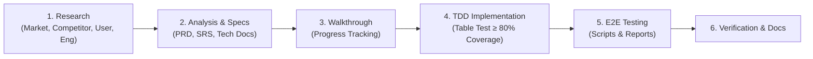

# Engineering Guidelines & Agent Instructions
# Hotel Booking Engine — Pulang ke Uttara (Yogyakarta)

Dokumen ini memuat standar operasional baku bagi seluruh AI Agent dan engineer yang bekerja di repositori ini.

---

## 1. Tahapan Siklus Pengembangan Fitur (Feature Lifecycle)

Setiap penambahan fitur baru atau *refinement* wajib mengikuti 6 tahap berurutan:



### Tahap 1: Riset Mendalam (*Research Phase*)
* Analisis pasar, benchmarking kompetitor (Book-Secure, Cloudbeds, SiteMinder), dan persona hotel bintang 4 (Pulang ke Uttara, 95 kamar).
* Riset engineering: Idiom Go, PostgreSQL pool, Valkey/Redis queue, dan Casbin RBAC.
* *Tools / Skills:* `search_web`, `read_url_content`, `golang-pro`, `postgres-best-practices`.

### Tahap 2: Analisis & Dokumen Spesifikasi
* **PRD**: `docs/prd/[feature-name]-[date].md` (Konteks bisnis, persona, acceptance criteria).
* **SRS**: `docs/srs/[feature-name]-[date].md` (Kebutuhan fungsional FR-01+, skema HTTP JSON).
* **Tech Architecture**: `docs/tech/[feature-name]-architecture-[date].md` (Diagram Mermaid, skema DB, benchmark).
* *Tools / Skills:* `api-design-principles`, `postgres-best-practices`, `ponytail`, `golang-pro`.

### Tahap 3: Walkthrough Tracking
* Buat dokumen pelacak progres: `docs/walkthrough/[feature-name]-walkthrough-[date].md`.
* Tracking milestone, catatan modifikasi per file, dan log perintah terminal.

### Tahap 4: Implementasi TDD (Target Coverage $\ge$ 80%)
* Pola pengujian wajib: **Table-Driven Tests** (`tests := []struct{...}`).
* Kode baru/refinement wajib mencapai **minimal 80% code coverage**:
  ```bash
  go test -v -cover ./...
  ```
* Wajib bersih dari lint/vet issues:
  ```bash
  go vet ./...
  ```

### Tahap 5: End-to-End (E2E) Testing
* Buat skrip automasi pengujian di: `testing/e2e/script/[feature-name]_e2e.sh`.
* Lakukan pengujian terhadap fitur baru serta regresi pada fitur yang sudah ada.
* Dokumentasikan laporan hasil pengujian di: `testing/e2e/report/[date-time]-[feature-name]-e2e-report.md`.

---

## 2. Struktur Direktori Proyek

```text
.
├── .agents/rules/               # Aturan otomatis AI Agent
├── cmd/
│   ├── migrate/                 # Standalone Goose migration runner
│   └── server/                  # Monolith entrypoint (HTTP, outbox, workers)
├── config/                      # Konfigurasi model (Casbin rbac_model.conf)
├── docs/
│   ├── prd/                     # Product Requirements Documents
│   ├── srs/                     # Software Requirements Specifications
│   ├── tech/                    # Technical Architecture & Design
│   ├── guidelines/              # Engineering guidelines & best practices
│   └── walkthrough/             # Progress tracking & execution logs
├── internal/
│   ├── api/                     # HTTP router, middleware, handlers (Transport)
│   ├── booking/                 # Core booking domain & transaction runner
│   ├── inventory/               # Room inventory store & availability
│   ├── platform/                # Config, DB pool, Valkey, Casbin adapter
│   ├── rates/                   # Dynamic rate pricing engine
│   └── workers/                 # Outbox relay & asynchronous workers
├── migrations/                  # Goose SQL migrations (00001+, Up & Down)
└── testing/
    └── e2e/
        ├── script/              # Executable E2E test scripts
        └── report/              # Detailed E2E test run reports
```
