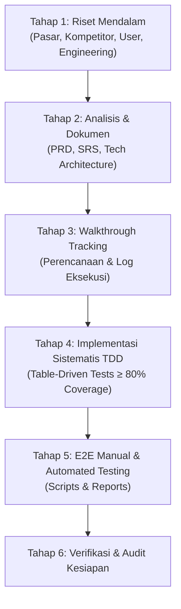

# Feature Lifecycle & AI Agent Engineering Guidelines
# Standar Pengembangan Fitur, Riset, TDD, dan E2E Testing
**Proyek:** Hotel Booking Engine — Pulang ke Uttara (Yogyakarta)  
**Dokumen ID:** `GUIDE-LIFECYCLE-2026-10-03`  
**Versi:** 1.0.0  
**Tanggal:** 2026-10-03  
**Status:** Canonical Engineering Standard  

---

## 1. Pendahuluan & Filosofi Pengembangan

Sistem pemesanan kamar hotel **Pulang ke Uttara** dibangun dengan arsitektur **Modular Monolith Hexagonal** berkinerja tinggi. Agar setiap evolusi sistem—baik berupa penambahan fitur baru (*new feature*) maupun penyempurnaan fitur yang telah ada (*refinement*)—memiliki standar mutu industri bintang-4, dokumen ini mendefinisikan alur kerja wajib bagi AI Agent dan software engineer.

Siklus hidup pengembangan terdiri dari **6 tahap terstruktur**:



---

## 2. Pemetaan Skill & Tools pada Setiap Tahap Siklus

| Tahap | Aktivitas Utama | Skill & Tools yang Wajib Digunakan |
| :--- | :--- | :--- |
| **1. Riset** | Benchmarking kompetitor (Book-Secure, Cloudbeds, Agoda), riset persona hotel, standar Go & Postgres | `search_web`, `read_url_content`, `golang-pro`, `postgres-best-practices` |
| **2. Analisis & Dokumen** | Penyusunan PRD, SRS, Tech Architecture, evaluasi anti-overengineering | `ponytail`, `api-design-principles`, `postgres-best-practices`, `golang-pro` |
| **3. Walkthrough** | Pembuatan tracker pengerjaan langkah demi langkah | `view_file`, `write_to_file` |
| **4. TDD Implementasi** | Penulisan table tests (Red-Green-Refactor) dengan cakupan $\ge 80\%$ | `golang-pro`, `replace_file_content`, `run_command` (`go test -cover`) |
| **5. E2E Testing** | Eksekusi skrip E2E end-to-end (fitur baru + regresi fitur lama) dan pelaporan | Bash scripting, `curl`, `run_command`, `write_to_file` |
| **6. Verifikasi & Commit** | Static analysis, audit test suite, dan konfirmasi commit | `run_command` (`go test ./...`, `go vet ./...`, `git status`) |

---

## 3. Rincian 6 Tahap Siklus Hidup Fitur

### 3.1 Tahap 1: Riset Mendalam (Market, Competitor, User, Engineering)
Sebelum membuat keputusan desain, lakukan riset menyeluruh:
1. **Riset Pasar & Kompetitor**:
   * Telusuri cara booking engine komersial (seperti Book-Secure, Cloudbeds, Opera PMS, SiteMinder) menangani use case terkait.
   * Gunakan tool `search_web` dan `read_url_content` untuk melihat flow UX dan penanganan edge cases.
2. **Riset Pengguna (User Personas)**:
   * Petakan interaksi persona spesifik properti Pulang ke Uttara (95 kamar):
     - `guest`: Tamu umum (pencarian kamar, hold booking, pembayaran instan).
     - `receptionist`: Front desk (alokasi nomor kamar fisik, check-in, check-out, no-show).
     - `housekeeping`: Tata graha (pembaruan status fisik kamar: clean/dirty/inspected).
     - `revenue_mgr`: Manajemen pendapatan (penyesuaian tarif dinamis dan blok inventaris).
     - `finance`: Keuangan (rekonsiliasi pembayaran dan refund).
     - `gm_admin`: General manager (pengaturan menyeluruh).
3. **Riset Engineering**:
   * Evaluasi idiom Go terkini, pola konkurensi (channel, sync, context), dan mitigasi race conditions.
   * Evaluasi performa skema database PostgreSQL (indexing, locking, transaction isolation).

### 3.2 Tahap 2: Analisis & Dokumen Siklus Hidup
Agent wajib menghasilkan 3 dokumen formal pada folder `docs/`:

1. **Product Requirements Document (PRD)**:
   * **Lokasi:** `docs/prd/[feature-name]-[YYYY-MM-DD].md`
   * **Struktur Wajib:**
     - Executive Summary & Latar Belakang Bisnis.
     - Personas & Role Matrix.
     - Matriks Hak Akses & Fitur.
     - User Stories & Acceptance Criteria spesifik.
     - Kebutuhan Non-Fungsional (NFR).

2. **Software Requirements Specification (SRS)**:
   * **Lokasi:** `docs/srs/[feature-name]-[YYYY-MM-DD].md`
   * **Struktur Wajib:**
     - Ruang Lingkup Sistem & Aktor.
     - Kebutuhan Fungsional bernomor unik (`FR-01`, `FR-02`, dst.).
     - Kontrak Antarmuka HTTP (Header, URL path, Method, Status Code).
     - Kontrak Skema JSON (Request & Response) termasuk skema error RFC 7807.
     - Kebutuhan Data, Skema Tabel, dan Integritas Relasional.

3. **Dokumen Desain Teknis (Tech Architecture)**:
   * **Lokasi:** `docs/tech/[feature-name]-architecture-[YYYY-MM-DD].md`
   * **Struktur Wajib:**
     - Diagram Alur Arsitektur (Mermaid flowchart/sequence diagram).
     - Desain Modular Hexagonal (Domain vs Ports vs Adapters).
     - Skema Migrasi Database (Goose SQL format).
     - Strategi Caching, Concurrency, dan Thread Safety.
     - Analisis **Ponytail**: Menjamin solusi tidak *over-engineered*, YAGNI, tanpa dependency eksternal yang tidak diperlukan.

### 3.3 Tahap 3: Walkthrough Tracking
* **Lokasi:** `docs/walkthrough/[feature-name]-walkthrough-[YYYY-MM-DD].md`
* Berfungsi sebagai catatan *live progress* selama pengerjaan:
  - Checklist fase pengerjaan (To-Do / In Progress / Done).
  - Daftar file yang dibuat dan dimodifikasi.
  - Snapshot output perintah terminal dan hasil pengujian.

### 3.4 Tahap 4: Implementasi TDD dengan Standar Coverage $\ge$ 80%
Pengembangan kode wajib mengikuti disiplin **Test-Driven Development (TDD)** dengan pola **Table-Driven Tests**:

1. **Table-Driven Test Pattern**:
   ```go
   func TestFeatureLogic(t *testing.T) {
       tests := []struct {
           name           string
           inputParam     string
           initialState   DomainState
           expectedResult ExpectedType
           expectError    bool
           expectedStatus int
       }{
           {
               name:           "Happy path case",
               inputParam:     "valid-val",
               expectedResult: expectedVal,
               expectError:    false,
           },
           {
               name:        "Invalid input returns error",
               inputParam:  "",
               expectError: true,
           },
       }

       for _, tt := range tests {
           t.Run(tt.name, func(t *testing.T) {
               res, err := ExecuteFeature(tt.inputParam)
               if (err != nil) != tt.expectError {
                   t.Fatalf("expected error: %v, got: %v", tt.expectError, err)
               }
               // Assertions
           })
       }
   }
   ```
2. **Ambang Batas Coverage**:
   * Package baru atau fungsi yang diperbaiki wajib memiliki **test coverage $\ge$ 80%**.
   * Perintah verifikasi coverage:
     ```bash
     go test -v -cover ./internal/...
     ```
3. **Pemeriksaan Linter & Static Analysis**:
   ```bash
   go vet ./...
   ```

### 3.5 Tahap 5: Manual & Automated E2E Testing
Setelah seluruh unit dan integration tests lolos, lakukan pengujian end-to-end pada runtime sesungguhnya:
1. **Penyimpanan Skrip E2E**:
   * Folder: `testing/e2e/script/`
   * Format: `testing/e2e/script/[feature-name]_e2e.sh` (executable bash script menggunakan `curl` dan `jq`) atau runner Go di `testing/e2e/script/`.
   * Skrip harus menguji:
     - Skenario positif fitur baru (*happy path*).
     - Skenario penolakan / error handling fitur baru (*negative path*).
     - Skenario regresi terhadap fitur yang sudah ada sebelumnya (*backward-compatibility*).
2. **Penyimpanan Laporan E2E**:
   * Folder: `testing/e2e/report/`
   * Format Nama File: `testing/e2e/report/[YYYY-MM-DD-HHMMSS]-[feature-name]-e2e-report.md`
   * Format Isi Laporan:
     - Tanggal & Waktu Pengujian.
     - Komponen & Port Target (misal `http://localhost:8080`).
     - Matriks Skenario Uji (ID, Deskripsi, Method, Path, Expected Code, Actual Code, Status PASS/FAIL).
     - Cuplikan Raw Request & Response JSON.
     - Kesimpulan Kesiapan Rilis (*Sign-off*).

### 3.6 Tahap 6: Verifikasi & Audit Kesiapan
1. Pastikan seluruh berkas git bersih dari sisa scratch debug atau log sementara.
2. Seluruh file dokumentasi saling terhubung menggunakan github markdown links (`file:///...`).
3. Lakukan konfirmasi status kepada User sebelum pembuatan git commit.
