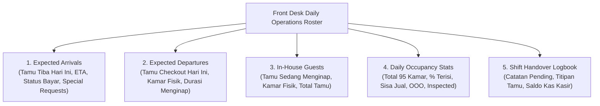

# PRD — Front Desk Daily Operations Roster & Shift Handover Board
# Hotel Booking Engine — Pulang ke Uttara (Yogyakarta)

- **Tanggal Dokumen:** 2026-10-03
- **Dokumen SRS Pasangan:** [SRS-Front-Desk-Roster](../srs/front-desk-daily-operations-roster-2026-10-03.md)
- **Desain Arsitektur Teknis:** [TECH-Front-Desk-Roster](../tech/front-desk-daily-operations-roster-architecture-2026-10-03.md)
- **Pelacak Eksekusi:** [Walkthrough Front Desk](../walkthrough/front-desk-daily-operations-roster-walkthrough-2026-10-03.md)
- **Status:** Approved / Ready for Implementation
- **Target Role:** `receptionist`, `gm_admin`, `revenue_mgr`, `housekeeping`
- **Lingkup:** Manajemen Operasional Harian Front Desk & Serah Terima Shift (*Shift Handover*)

---

## 1. Latar Belakang & Urgensi Bisnis

Hotel Pulang ke Uttara (Yogyakarta) adalah properti bintang 4 dengan 95 kamar fisik yang terdistribusi di 4 lantai (Lantai 2 hingga Lantai 5). Meja depan (*Front Desk*) beroperasi 24 jam sehari yang dibagi ke dalam 3 regu kerja (*Shift*):
- **Morning Shift (Pagi):** 07:00 – 15:00 WIB (Puncak aktivitas check-out tamu dan persiapan kamar tiba).
- **Afternoon Shift (Sore):** 15:00 – 23:00 WIB (Puncak kedatangan tamu/check-in dan penanganan permintaan kamar).
- **Night Audit Shift (Malam):** 23:00 – 07:00 WIB (Verifikasi kasir meja depan, penutupan hari operasional, dan persiapan daftar kedatangan esok hari).

### Permasalahan Operasional Saat Ini:
1. **Ketiadaan Visibilitas Harian Terpadu (*Fragmented Operational View*):**
   Resepsionis harus memfilter data reservasi satu per satu untuk mengetahui siapa tamu yang akan datang hari ini (*expected arrivals*), siapa yang harus keluar (*expected departures*), dan siapa yang sedang in-house. Hal ini memperlambat proses check-in saat *rush hour* (14:00–16:00 WIB).
2. **Koordinasi Meja Depan dengan Housekeeping:**
   Housekeeping membutuhkan daftar *departures* yang akurat dan real-time untuk menentukan prioritas pembersihan kamar (*turnaround priority*) agar kamar siap (*inspected*) sebelum tamu berikutnya tiba.
3. **Pencatatan Serah Terima Shift (*Shift Handover Log*):**
   Pencatatan saldo kas kecil meja depan (*cash float*), titipan kunci/koper tamu, serta komplain tamu yang masih *pending* saat ini masih dilakukan secara verbal atau buku manual rentan hilang. Diperlukan *Digital Shift Handover Log* yang terikat pada audit identity akun staf.

---

## 2. Profil Persona & Matriks Hak Akses (RBAC Matrix)

| Persona | Hak Akses | Kebutuhan Informasi Harian |
| :--- | :--- | :--- |
| **Resepsionis Meja Depan (`receptionist`)** | Read Roster & Write Handover | Membaca daftar *Arrivals*, *Departures*, *In-House*; melihat estimasi kedatangan tamu (ETA) & permintaan khusus; menulis dan meninjau log serah terima shift. |
| **Housekeeping Supervisor (`housekeeping`)** | Read Departures & In-House | Memantau kamar-kamar yang dijadwalkan checkout hari ini agar pembersihan dapat dijadwalkan segera. |
| **Revenue Manager (`revenue_mgr`)** | Read Stats & Forecast | Memantau *occupancy rate* harian hotel, sisa kamar jual (*sellable rooms*), dan tren kedatangan. |
| **General Manager (`gm_admin`)** | Full Control & Audit | Meninjau kepatuhan operasional, catatan serah terima shift seluruh shift, serta audit keuangan kasir meja depan. |

---

## 3. Komponen Utama Roster Operasional Harian

---

## 4. Aturan Bisnis Utama (Business Rules)

- **BR-FD-01: Auto-Calculation of Daily Cohorts:**
  Pengelompokan data dinamis berdasarkan tanggal operasional hotel (WIB / UTC+7):
  - *Expected Arrivals:* Reservasi berstatus `confirmed` dengan `check_in = OPERATIONAL_DATE`.
  - *Expected Departures:* Reservasi berstatus `checked_in` dengan `check_out = OPERATIONAL_DATE`.
  - *In-House Guests:* Seluruh reservasi berstatus `checked_in` yang mencakup tanggal operasional.
- **BR-FD-02: Real-Time Occupancy Formula:**
  $$\text{Sellable Rooms} = \text{Total Rooms (95)} - \text{Kamar Out of Order (OOO)}$$
  $$\text{Occupancy Rate (\%)} = \frac{\text{Jumlah Kamar Berstatus Occupied}}{\text{Sellable Rooms}} \times 100$$
- **BR-FD-03: Immutability of Handover Log:**
  Setiap entri catatan serah terima shift bersifat *append-only* (tidak dapat diedit/dihapus setelah dikirim) untuk menjaga integritas jejak audit operasional dan pertanggungjawaban kasir.

---

## 5. Analisis Anti-Overengineering (Ponytail Framework)

1. **Database Simpel:** Menggunakan query agregasi tunggal di PostgreSQL yang memanfaatkan indeks tanggal dan status yang sudah ada, tanpa membuat read-replica atau Elasticsearch.
2. **No Unneeded Dependencies:** Tidak menggunakan third-party cron atau framework dashboard terpisah. Data dihitung *on-demand* dengan query SQL terindeks yang sangat cepat (< 10 ms pada 95 kamar).
3. **Clean DTO Representation:** Mengembalikan JSON DTO yang ringkas dan siap dikonsumsi langsung oleh UI Nuxt front-desk.

---

## 6. Kriteria Keberterimaan (Acceptance Criteria)

- [ ] **AC-FD-01:** Endpoint `GET /api/v1/front-desk/daily-roster` menyajikan ringkasan *Arrivals*, *Departures*, *In-House*, dan metrik okupansi secara real-time.
- [ ] **AC-FD-02:** Mendukung query parameter `date=YYYY-MM-DD` (default: hari ini WIB) untuk kebutuhan forecast harian.
- [ ] **AC-FD-03:** Setiap baris reservasi pada daftar *Arrivals* menyertakan jam estimasi tiba (*ETA*), ringkasan *special request*, dan status penugasan kamar.
- [ ] **AC-FD-04:** Endpoint `POST /api/v1/front-desk/handover-notes` memungkinkan staf mencatat log serah terima shift (shift, cash float, pending issues, vip notes).
- [ ] **AC-FD-05:** Endpoint `GET /api/v1/front-desk/handover-notes` menyajikan riwayat catatan shift dengan pagination.
