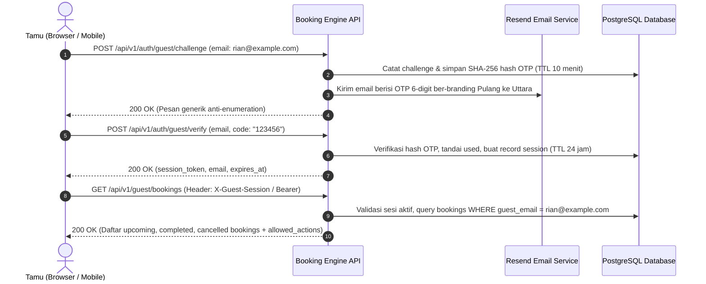

# Product Requirements Document (PRD)
# Akses Tamu, Manajemen Sesi & Booking Saya (F02 & F03)
# Hotel Booking Engine — Pulang ke Uttara (Yogyakarta)

- **Tanggal Dokumen:** 3 Oktober 2026
- **Status:** **APPROVED FOR IMPLEMENTATION**
- **Feature Trace:** F02 (Guest Access & Session), F03 (My Bookings), Gap BE-G13, BE-G15, BE-G19
- **Domain:** Guest Authentication, Identity Verification, Session Management, Private Bookings Read Model

---

## 1. Konteks Bisnis & Latar Belakang

Hotel **Pulang ke Uttara** adalah hotel butik bintang 4 di kawasan Jl. Kaliurang Km 5.6, Yogyakarta dengan 95 kamar terbagi ke dalam 7 varian kamar (*Superior, Deluxe, Deluxe Premier, Executive Suite, Grand Suite, Family Suite, Penthouse*).

Saat ini, tamu publik yang telah membuat reservasi hanya dapat mengakses reservasi mereka secara instan melalui ID booking dan `X-Guest-Token`. Namun, terdapat kebutuhan kritis dari sisi pengalaman pengguna (*user experience*) dan regulasi perlindungan data pribadi:
1. **Kebutuhan Pengalaman Tamu (Guest Experience):**
   * Tamu sering kali memesan kamar dari ponsel atau laptop, lalu ingin melihat kembali seluruh riwayat pesanan aktif, jadwal check-in yang akan datang (*upcoming*), maupun invoice tanpa perlu mencari satu per satu tautan booking yang terpisah.
   * Tamu hotel berlibur enggan mengingat kata sandi (*passwordless*) yang rumit. Pola **Email OTP 6-Digit** atau **Magic Link** adalah standar emas industri hospitality modern (seperti yang diterapkan hotel butik global dan maskapai penerbangan).
2. **Kepatuhan Hukum & Privasi (UU PDP No. 27/2022 & ISO/IEC 27001):**
   * Reservasi hotel memuat Data Pribadi Spesifik dan Umum (nama lengkap, alamat email, nomor telepon, catatan preferensi menginap).
   * Mengetahui kode referensi atau UUID booking orang lain **TIDAK BOLEH** mengekspos PII tamu lain (*Insecure Direct Object Reference / IDOR mitigation* - Gap BE-G13).
   * Hak akses melihat detail lengkap pemesanan wajib terikat pada bukti kepemilikan email yang terverifikasi secara kriptografis (*verified guest session*).

---

## 2. Persona Pengguna & Matriks Hak Akses

| Persona | Deskripsi | Hak Akses (*Permissions*) |
| :--- | :--- | :--- |
| `anonymous` | Pengunjung web / calon tamu yang belum login. | Dapat meminta tantangan login (*request challenge OTP*) untuk alamat email tertentu. Menerima respons generik untuk mencegah kebocoran informasi (*anti-enumeration*). |
| `verified_guest` | Tamu yang berhasil memvalidasi kode OTP 6 digit dan memegang sesi aktif. | Mengakses profil sesi (`/auth/guest/me`), melihat seluruh daftar booking miliknya (`/guest/bookings`), melihat detail booking privat (`/guest/bookings/{id}`), dan mengakhiri sesi (`/auth/guest/logout`). |
| `staff` (*Receptionist, GM, etc.*) | Staf internal hotel yang terautentikasi via Casbin RBAC Bearer token. | Mengelola operasional hotel secara terpisah melalui namespace internal, tidak bercampur dengan sesi publik tamu. |

---

## 3. Alur Pengguna (User Journey)

---

## 4. Kriteria Keberatan Produk (Product Acceptance Criteria)

### F02-AC-01: Challenge Generik & Anti-Enumeration (OWASP ASVS V2)
* **Kebutuhan:** Request challenge via `POST /api/v1/auth/guest/challenge` wajib memberikan respons sukses yang seragam apakah email sudah pernah memesan atau belum.
* **Acceptance:**
  * Payload valid: `{"status": "ok", "message": "Jika email terdaftar, kode verifikasi 6 digit telah dikirimkan."}`.
  * Backend tidak membocorkan apakah email terdaftar di sistem hotel.
  * Terdapat rate-limiting / cooldown minimal 60 detik per email untuk menangkal flooding.

### F02-AC-02: Cryptographic OTP & Expiry (OWASP ASVS V2.8)
* **Kebutuhan:** Kode OTP terdiri dari 6 digit numerik acak aman (*cryptographically secure random* via `crypto/rand`).
* **Acceptance:**
  * Kode disimpan di database dalam bentuk **SHA-256 hash** (bukan plaintext).
  * Masa berlaku (*TTL*) dibatasi 10 menit.
  * Batas percobaan gagal maksimal 3 kali. Setelah 3 kali gagal, kode otomatis hangus.
  * Kode hanya dapat digunakan satu kali (*one-time use*). Replay verifikasi wajib ditolak.

### F02-AC-03: Sesi Tamu yang Aman & Terbatas (OWASP ASVS V3)
* **Kebutuhan:** Verifikasi sukses menghasilkan token sesi acak berkekuatan tinggi (32-byte hex/base64 URL-safe).
* **Acceptance:**
  * Token sesi disimpan dalam bentuk hash SHA-256 di tabel `guest_sessions`.
  * Masa kedaluwarsa sesi *idle* 24 jam dan *absolute* 7 hari.
  * Tamu dapat mengakhiri sesi melalui `POST /api/v1/auth/guest/logout`, yang langsung mencabut validitas token di database.

### F03-AC-01: Daftar Reservasi Privat Tamu (My Bookings)
* **Kebutuhan:** Tamu yang terautentikasi dapat melihat seluruh reservasi yang terkait dengan alamat emailnya melalui `GET /api/v1/guest/bookings`.
* **Acceptance:**
  * Mendukung filter status: `status=upcoming`, `status=completed`, `status=cancelled`, atau `all`.
  * Mendukung paginasi cursor yang efisien.
  * Menyajikan data ringkas: booking ID, check-in, check-out, tipe kamar, total harga (IDR integer), status pemesanan, dan status pembayaran.

### F03-AC-02: Detail Booking & Aksi yang Diizinkan (*Allowed Actions*)
* **Kebutuhan:** Tamu dapat melihat rincian lengkap pesanan miliknya melalui `GET /api/v1/guest/bookings/{id}`.
* **Acceptance:**
  * Menampilkan PII lengkap (karena pemilik sah terverifikasi).
  * Mengembalikan objek `allowed_actions`:
    * `can_pay`: true jika status `HOLD` dan hold belum kedaluwarsa.
    * `can_cancel`: true jika status `CONFIRMED` dan kebijakan mengizinkan pembatalan.
    * `can_download_receipt`: true jika status `CONFIRMED`, `CHECKED_IN`, atau `CHECKED_OUT`.

### F03-AC-03: Pencegahan IDOR Total (UU PDP No. 27/2022 & OWASP API Top 10)
* **Kebutuhan:** Jika tamu A mencoba mengakses booking ID milik tamu B melalui `GET /api/v1/guest/bookings/{id}`.
* **Acceptance:**
  * Backend mengembalikan HTTP `404 Not Found` generik (`BOOKING_NOT_FOUND`).
  * Tidak mengembalikan `403 Forbidden` agar penyerang tidak dapat mengonfirmasi keberadaan reservasi orang lain.

---

## 5. Non-Functional Requirements (NFR)

1. **Performa:** Query daftar booking terindeks `idx_bookings_guest_email` dengan latensi $< 20$ ms pada $p99$.
2. **Keandalan:** Pengiriman email OTP menggunakan `ResendNotifier` transaksional dengan fallback ke log lokal di environment development.
3. **Anti-Overengineering (Prinsip Ponytail):** Menggunakan standard library murni Go `crypto/rand`, `crypto/sha256`, `net/http` dan schema SQL standar PostgreSQL tanpa framework autentikasi pihak ketiga yang membengkak.
