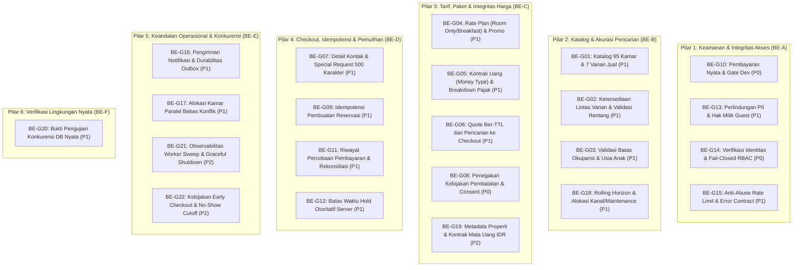

# Product Requirements Document (PRD)
# Hotel Booking Engine Parity & Gap Remediation
**Properti:** Hotel Pulang ke Uttara, Yogyakarta (95 Kamar)  
**Dokumen ID:** `PRD-GAP-PARITY-2026-10-03`  
**Versi:** 1.0.0  
**Tanggal:** 2026-10-03  
**Status:** Approved / Ready for Execution  
**Referensi Audit:** [`docs/gap/README.md`](file:///mnt/code/projects/jobs/pulang/current-booking/docs/gap/README.md) (`BE-G01` s/d `BE-G22`)  

---

## 1. Executive Summary & Visi Produk

Sistem backend *hotel-booking* saat ini telah membuktikan kelayakan arsitektur modular monolith Go dengan database PostgreSQL, Goose migration, Valkey job queue, dan proteksi Casbin RBAC. Namun, berdasarkan hasil audit gap komprehensif terhadap standar operasional live hotel bintang-4 **Pulang ke Uttara** (dan paritas terhadap mesin pemesanan *Book-Secure*), sistem saat ini masih memiliki celah kritikal yang menghalangi deployment produksi langsung (*live replacement gate*).

Dokumen PRD ini menetapkan kebutuhan produk terperinci untuk mentransformasikan backend dari prototipe fungsional menjadi mesin pemesanan siap-produksi (*production-grade booking engine*) yang aman, akurat secara moneter, tahan beban konkurensi, dan memberikan pengalaman pemesanan tamu tanpa gesekan.

---

## 2. Pemetaan Pilar Bisnis & 22 Gap Codex

Penyelesaian gap dikelompokkan ke dalam 6 pilar bisnis utama:



---

## 3. Matriks Spesifikasi Produk per Pilar

### 3.1 Pilar 1: Keamanan & Boundary API (BE-A)
1. **Eliminasi Rute Simulasi pada Produksi (`BE-G10`)**:
   * Endpoint `/fake-pay/*` wajib dikunci di balik build tag / environment gate `APP_ENV=development`. Pada mode produksi, rute ini wajib menghasilkan 404 Not Found atau memblokir server startup jika provider pembayaran nyata belum dikonfigurasi.
2. **Perlindungan Data Pribadi (PII) & Token Akses Guest (`BE-G13`)**:
   * Endpoint `GET /api/v1/bookings/:id` tidak boleh mengembalikan nomor telepon, email, atau detail reservasi lengkap kepada publik yang hanya menebak UUID.
   * Tamu pemesan menerima `guest_access_token` (high-entropy) saat reservasi dibuat. Akses privat dan pembatalan wajib memverifikasi header `X-Guest-Token` atau cookie sesi.
3. **Autentikasi Terverifikasi & Fail-Closed RBAC (`BE-G14`)**:
   * Menolak manipulasi header `X-User-Role` dari public caller. Role hanya boleh diekstrak dari validasi JWT/token session staf terdaftar di tabel `staff_users` yang berstatus `is_active = TRUE`.
   * Jika inisialisasi Casbin Enforcer gagal, router wajib **Fail-Closed** (menolak seluruh request terproteksi dengan HTTP 500/503), bukan membiarkan request lolos tanpa pemeriksaan.
4. **Pembatasan Laju (Rate Limiting) & Standarisasi Error (`BE-G15`)**:
   * Rate limiting pada endpoint publik: Search (30 req/min), Create Booking (5 req/min).
   * Format error response wajib mengikuti standar RFC 7807 (Problem Details) dengan error code mesin yang terprediksi (`INVALID_DATE_RANGE`, `CAPACITY_EXCEEDED`, `ROOM_UNAVAILABLE`, `RATE_PLAN_NOT_FOUND`).

### 3.2 Pilar 2: Katalog & Ketersediaan Kamar (BE-B)
1. **Model Katalog 95 Kamar Pulang ke Uttara (`BE-G01`)**:
   * Struktur kamar dirombak sesuai properti fisik nyata (5 Room Families, 7 Varian Penjualan):
     1. Deluxe Balcony (King / Twin)
     2. Deluxe Bay Window (King / Twin)
     3. Executive Suite (King)
     4. Suite (King)
     5. Family Suite (King + Single)
   * Menyediakan atribut kaya: deskripsi, fasilitas (*amenities*), luas m², tipe ranjang (*bed type*), foto/media URL, dan slug yang ramah SEO.
2. **Pencarian Multi-Varian & Ketersediaan Utuh (`BE-G02`)**:
   * Endpoint `GET /api/v1/search` memungkinkan pencarian tanggal *check-in* & *check-out* serta jumlah tamu tanpa mewajibkan caller mengetahui `room_type_id`.
   * Memvalidasi ketersediaan di setiap malam tanpa bolong (*continuous availability*). Jika satu malam habis, status kamar ditampilkan sebagai *Sold Out* untuk rentang tersebut.
3. **Batas Okupansi & Anak (`BE-G03`)**:
   * Parameter pencarian mendukung komposisi keluarga: `adults`, `children`, dan usia anak (*child ages*).
   * Menegakkan batas maksimal kapasitas per unit dan batas durasi menginap (*Max Length of Stay / LOS* maks 30 hari).
4. **Horizon Inventaris Rolling (`BE-G18`)**:
   * Inventaris dipelihara dengan horizon dinamis (misal 365 hari berjalan), mendukung reservasi pemeliharaan (*maintenance blocks*) dan pemisahan alokasi kanal OTA vs Direct Booking.

### 3.3 Pilar 3: Tarif, Paket & Integritas Moneter (BE-C)
1. **Rate Plans & Paket Manfaat (`BE-G04`)**:
   * Setiap varian kamar memiliki opsi tarif:
     - **Room Only (RO)**
     - **Bed & Breakfast (BB)**: Termasuk sarapan harian untuk kapasitas dewasa terdaftar.
     - **Promotional / Package Rates** (e.g. Early Bird, Staycation Package).
2. **Tipe Data Moneter Presisi (Money Object) (`BE-G05`)**:
   * Menggantikan kalkulasi floating-point dengan representasi integer presisi:
     ```json
     {
       "currency": "IDR",
       "amount": 1100000,
       "exponent": 0,
       "breakdown": {
         "base_amount": 1000000,
         "tax_amount": 100000,
         "service_charge": 0,
         "discount_amount": 0
       }
     }
     ```
3. **Jaminan Quote Bertenggat Waktu (Quote TTL) (`BE-G06`)**:
   * Hasil pencarian menghasilkan `quote_id` dengan masa berlaku (misal 15 menit). Saat tamu menekan *Book Now*, harga dikunci sesuai quote. Jika quote kedaluwarsa sebelum booking dibuat, caller diarahkan untuk *re-quote*.
4. **Penegakan Kebijakan Pembatalan & Consent (`BE-G08`)**:
   * Merekam snapshot kebijakan pembatalan (Non-Refundable vs Free Cancellation hingga H-3) dan persetujuan syarat/ketentuan (*Terms & Conditions consent timestamp*) saat reservasi dibuat.

### 3.4 Pilar 4: Checkout, Idempotensi & Pemulihan (BE-D)
1. **Kelengkapan Kontak & Special Requests (`BE-G07`)**:
   * Menampung `phone_number` berformat E.164, estimasi jam kedatangan (*estimated arrival time*), dan catatan khusus tamu (*special requests*) hingga 500 karakter dengan disclaimer "bergantung ketersediaan saat check-in".
2. **Idempotensi Create Booking (`BE-G09`)**:
   * Mendukung header `Idempotency-Key: <UUID>`. Percobaan pengiriman ulang (*network retry*) dengan kunci dan payload yang sama mengembalikan respon booking yang sudah ada tanpa mengurangi stok kamar ganda.
3. **Ledger Transaksi Pembayaran & Batas Waktu Hold Otoritatif (`BE-G11`, `BE-G12`)**:
   * Mencatat tabel `payment_attempts` dengan status: `initiated`, `pending`, `successful`, `failed`, `expired`, `refunded`.
   * Batas waktu hold kamar (`expires_at`) disimpan di PostgreSQL dan menjadi otoritas mutlak saat verifikasi webhook pembayaran.

### 3.5 Pilar 5: Keandalan Operasional & Konkurensi (BE-E)
1. **Durabilitas Outbox & Notifikasi Nyata (`BE-G16`)**:
   * Notifikasi email pemesanan dikirim melalui adapter email nyata (SMTP / Transactional Email Provider seperti Mailgun/Resend) dengan deduplikasi pengiriman.
2. **Alokasi Kamar Paralel Bebas Konflik (`BE-G17`)**:
   * Menghindari false conflict saat dua resepsionis melakukan check-in bersamaan untuk tipe kamar yang sama menggunakan strategi *locking* atau alokasi berurut deterministik.
3. **Observabilitas & Kebijakan Operasional Khusus (`BE-G21`, `BE-G22`)**:
   * Menangani *rows.Err* pada worker sweep, pembersihan koneksi saat startup gagal, penanganan early check-out, dan batas waktu mark no-show (H+1 jam 06:00 WIB).

---

## 4. Kriteria Penerimaan (Acceptance Criteria) Global

1. **Paritas Fitur Tamu**: Tamu dapat mencari kamar berdasarkan tanggal dan komposisi tamu, memilih varian ranjang (King/Twin) dan paket sarapan, mendapatkan rincian harga transparan dalam IDR, serta mengamankan pesanan dengan batas waktu hold 30 menit.
2. **Nol Kebocoran Keamanan**:
   * Staf operations tidak dapat dipalsukan via header publik.
   * Tamu tidak dapat membaca atau membatalkan pesanan milik tamu lain.
   * Rute dev/fake-pay mati total di lingkungan produksi.
3. **Integritas Moneter & Inventaris**:
   * Tidak ada kasus *double booking* atau *overbooking* saat ratusan permintaan paralel tiba di detik yang sama.
   * Jumlah malam $\times$ harga per malam $+$ pajak $-$ diskon $=$ total tagihan secara matematis akurat hingga satuan terkecil.
