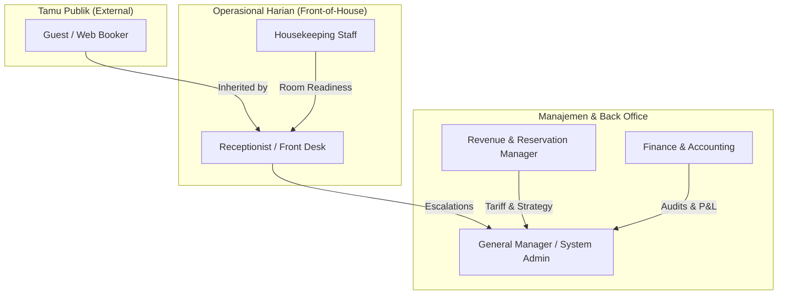

# Product Requirements Document (PRD)
# Role-Based Access Control (RBAC) System with Casbin & PostgreSQL
**Properti:** Hotel Pulang ke Uttara, Yogyakarta (95 Kamar, 5 Tipe Kamar)  
**Dokumen ID:** `PRD-RBAC-2026-10-03`  
**Versi:** 1.0.0  
**Tanggal:** 2026-10-03  
**Status:** Approved / In Execution  
**Author:** Engineering & Product Team  

---

## 1. Executive Summary & Business Context

### 1.1 Latar Belakang
Hotel **Pulang ke Uttara** adalah boutique hotel bintang-4 independen yang berlokasi di Jl. Kaliurang KM 5.5 No. 72, Caturtunggal, Depok, Sleman, D.I. Yogyakarta (Kodepos 55281). Properti ini mengoperasikan 95 unit kamar yang terbagi ke dalam 5 tipe utama:
1. **Deluxe Balcony** (~32 m²)
2. **Deluxe Bay Window** (~30 m²)
3. **Executive Suite** (~45 m²)
4. **Suite** (~52 m²)
5. **Family Suite** (~64 m²)

Sebelumnya, seluruh endpoint HTTP pada sistem pemesanan ([`internal/api/router.go`](file:///mnt/code/projects/jobs/pulang/current-booking/internal/api/router.go)) bersifat publik atau hanya terproteksi secara parsial tanpa segregasi wewenang yang terstandarisasi. Tindakan kritikal seperti **Check-In**, **Check-Out**, **Mark No-Show**, pembatalan reservasi, dan manipulasi inventaris dapat dipanggil tanpa verifikasi hak akses staf yang semestinya.

### 1.2 Masalah Bisnis yang Diselesaikan
1. **Risiko Keamanan & Data Breach**: Tamu publik secara teoritis dapat memicu aksi staf front office (check-in/check-out/no-show) jika mengetahui ID pemesanan.
2. **Ketiadaan Pemisahan Wewenang (Segregation of Duties)**: Housekeeping, Receptionist, Revenue Manager, dan Finance membutuhkan batasan akses yang tegas agar tidak terjadi salah eksekusi operasional (contoh: staf front office tidak boleh mengubah formula tarif dinamis kamar).
3. **Audit Trail & Kepatuhan**: Hotel butik membutuhkan rekam jejak kepatuhan perizinan yang terverifikasi dan tersentralisasi pada database PostgreSQL utama tanpa ketergantungan pada vendor SaaS luar.

### 1.3 Solusi yang Diusulkan
Mengimplementasikan modul **Role-Based Access Control (RBAC)** berbasis **Casbin** dengan penyimpanan kebijakan langsung di **PostgreSQL** (`casbin_rule`), dieksekusi secara in-memory melalui Chi HTTP middleware yang ringan, cepat (<1µs evaluasi), dan mengikuti filosofi **Ponytail (Anti-Overengineering)**.

---

## 2. User Personas & Role Matrix

Sistem dirancang untuk melayani 6 persona utama dalam alur operasional 1 gedung hotel Pulang ke Uttara:

### 2.1 Definisi Persona & Kebutuhan Akses

#### A. Guest (Tamu / Publik)
* **Tanggung Jawab:** Mencari ketersediaan kamar, membuat hold reservasi, membayar kamar, mengecek status reservasi pribadi, dan membatalkan pesanan sebelum tenggat hold habis.
* **Cakupan Akses:**
  * `GET /api/v1/availability`
  * `POST /api/v1/bookings`
  * `GET /api/v1/bookings/:id` (hanya booking miliknya)
  * `POST /api/v1/bookings/:id/cancel`
  * `POST /fake-pay/:ref` (simulasi transaksi pembayaran)

#### B. Receptionist (Front Desk / Front Office)
* **Tanggung Jawab:** Menyambut tamu tiba, memvalidasi identitas, mengalokasikan nomor kamar fisik (check-in), memproses keberangkatan tamu (check-out), dan menandai pemesanan no-show jika tamu tidak hadir setelah batas waktu.
* **Cakupan Akses:**
  * Seluruh hak akses `guest` (pewarisan wewenang / role inheritance: `g, receptionist, guest`).
  * `POST /api/v1/bookings/:id/check-in`
  * `POST /api/v1/bookings/:id/check-out`
  * `POST /api/v1/bookings/:id/no-show`
  * `GET /api/v1/bookings` (pencarian dan filter daftar reservasi harian)

#### C. Housekeeping
* **Tanggung Jawab:** Memperbarui status fisik kebersihan kamar (Dirty $\rightarrow$ Cleaning $\rightarrow$ Inspected $\rightarrow$ Clean / Out-of-Order).
* **Cakupan Akses:**
  * `GET /api/v1/rooms/housekeeping`
  * `PUT /api/v1/rooms/:room_number/housekeeping`

#### D. Revenue Manager
* **Tanggung Jawab:** Mengelola harga dasar per malam, strategi dynamic pricing, dan pemblokiran kuota inventaris untuk pemeliharaan gedung atau pesanan grup/offline.
* **Cakupan Akses:**
  * Hak baca ketersediaan dan reservasi (`GET /api/v1/availability`, `GET /api/v1/bookings`).
  * `PUT /api/v1/rates`
  * `POST /api/v1/inventory/blocks`

#### E. Finance & Accounting
* **Tanggung Jawab:** Rekonsiliasi transaksi pembayaran, pelaporan harian (ADR, RevPAR, Occupancy Rate), audit log keuangan, dan persetujuan pengembalian dana (refund).
* **Cakupan Akses:**
  * `GET /api/v1/reports/*`
  * `POST /api/v1/bookings/:id/refund`
  * Hak baca seluruh transaksi pembayaran dan booking status.

#### F. General Manager / Hotel Administrator (`gm_admin`)
* **Tanggung Jawab:** Manajemen staf, delegasi hak akses darurat, pengawasan operasional hotel penuh, dan pemeliharaan konfigurasi sistem.
* **Cakupan Akses:**
  * Superuser / Wildcard akses: Method `*` pada endpoint `*`.

---

## 3. Matriks Perizinan (Permission Matrix)

| Endpoint | HTTP Method | `guest` | `receptionist` | `housekeeping` | `revenue_mgr` | `finance` | `gm_admin` |
| :--- | :---: | :---: | :---: | :---: | :---: | :---: | :---: |
| `/healthz`, `/ready` | `GET` | ✅ Bebas | ✅ Bebas | ✅ Bebas | ✅ Bebas | ✅ Bebas | ✅ Bebas |
| `/api/v1/availability` | `GET` | ✅ | ✅ | ❌ | ✅ | ✅ | ✅ |
| `/api/v1/bookings` | `POST` | ✅ | ✅ | ❌ | ❌ | ❌ | ✅ |
| `/api/v1/bookings/:id` | `GET` | ✅ (Own) | ✅ (All) | ❌ | ✅ (All) | ✅ (All) | ✅ |
| `/api/v1/bookings/:id/cancel`| `POST` | ✅ | ✅ | ❌ | ❌ | ❌ | ✅ |
| `/api/v1/bookings/:id/check-in`| `POST`| ❌ | ✅ | ❌ | ❌ | ❌ | ✅ |
| `/api/v1/bookings/:id/check-out`| `POST`| ❌ | ✅ | ❌ | ❌ | ❌ | ✅ |
| `/api/v1/bookings/:id/no-show`| `POST`| ❌ | ✅ | ❌ | ❌ | ❌ | ✅ |
| `/fake-pay/:ref` | `POST` | ✅ | ✅ | ❌ | ❌ | ❌ | ✅ |
| `/api/v1/staff/users` | `*` | ❌ | ❌ | ❌ | ❌ | ❌ | ✅ |

---

## 4. User Stories & Acceptance Criteria

### US-01: Proteksi Endpoint Front Desk
* **Sebagai:** Staf Receptionist Pulang ke Uttara.
* **Saya ingin:** Memproses check-in, check-out, dan no-show tamu menggunakan token/kredensial staf saya.
* **Agar:** Tamu luar atau pihak tidak berkepentingan tidak dapat mengubah status kamar secara liar.
* **Acceptance Criteria:**
  1. Request `POST /api/v1/bookings/{id}/check-in` tanpa header otentikasi wajib mengembalikan HTTP `401 Unauthorized`.
  2. Request dengan role `guest` wajib ditolak dengan HTTP `403 Forbidden`.
  3. Request dengan role `receptionist` atau `gm_admin` diproses sukses (HTTP `200 OK`).

### US-02: Public Booking Tanpa Hambatan
* **Sebagai:** Calon tamu Pulang ke Uttara.
* **Saya ingin:** Mencari ketersediaan kamar dan melakukan pemesanan tanpa perlu membuat akun staf terlebih dahulu.
* **Agar:** Friction pemesanan tetap rendah dan conversion rate booking online optimal.
* **Acceptance Criteria:**
  1. Endpoint `GET /api/v1/availability` dan `POST /api/v1/bookings` dapat diakses secara publik (defaulting to role `guest` jika tidak ada token).

### US-03: Kepatuhan Standar Anti-Overengineering (Ponytail)
* **Sebagai:** Tim Engineering / Developer.
* **Saya ingin:** Sistem otorisasi RBAC menggunakan pustaka standar Casbin tanpa dependensi microservices atau ORM berat.
* **Agar:** Penggunaan memori rendah (< 20MB overhead), latensi evaluasi di bawah 1 mikrosekon, dan kode mudah dipelihara oleh satu tim pengembang.
* **Acceptance Criteria:**
  1. Adapter Casbin terhubung langsung ke connection pool `*pgxpool.Pool` yang sudah ada.
  2. Tidak ada tambahan dependency framework ORM (seperti GORM / Ent / SQLx).
  3. Skema tabel didefinisikan secara bersih lewat Goose SQL migration.

---

## 5. Non-Functional Requirements (NFR)

1. **Performa & Latensi**:
   * Evaluasi otorisasi Casbin dieksekusi secara in-memory dari cache sinkron (`casbin.SyncedEnforcer`).
   * P99 latensi tambahan otorisasi per request: $\le 10 \mu\text{s}$ (mikrosekon).
2. **Ketersediaan & Keandalan**:
   * Jika database PostgreSQL restart, Casbin enforcer yang sudah memuat policy di memori tetap dapat melayani evaluasi perizinan tanpa mengalami outage.
3. **Keamanan (Security)**:
   * Seluruh penolakan akses wajib menggunakan format JSON standar yang informatif tanpa membocorkan rincian sensitif infrastruktur.
   * Parameter path dinamis (misal ID pemesanan UUID) ditangani secara aman menggunakan algoritma pencocokan `keyMatch2`.
4. **Auditabilitas**:
   * Tabel `casbin_rule` dan perubahan policy tercatat dalam versi migrasi database terstruktur.
