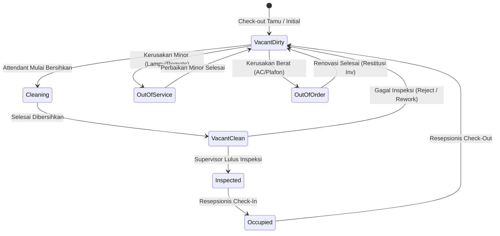

# PRD — Housekeeping Room Status & Readiness Lifecycle
# Hotel Booking Engine — Pulang ke Uttara (Yogyakarta)

Dokumen Terkait:
- **SRS Pasangan:** [SRS-Housekeeping-Readiness](../srs/housekeeping-room-status-and-readiness-2026-10-03.md)
- **Tech Architecture:** [TECH-Housekeeping-Readiness](../tech/housekeeping-room-status-architecture-2026-10-03.md)
- **Walkthrough Tracking:** [Walkthrough Housekeeping](../walkthrough/housekeeping-room-status-walkthrough-2026-10-03.md)

---

## 1. Latar Belakang & Riset Mendalam (Business Background & Research)

### 1.1. Konteks Hotel & Urgensi Operasional
Hotel **Pulang ke Uttara** adalah hotel butik bintang 4 di Yogyakarta dengan total kapasitas **95 kamar fisik** (terbagi ke dalam 7 varian kamar: Superior King/Twin, Deluxe King/Twin, Executive King, Junior Suite, dan Presidential Suite).

Dalam evaluasi alur kerja hotel nyata, ditemukan celah kritis pada sistem saat ini:
* Tabel `rooms` hanya memetakan relasi statis antara `room_number` dan `room_type_id`.
* Endpoint check-in (`POST /api/v1/bookings/{id}/check-in`) hanya mengecek tumpang tindih tanggal (*GiST exclusion constraint*), tanpa memvalidasi apakah kamar fisik tersebut **bersih, sudah disterilkan, atau layak dihuni**.
* Risiko bisnis di lapangan: Resepsionis berpotensi menyerahkan kunci kamar kotor (*dirty room*) kepada tamu baru yang baru tiba setelah perjalanan jauh. Dalam industri perhotelan bintang 4, insiden kamar kotor mengakibatkan komplain fatal, tuntutan kompensasi/refund, serta kehancuran reputasi di Online Travel Agent (penurunan rating TripAdvisor/Google Review dari 4.8 menjadi < 4.0).

### 1.2. Hasil Riset Standar Industri (Benchmarking: AHLA, Cloudbeds, Oracle OPERA)
Berdasarkan standar operasional baku perhotelan internasional:
1. **Verifikasi Dua Tahap (*Dual-Stage Cleanliness Protocol*):**
   * *Room Attendant:* Petugas kebersihan membersihkan kamar, mengganti linen/sprei, mencuci kamar mandi, dan melengkapi amenities ➔ Status menjadi `vacant_clean`.
   * *Housekeeping Supervisor:* Supervisor melakukan *Quality Control (QC)* memeriksa aroma, kebersihan sudut ruangan, kelengkapan minibar, dan fungsi fasilitas ➔ Status dinaikkan menjadi `inspected` (*Vacant Ready*).
   * **Aturan Mutlak:** Resepsionis **hanya boleh** melakukan *check-in* tamu ke kamar berstatus `inspected`.
2. **Pembedaan Dampak Inventaris (*OOO vs. OOS*):**
   * **Out of Order (OOO):** Kerusakan struktural berat (AC bocor, renovasi kamar mandi, plafon retak). Kamar berstatus OOO wajib **memotong kapasitas inventaris yang dijual** (`inventory.available_rooms` dan `inventory.total_rooms`) agar tidak terjual di mesin booking online.
   * **Out of Service (OOS):** Kerusakan minor (lampu meja putus, remote TV hilang). Kamar OOS **tidak memotong kuota inventaris**, namun memblokir penugasan kamar fisik hingga perbaikan selesai.
3. **Otomasi Siklus Hidup (*Automated Turnaround Cycle*):**
   * Saat tamu *check-out*, sistem wajib secara otomatis mengubah status kamar menjadi `vacant_dirty`.
   * Setiap pukul 02:00 pagi (Night Audit reset), kamar berstatus `occupied` ditandai untuk jadwal pembersihan harian (*turn-down / daily cleaning*).

---

## 2. Profil Persona & Matriks Hak Akses (RBAC Matrix)

| Persona | Peran & Hak Akses | Batas Tanggung Jawab Operasional |
| :--- | :--- | :--- |
| **Room Attendant (`housekeeping`)** | Update Kebersihan | Melihat daftar kamar kotor (*dirty*), mengubah status ke `cleaning` saat mulai bekerja, dan mengubah ke `clean` setelah selesai membersihkan. |
| **HK Supervisor (`housekeeping`)** | Approval & Kualitas | Menginspeksi kamar berstatus `clean` dan menaikkan status menjadi `inspected` (siap huni). Menandai kamar `out_of_service`. |
| **Resepsionis Meja Depan (`receptionist`)** | Read & Check-in Guard | Melihat *Room Readiness Board* secara real-time. Sistem menolak proses *check-in* jika kamar yang dipilih belum berstatus `inspected`. |
| **General Manager (`gm_admin`)** | Full Control & OOO | Menandai kamar `out_of_order` (OOO), menetapkan tanggal estimasi selesai perbaikan, dan melakukan *override check-in* darurat bila diperlukan. |

---

## 3. Diagram Alur Transisi Status Kamar (State Machine)

---

## 4. Aturan Bisnis Utama (Business Rules)

- **BR-HK-01: Strict Check-In Guard:**
  Resepsionis tidak dapat menyelesaikan *check-in* (`POST /api/v1/bookings/{id}/check-in`) ke nomor kamar fisik tertentu kecuali kamar tersebut berstatus `inspected`. Upaya *check-in* ke kamar `dirty` atau `cleaning` menghasilkan HTTP `409 Conflict` (`ROOM_NOT_READY`).
- **BR-HK-02: Auto-Dirty on Check-Out:**
  Setiap kali tamu melakukan *check-out* (`POST /api/v1/bookings/{id}/check-out`), status kamar fisik yang dilepaskan otomatis berubah dari `occupied` menjadi `vacant_dirty`.
- **BR-HK-03: Inventory Deduction on Out of Order (OOO):**
  Ketika kamar diubah menjadi `out_of_order`, sistem secara atomik memotong `total_rooms` dan `available_rooms` pada tabel `inventory` untuk rentang tanggal perbaikan agar kamar tidak terjual di web.
- **BR-HK-04: Strict Sequential State Transitions:**
  Transisi status kamar harus mengikuti urutan legal. Kamar tidak dapat melompat dari `vacant_dirty` langsung ke `inspected` tanpa melalui status `cleaning` dan `vacant_clean`.
- **BR-HK-05: Audit Trail Perubahan Status:**
  Setiap transisi status mencatat identitas staf (`actor_id`, `actor_role`), timestamp perubahan, serta catatan pemeliharaan (*maintenance notes*) jika kamar bermasalah.

---

## 5. Kriteria Keberterimaan (Acceptance Criteria)

- [ ] **AC-HK-01:** Kolom status kebersihan (`cleanliness_status`), status okupansi (`occupancy_status`), dan catatan (`maintenance_notes`) ditambahkan pada tabel `rooms` via Goose migration.
- [ ] **AC-HK-02:** Endpoint `GET /api/v1/housekeeping/rooms` menyajikan daftar 95 kamar beserta status terkini, lantai (*floor*), tipe kamar, dan status tamu in-house.
- [ ] **AC-HK-03:** Endpoint `PUT /api/v1/housekeeping/rooms/{room_number}/status` memproses pembaruan status kamar oleh staf Housekeeping dengan validasi transisi legal.
- [ ] **AC-HK-04:** Endpoint `POST /api/v1/bookings/{id}/check-in` memvalidasi kesiapan kamar fisik dan menolak kamar yang belum `inspected`.
- [ ] **AC-HK-05:** Endpoint `POST /api/v1/bookings/{id}/check-out` secara otomatis mengubah status kamar fisik menjadi `vacant_dirty`.
- [ ] **AC-HK-06:** Pengujian Table-Driven unit dan integrasi mencapai coverage $\ge 80\%$ dan lulus `go vet ./...`.
