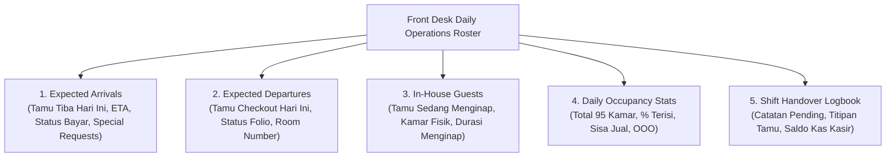

# PRD — Proposed 02: Front Desk Daily Operations Roster & Shift Board
# Hotel Booking Engine — Pulang ke Uttara (Yogyakarta)

- **Dokumen SRS Pasangan:** [SRS-Proposed-02](../../srs/proposed/02-front-desk-daily-operations-roster.md)
- **Status:** Proposed / Under Review
- **Target Role:** `receptionist`, `gm_admin`, `revenue_mgr`, `housekeeping`
- **Lingkup:** Manajemen Operasional Harian Front Desk & Serah Terima Shift (*Shift Handover*)

---

## 1. Latar Belakang & Urgensi Bisnis (Crucial Impact)

Front Desk adalah pusat saraf (*nerve center*) operasional hotel bintang 4. Resepsionis bekerja dalam sistem pergantian regu (*3 shifts: Morning 07:00–15:00, Afternoon 15:00–23:00, Night Audit 23:00–07:00*):
1. **Ketiadaan Visibilitas Harian Terpadu (*Fragmented Operational View*):**
   * Saat ini, staf resepsionis harus memfilter data reservasi satu per satu secara manual untuk mencari tamu yang tiba hari ini (*arrivals*) atau tamu yang harus keluar hari ini (*departures*).
   * Tanpa endpoint agregasi harian, resepsionis tidak memiliki panduan kerja harian untuk menyiapkan *registration card*, menyapa tamu VIP, atau mengantisipasi jam sibuk kedatangan (*peak arrival rush*).
2. **Kebutuhan Koordinasi Antar-Departemen (FO ⇄ Housekeeping):**
   * Housekeeping membutuhkan daftar *Expected Departures* sejak pagi hari untuk memprioritaskan kamar-kamar yang harus segera dibersihkan (*priority turnaround*) sebelum tamu *Expected Arrivals* berikutnya tiba.
3. **Pencatatan Log Serah Terima Shift (*Digital Shift Handover Log*):**
   * Hotel bintang 4 menuntut catatan tertulis saat pergantian shift: tugas pending, titipan kunci/koper tamu, keluhan tamu yang belum tuntas, dan verifikasi kas meja depan (*cash float*).

---

## 2. Profil Persona & Hak Akses (RBAC Matrix)

| Persona | Hak Akses | Kebutuhan Informasi Harian |
| :--- | :--- | :--- |
| **Resepsionis Meja Depan (`receptionist`)** | Read & Write Shift Notes | Membaca daftar *Arrivals*, *Departures*, *In-House*; mencatat estimasi kedatangan tamu; menulis dan membaca log serah terima shift. |
| **Housekeeping Supervisor (`housekeeping`)** | Read Departures & In-House | Memantau kamar mana saja yang sudah checkout agar segera dialokasikan tim pembersih. |
| **Revenue Manager (`revenue_mgr`)** | Read Statistics | Memantau *occupancy rate* harian hotel dan ketersediaan kamar yang tersisa untuk dijual *last-minute*. |
| **General Manager (`gm_admin`)** | Full Control & Audit | Meninjau kepatuhan operasional, catatan serah terima shift, dan ringkasan eksekutif harian hotel. |

---

## 3. Komponen Utama Roster Harian

---

## 4. Aturan Bisnis Utama (Business Rules)

- **BR-FD-01: Auto-Calculation of Daily Cohorts:**
  Sistem secara dinamis mengelompokkan data berdasarkan tanggal operasional hotel (WIB / UTC+7):
  - *Expected Arrivals:* Reservasi berstatus `confirmed` dengan `check_in = CURRENT_DATE`.
  - *Expected Departures:* Reservasi berstatus `checked_in` dengan `check_out = CURRENT_DATE`.
  - *In-House Guests:* Seluruh reservasi berstatus `checked_in` terlepas dari tanggal checkout.
- **BR-FD-02: Real-Time Occupancy Formula:**
  $$\text{Occupancy Rate (\%)} = \frac{\text{Jumlah Kamar Berstatus Occupied}}{\text{Total Kamar (95)} - \text{Kamar Out of Order (OOO)}} \times 100$$
- **BR-FD-03: Immutability of Handover Log:**
  Setiap entri catatan serah terima shift bersifat *append-only* (tidak dapat diedit/dihapus setelah dikirim) untuk menjaga integritas jejak audit operasional.

---

## 5. Kriteria Keberterimaan (Acceptance Criteria)

- [ ] **AC-FD-01:** Endpoint `GET /api/v1/front-desk/daily-roster` menyajikan ringkasan *Arrivals*, *Departures*, *In-House*, dan metrik okupansi secara real-time.
- [ ] **AC-FD-02:** Setiap baris reservasi pada daftar *Arrivals* menyertakan indikator status pembayaran (`paid`, `unpaid`, `partial`), jam estimasi tiba (*ETA*), dan ringkasan *special request*.
- [ ] **AC-FD-03:** Endpoint `POST /api/v1/front-desk/handover-notes` memungkinkan staf mencatat log serah terima shift beserta timestamp dan identitas staf.
- [ ] **AC-FD-04:** Endpoint `GET /api/v1/front-desk/handover-notes` menyajikan riwayat catatan shift 7 hari terakhir.
