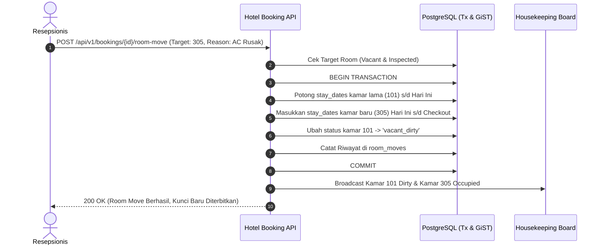

# PRD — Proposed 03: Stay Modification: Room Move & Stay Extension
# Hotel Booking Engine — Pulang ke Uttara (Yogyakarta)

- **Dokumen SRS Pasangan:** [SRS-Proposed-03](../../srs/proposed/03-stay-modification-room-move-and-extension.md)
- **Status:** Proposed / Under Review
- **Target Role:** `receptionist`, `gm_admin`, `finance`, `housekeeping`
- **Lingkup:** Manajemen Transaksi Modifikasi Masa Menginap Tamu (*In-House Stay Lifecycle*)

---

## 1. Latar Belakang & Urgensi Bisnis (Crucial Impact)

Pada operasional harian hotel bintang 4, masa menginap tamu (*in-house stay*) bersifat dinamis dan sering mengalami perubahan:
1. **Pemindahan Kamar Fisik (*Room Move*):**
   * Tamu sering meminta pindah kamar karena keluhan teknis (AC kurang dingin, kebisingan jalan Kaliurang, saluran air mampet) atau *upsell upgrade* ke tipe kamar yang lebih tinggi.
   * Saat ini, tabel `room_assignments` menggunakan PostgreSQL GiST exclusion constraint (`EXCLUDE USING GIST (room_number WITH =, stay_dates WITH &&)`). Resepsionis tidak dapat memindahkan kamar tanpa merusak integritas database kecuali dibuat use case atomik: memotong rentang tanggal kamar lama, memasang kamar baru, dan mengubah status kamar lama menjadi `dirty`.
2. **Perpanjangan Menginap (*Stay Extension*):**
   * Tamu bisnis atau wisatawan sering memperpanjang waktu menginap (*extend*) 1 hingga 3 malam tambahan.
   * Proses perpanjangan membutuhkan verifikasi ketersediaan inventaris harian, penghitungan tarif dinamis (*dynamic rates*) untuk malam tambahan, dan penyesuaian tanggal checkout secara otomatis.
3. **Pemberitahuan Otomatis ke Housekeeping:**
   * Setiap kali tamu pindah kamar (*room move*), kamar lama seketika berstatus `vacant_dirty` agar tim kebersihan segera mencuci dan mengganti sprei kamar tersebut.

---

## 2. Profil Persona & Hak Akses (RBAC Matrix)

| Persona | Hak Akses | Batas Tanggung Jawab Operasional |
| :--- | :--- | :--- |
| **Resepsionis Meja Depan (`receptionist`)** | Eksekusi Modifikasi | Melakukan pemindahan kamar (*room move*) pada tipe yang sama; memproses perpanjangan menginap (*extend stay*) dengan penagihan biaya tambahan. |
| **Staf Keuangan (`finance`)** | Audit Billing & Folio | Memantau penambahan tagihan (*additional charges*) dari perpanjangan menginap atau selisih tarif upgrade kamar. |
| **Housekeeping (`housekeeping`)** | Notifikasi Kamar Kotor | Menerima sinyal instan bahwa kamar lama telah ditinggalkan dan siap dibersihkan. |
| **General Manager (`gm_admin`)** | Full Control & Override | Menyetujui upgrade kamar tanpa biaya (*complimentary room upgrade*) atas dasar kompensasi keluhan tamu. |

---

## 3. Diagram Alur Transaksi Room Move

---

## 4. Aturan Bisnis Utama (Business Rules)

- **BR-STAY-01: Target Room Readiness Guard:**
  Kamar target untuk pemindahan (*room move*) wajib berada dalam status `inspected`. Sistem menolak pemindahan ke kamar yang masih `dirty` atau `cleaning`.
- **BR-STAY-02: Atomisitas GiST Constraint pada Room Move:**
  Pemindahan kamar memotong `daterange` kamar asal menjadi `[check_in, CURRENT_DATE)` dan membuat baris baru di `room_assignments` untuk kamar baru dengan rentang `[CURRENT_DATE, check_out)`.
- **BR-STAY-03: Dynamic Extension Pricing:**
  Malam tambahan dari *stay extension* wajib dihitung berdasarkan mesin tarif (*pricing engine*) untuk tanggal-tanggal tambahan tersebut (termasuk penyesuaian tarif akhir pekan).
- **BR-STAY-04: Mandatory Reason for Room Move:**
  Setiap *room move* wajib menyertakan alasan (`maintenance_defect`, `noise_complaint`, `upgrade`, `guest_request`).

---

## 5. Kriteria Keberterimaan (Acceptance Criteria)

- [ ] **AC-STAY-01:** Endpoint `POST /api/v1/bookings/{id}/room-move` memindahkan kamar fisik tamu aktif tanpa melanggar GiST exclusion constraint.
- [ ] **AC-STAY-02:** Kamar yang ditinggalkan saat room move otomatis berubah status menjadi `vacant_dirty`.
- [ ] **AC-STAY-03:** Endpoint `POST /api/v1/bookings/{id}/extend-stay` memvalidasi ketersediaan inventaris, memperpanjang tanggal checkout, dan membuat tagihan delta.
- [ ] **AC-STAY-04:** Riwayat pemindahan kamar tercatat dalam tabel `room_move_logs` untuk jejak audit hotel.
