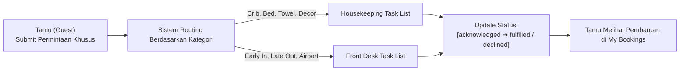

# PRD — Proposed 04: Guest Assistance & Special Requests Management
# Hotel Booking Engine — Pulang ke Uttara (Yogyakarta)

- **Dokumen SRS Pasangan:** [SRS-Proposed-04](../../srs/proposed/04-guest-assistance-and-special-requests.md)
- **Status:** Proposed / Under Review
- **Target Role:** `guest`, `receptionist`, `housekeeping`, `gm_admin`
- **Lingkup:** Manajemen Permintaan Khusus & Personalisasi Tamu (*Guest Service Fulfillment*)

---

## 1. Latar Belakang & Urgensi Bisnis (Crucial Impact)

Sebagai hotel butik bintang 4 di kawasan prestisius Kaliurang Yogyakarta, *Pulang ke Uttara* membedakan dirinya melalui **pelayanan ramah dan personalisasi pengalaman menginap**:
1. **Kelemahan Penyimpanan Teks Statis (*The Limitation of Free-Text Notes*):**
   * Saat ini, kolom `special_requests` pada tabel `bookings` hanya berupa string teks bebas tanpa status pemenuhan (*fulfillment tracking*).
   * Resepsionis dan Housekeeping sering kali melewatkan permintaan penting (seperti setup bulan madu / *honeymoon setup*, *baby crib*, atau alergi makanan) karena tidak ada daftar tugas terstruktur (*actionable task list*).
2. **Kebutuhan Komunikasi Dua Arah Tamu & Staf Hotel:**
   * Tamu yang memesan jauh hari sering kali ingin menambahkan permintaan khusus beberapa hari menjelang kedatangan melalui portal *My Bookings*.
   * Tamu berhak mengetahui apakah permintaannya disetujui (*confirmed/acknowledged*), sedang disiapkan (*in preparation*), atau tidak dapat dipenuhi (*declined*, misal: kamar lantai tinggi penuh) demi transparansi ekspektasi.
3. **Penyaluran Tugas Otomatis (*Departmental Routing*):**
   * Permintaan bantal tambahan atau *baby crib* wajib masuk ke antrean tugas **Housekeeping**.
   * Permintaan *early check-in* atau penjemputan bandara wajib masuk ke antrean tugas **Front Desk**.

---

## 2. Profil Persona & Hak Akses (RBAC Matrix)

| Persona | Hak Akses | Batas Tanggung Jawab Operasional |
| :--- | :--- | :--- |
| **Tamu Terverifikasi (`guest`)** | Sesi Privat (OTP) | Mengajukan, memperbarui, atau membatalkan permintaan khusus pada reservasinya sendiri. Melihat status persetujuan staf. |
| **Resepsionis (`receptionist`)** | Review & Fulfill FO | Meninjau permintaan kedatangan/keberangkatan (*early/late*), konfirmasi penjemputan, dan menandai status pemenuhan. |
| **Housekeeping (`housekeeping`)** | Review & Fulfill HK | Meninjau permintaan perlengkapan kamar (*crib, extra towel, honeymoon decoration*), menandai kesiapan di kamar fisik. |
| **General Manager (`gm_admin`)** | Full Control & Audit | Memantau rasio pemenuhan permintaan tamu (*request fulfillment rate*) sebagai KPI kualitas layanan hotel. |

---

## 3. Kategori Permintaan Khusus & Alur Kerja

---

## 4. Aturan Bisnis Utama (Business Rules)

- **BR-REQ-01: Anti-IDOR Request Submission:**
  Tamu hanya dapat mengajukan permintaan khusus pada reservasi yang terikat dengan email sesi aktifnya (`guest_email = session.email`).
- **BR-REQ-02: Structured Categorization:**
  Setiap permintaan diklasifikasikan ke dalam kategori baku: `early_arrival`, `late_departure`, `high_floor`, `quiet_room`, `bed_type`, `celebration_setup`, `baby_crib`, `dietary_allergy`, `other`.
- **BR-REQ-03: Mandatory Departmental Ownership:**
  Sistem secara otomatis menetapkan `responsible_department` (`front_desk` atau `housekeeping`) berdasarkan kategori permintaan.
- **BR-REQ-04: Non-Guaranteed Disclaimer:**
  Permintaan khusus berstatus `non-guaranteed` (bergantung pada ketersediaan kamar saat check-in). Staf wajib memberikan catatan alasan jika menolak (*declined*) permintaan.

---

## 5. Kriteria Keberterimaan (Acceptance Criteria)

- [ ] **AC-REQ-01:** Tabel `booking_special_requests` mendukung status pemenuhan (`pending`, `acknowledged`, `fulfilled`, `declined`).
- [ ] **AC-REQ-02:** Endpoint `POST /api/v1/guest/bookings/{id}/special-requests` memungkinkan tamu menambahkan permintaan khusus terstruktur.
- [ ] **AC-REQ-03:** Endpoint `GET /api/v1/front-desk/special-requests` menyajikan antrean permintaan terfilter untuk staf FO dan HK.
- [ ] **AC-REQ-04:** Endpoint `PUT /api/v1/front-desk/special-requests/{id}/status` memperbarui status pemenuhan beserta catatan staf.
