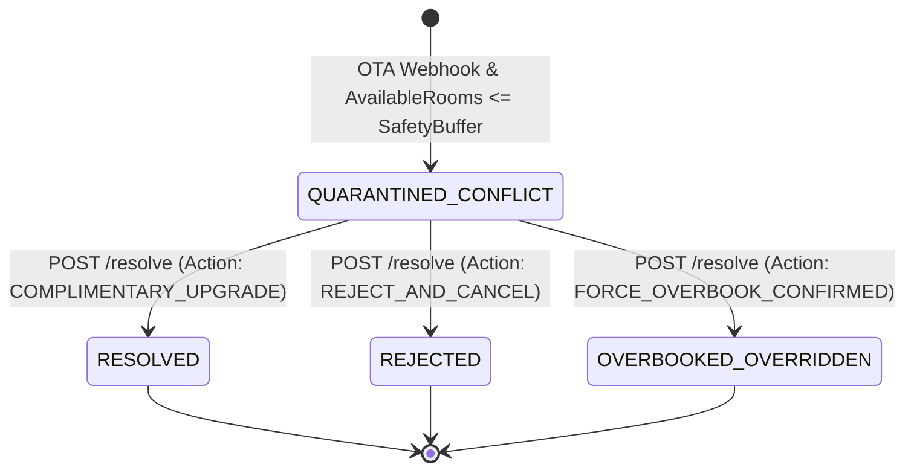

# Software Requirements Specification (SRS)
# Last-Room Hospitality Safeguards: LRDA Safety Buffer, Dynamic Hold & 1-Click Complimentary Upgrade
**Hotel Booking Engine — Pulang ke Uttara (Yogyakarta)**

- **Dokumen Identitas:** `SRS-FEAT-LAST-ROOM-SAFEGUARDS-2026-10-04`
- **Tanggal Efektif:** 4 Oktober 2026
- **Status Dokumen:** APPROVED / IN IMPLEMENTATION
- **Penanggung Jawab:** Lead Systems Architect & Principal Hospitality Engineer
- **Target Properti:** Hotel Pulang ke Uttara (95 Kamar, Sleman, D.I. Yogyakarta)
- **Dokumen Pasangan Terkait:**
  - PRD: [`docs/prd/last-room-safeguards-and-complimentary-upgrade-2026-10-04.md`](file:///mnt/code/projects/jobs/pulang/current-booking/docs/prd/last-room-safeguards-and-complimentary-upgrade-2026-10-04.md)
  - Arsitektur Teknis: [`docs/tech/last-room-safeguards-and-complimentary-upgrade-architecture-2026-10-04.md`](file:///mnt/code/projects/jobs/pulang/current-booking/docs/tech/last-room-safeguards-and-complimentary-upgrade-architecture-2026-10-04.md)
  - Walkthrough Tracking: [`docs/walkthrough/last-room-safeguards-and-complimentary-upgrade-walkthrough-2026-10-04.md`](file:///mnt/code/projects/jobs/pulang/current-booking/docs/walkthrough/last-room-safeguards-and-complimentary-upgrade-walkthrough-2026-10-04.md)

---

## 1. Kebutuhan Fungsional (Functional Requirements)

### FR-LRDA-01 (Last-Room Direct Allocation / Safety Buffer per Channel Partner)
1. Setiap mitra kanal eksternal (`channel_partners`) wajib memiliki atribut konfigurasi alokasi `safety_buffer` bertipe integer (default: 1, minimum: 0).
2. Ketika webhook reservasi masuk dari mitra kanal OTA diproses (`POST /api/v1/channel-events`), sistem wajib mengevaluasi ketersediaan fisik kamar untuk seluruh rentang tanggal `[check_in, check_out)` terhadap nilai `safety_buffer` mitra:
   $$\text{AvailableRooms} - \text{RequestedRooms} \ge \text{safety\_buffer}$$
3. Jika pada satu malam saja sisa kamar setelah pengurangan akan bernilai kurang dari `safety_buffer`, pemesanan dari kanal luar **wajib ditolak** dengan HTTP `409 Conflict` (`ALLOTMENT_EXHAUSTED`).
4. Kamar terakhir yang berada di dalam ambang batas `safety_buffer` ini 100% dialokasikan secara eksklusif untuk **Direct Web Booking** (situs resmi `pulangkeuttara.id`) dan **Walk-in Meja Depan**, guna mengamankan margin profit hotel tanpa potongan komisi pihak ketiga (15%-20%).

### FR-LRDA-02 (Dynamic Last-Room Hold Timeout / Anti-Ghost Booking)
1. Pada proses pembuatan reservasi direct tamu publik (`POST /api/v1/bookings`):
   - Jika untuk seluruh malam yang dipesan ketersediaan kamar $\ge 2$: durasi penahanan stok (*hold expiry*) adalah standar **30 menit** (`30 * time.Minute`).
   - Jika terdapat setidaknya 1 malam di mana ketersediaan kamar bernilai kritis $\le 1$: durasi penahanan stok otomatis dipersingkat menjadi **15 menit** (`15 * time.Minute` atau setengah dari durasi reguler).
2. Batas waktu ini dihitung secara presisi sejak timestamp pembuatan pesanan dan disimpan pada kolom `expires_at` tabel `bookings`.
3. Hitung mundur (*countdown timer*) pada portal web tamu dan aliran Server-Sent Events (SSE) wajib mencerminkan durasi 15 menit ini untuk mencegah penahanan inventaris kamar kosong secara sia-sia (*ghost holds*).

### FR-LRDA-03 (Automated Quota Quarantine & Live Front Desk Conflict Escalation)
1. Setiap kali terjadi penolakan pemesanan kanal eksternal akibat alokasi habis atau pelanggaran `safety_buffer`, sistem wajib secara atomik:
   - Mencatat event masuk di `channel_event_inbox` dengan status `QUARANTINED`.
   - Membuat baris insiden di `channel_sync_issues` dengan status `QUARANTINED_CONFLICT`, mencantumkan provider, external reference, tipe kamar, rentang tanggal, nama tamu, dan deskripsi penyebab.
   - Menerbitkan event peringatan instan ke NATS JetStream / EventBus pada subjek `hospitality.channel.conflict` dengan event `channel_conflict`.
2. Staf front desk yang terhubung ke live SSE stream (`/api/v1/front-desk/live-stream`) menerima notifikasi push instan berisi informasi kamar yang bentrok, nama tamu OTA, dan nomor referensi eksternal.

### FR-LRDA-04 (1-Click Complimentary Upgrade Resolution Engine)
1. Sistem wajib menyediakan endpoint operasional staf:
   `POST /api/v1/staff/channel-sync-issues/:id/resolve`
2. Staf berwenang dapat menyelesaikan insiden karantina dengan aksi `COMPLIMENTARY_UPGRADE` dan menyertakan `target_room_type_id` (tipe kamar yang lebih tinggi, misal Deluxe atau Suite).
3. Saat aksi `COMPLIMENTARY_UPGRADE` dieksekusi:
   - Sistem wajib memeriksa ketersediaan kamar pada tipe kamar target untuk tanggal reservasi yang bersangkutan.
   - Secara atomik memotong stok kamar target (`LockAndDecrement` atau pengurangan inventaris) sehingga inventaris hotel tetap 100% konsisten dan terhindar dari *physical overbooking*.
   - Memperbarui status isu di `channel_sync_issues` menjadi `RESOLVED`, mencatat `resolved_by` (username staf), `resolved_at` (timestamp UTC), `upgrade_room_type_id`, dan catatan penanganan (*notes*).
   - Mengembalikan data isu yang telah diperbarui beserta rincian kamar upgrade.

### FR-LRDA-05 (Alternative Resolution Pathways: Rejection & Management Override)
1. Selain complimentary upgrade, staf dapat menyelesaikan isu dengan aksi:
   - `REJECT_AND_CANCEL`: Menolak reservasi overbooking secara permanen, memperbarui status menjadi `REJECTED`, dan memicu notifikasi pembatalan ke pihak OTA.
   - `FORCE_OVERBOOK_CONFIRMED`: Menyetujui kelebihan kapasitas fisik dengan otorisasi khusus General Manager / Revenue Manager (misal mengalokasikan kamar cadangan darurat manajemen), memperbarui status menjadi `OVERBOOKED_OVERRIDDEN`.

### FR-LRDA-06 (Outbound Real-Time Stop-Sell Dispatcher)
1. Setiap kali reservasi direct atau walk-in berhasil memotong stok kamar suatu tipe hingga menyentuh ambang batas kritis ($\text{AvailableRooms} \le \text{safety\_buffer}$):
   - Sistem wajib menerbitkan event `channel.outbound_stopsell` ke bus event / outbox.
   - Dispatcher mengirimkan notifikasi HTTP Webhook ke endpoint mitra OTA untuk menutup penjualan tipe kamar tersebut pada tanggal terkait (*Stop-Sell push broadcast*).

### FR-LRDA-07 (Role-Based Access Control & Audit Trail)
1. Hak akses resolusi isu sinkronisasi kanal dibatasi secara ketat via Casbin RBAC:
   - Role yang diizinkan (`POST /api/v1/staff/channel-sync-issues/:id/resolve`): `receptionist`, `revenue_mgr`, `gm_admin`.
   - Role `receptionist` juga diizinkan membaca daftar isu (`GET /api/v1/staff/channel-sync-issues`) untuk penanganan tamu yang tiba di meja depan.
   - Role `housekeeping`, `guest`, dan publik dilarang keras (HTTP `403 Forbidden`).
2. Setiap aksi resolusi wajib mencatat identitas staf pengeksekusi (`resolved_by`) dari JWT klaim `sub` / `username` dan timestamp `resolved_at`.

---

## 2. Spesifikasi Antarmuka HTTP RESTful (API Contracts)

---

### 2.1 POST `/api/v1/channel-events` (Enforced Safety Buffer)
Endpoint penerima webhook reservasi dari mitra OTA pihak ketiga.

* **Headers:**
  - `Content-Type: application/json`
  - `X-Channel-Provider: AGODA` (atau `TRAVELOKA`)
  - `X-Channel-Signature: t=1728000000,v1=...` (HMAC-SHA256)
  - `Idempotency-Key: evt_agd_20261004_1001`
* **Request Body `application/json`:**
  ```json
  {
    "provider": "AGODA",
    "event_id": "evt_agd_20261004_1001",
    "event_type": "reservation_created",
    "external_reference": "AGD-2026-99218",
    "room_type_id": "01900000-0000-7000-8000-000000000001",
    "check_in": "2026-10-15",
    "check_out": "2026-10-17",
    "rooms": 1,
    "guest_name": "Dr. Bambang Kusumo",
    "guest_email": "bambang.kusumo@example.com",
    "guest_phone": "+6281122334455",
    "total_payout_idr": 1950000
  }
  ```
* **Success Response `202 Accepted`:** (Jika stok kamar $> \text{safety\_buffer}$)
  ```json
  {
    "status": "ACCEPTED",
    "event_id": "evt_agd_20261004_1001",
    "message": "Event telah diterima dan sedang diproses secara asinkron",
    "timestamp": "2026-10-04T11:40:00Z"
  }
  ```
* **Conflict Response `409 Conflict`:** (Jika stok kamar $\le \text{safety\_buffer}$)
  ```json
  {
    "code": "ALLOTMENT_EXHAUSTED",
    "message": "Kamar penuh atau kuota alokasi OTA telah habis (Safety buffer direct protection active)",
    "details": {
      "provider": "AGODA",
      "external_reference": "AGD-2026-99218",
      "quarantined": true,
      "quarantine_issue_url": "/api/v1/staff/channel-sync-issues"
    }
  }
  ```

---

### 2.2 GET `/api/v1/staff/channel-sync-issues`
Melihat daftar insiden karantina inventaris kanal untuk ditindaklanjuti oleh staf.

* **Headers:** `Authorization: Bearer stf_jwt_<token>`
* **Otorisasi RBAC:** `receptionist`, `revenue_mgr`, `gm_admin`.
* **Response `200 OK`:**
  ```json
  {
    "issues": [
      {
        "id": "019234a5-c999-7000-8000-000000000001",
        "provider": "AGODA",
        "external_reference": "AGD-2026-99218",
        "event_type": "reservation_created",
        "room_type_id": "01900000-0000-7000-8000-000000000001",
        "status": "QUARANTINED_CONFLICT",
        "reason": "Kamar penuh/kuota tidak mencukupi untuk 2026-10-15 s.d 2026-10-17: inventory: insufficient rooms (safety buffer protected)",
        "upgrade_room_type_id": null,
        "notes": "",
        "resolved_by": "",
        "resolved_at": null,
        "created_at": "2026-10-04T11:40:00Z"
      }
    ]
  }
  ```

---

### 2.3 POST `/api/v1/staff/channel-sync-issues/:id/resolve`
Mengeksekusi penyelesaian operasional atas insiden karantina (Complimentary Upgrade, Rejection, atau Overbook Override).

* **Headers:**
  - `Authorization: Bearer stf_jwt_<token>`
  - `Content-Type: application/json`
* **Path Parameters:**
  - `id` (UUID, required): ID baris isu sinkronisasi di `channel_sync_issues`.
* **Otorisasi RBAC:**
  - Diizinkan: `receptionist`, `revenue_mgr`, `gm_admin`.
  - Dilarang: `housekeeping`, `guest`, publik (HTTP `403 Forbidden`).
* **Request Body `application/json` (Aksi 1: Complimentary Upgrade):**
  ```json
  {
    "action": "COMPLIMENTARY_UPGRADE",
    "target_room_type_id": "01900000-0000-7000-8000-000000000002",
    "notes": "Upgrade gratis dari Superior ke Deluxe Room atas kebijakan Meja Depan untuk tamu loyal Agoda"
  }
  ```
* **Request Body `application/json` (Aksi 2: Reject & Cancel):**
  ```json
  {
    "action": "REJECT_AND_CANCEL",
    "notes": "Hotel penuh, tamu dihubungi untuk relokasi ke properti rekanan"
  }
  ```
* **Success Response `200 OK` (Complimentary Upgrade):**
  ```json
  {
    "status": "SUCCESS",
    "message": "Insiden karantina berhasil diselesaikan dengan Complimentary Room Upgrade",
    "issue": {
      "id": "019234a5-c999-7000-8000-000000000001",
      "provider": "AGODA",
      "external_reference": "AGD-2026-99218",
      "status": "RESOLVED",
      "action_taken": "COMPLIMENTARY_UPGRADE",
      "original_room_type_id": "01900000-0000-7000-8000-000000000001",
      "upgrade_room_type_id": "01900000-0000-7000-8000-000000000002",
      "notes": "Upgrade gratis dari Superior ke Deluxe Room atas kebijakan Meja Depan untuk tamu loyal Agoda",
      "resolved_by": "receptionist_rini",
      "resolved_at": "2026-10-04T11:45:00Z"
    }
  }
  ```
* **Error Response `400 Bad Request`:**
  - `INVALID_ACTION`: Action tidak dikenali (hanya `COMPLIMENTARY_UPGRADE`, `REJECT_AND_CANCEL`, `FORCE_OVERBOOK_CONFIRMED`).
  - `MISSING_TARGET_ROOM_TYPE`: Aksi `COMPLIMENTARY_UPGRADE` mewajibkan `target_room_type_id`.
* **Error Response `404 Not Found`:**
  - `ISSUE_NOT_FOUND`: ID isu tidak ditemukan.
* **Error Response `409 Conflict`:**
  - `ISSUE_ALREADY_RESOLVED`: Isu sudah diselesaikan sebelumnya oleh staf lain.
  - `TARGET_ROOM_UNAVAILABLE`: Kamar pada tipe target upgrade tidak memiliki ketersediaan yang cukup.

---

### 2.4 POST `/api/v1/bookings` (Dynamic Hold Duration Contract)
Pembuatan reservasi direct oleh tamu publik.

* **Headers:** `Content-Type: application/json`
* **Request Body:** Standard `CreateBookingRequest` (termasuk `quote_id`, `check_in`, `check_out`, dll).
* **Response `201 Created`:**
  ```json
  {
    "booking": {
      "id": "019234a5-b123-7000-8000-000000000001",
      "room_type_id": "01900000-0000-7000-8000-000000000001",
      "status": "PENDING",
      "expires_at": "2026-10-04T12:00:00Z",
      "hold_duration_minutes": 15,
      "is_critical_inventory": true
    }
  }
  ```
  *(Catatan: Jika sisa kamar $\le 1$, `expires_at` disetel tepat 15 menit ke depan; jika sisa kamar $\ge 2$, `expires_at` disetel 30 menit ke depan).*

---

## 3. Spesifikasi Skema Database & Migrasi (Goose `00022`)

```sql
-- +goose Up
-- 1. Tambahkan safety_buffer pada channel_partners
ALTER TABLE channel_partners 
ADD COLUMN IF NOT EXISTS safety_buffer INT NOT NULL DEFAULT 1;

-- 2. Tambahkan kolom resolusi pada channel_sync_issues
ALTER TABLE channel_sync_issues
ADD COLUMN IF NOT EXISTS upgrade_room_type_id UUID REFERENCES room_types(id) ON DELETE SET NULL,
ADD COLUMN IF NOT EXISTS notes TEXT NOT NULL DEFAULT '';

-- 3. Kebijakan RBAC Casbin untuk Meja Depan dan Resolusi Sinkronisasi
INSERT INTO casbin_rule (ptype, v0, v1, v2) VALUES
    ('p', 'receptionist', '/api/v1/staff/channel-sync-issues', 'GET'),
    ('p', 'receptionist', '/api/v1/staff/channel-sync-issues/:id/resolve', 'POST'),
    ('p', 'revenue_mgr', '/api/v1/staff/channel-sync-issues/:id/resolve', 'POST'),
    ('p', 'gm_admin', '/api/v1/staff/channel-sync-issues/:id/resolve', 'POST')
ON CONFLICT DO NOTHING;

-- +goose Down
DELETE FROM casbin_rule WHERE ptype = 'p' AND v1 = '/api/v1/staff/channel-sync-issues/:id/resolve';
ALTER TABLE channel_sync_issues DROP COLUMN IF EXISTS notes;
ALTER TABLE channel_sync_issues DROP COLUMN IF EXISTS upgrade_room_type_id;
ALTER TABLE channel_partners DROP COLUMN IF EXISTS safety_buffer;
```

---

## 4. Matriks Siklus Hidup Status Isu Sinkronisasi (*State Transitions*)



---

## 5. Kebutuhan Non-Fungsional (Non-Functional Requirements)

1. **Atomisitas Transaksional (ACID & Zero Data Races):**
   - Penyesuaian stok kamar target pada saat `COMPLIMENTARY_UPGRADE` wajib berada dalam transaksi database atau memanfaatkan atomic decrement yang terkunci (`FOR UPDATE`) untuk mencegah pemindahan ke kamar yang ternyata juga sudah terisi.
2. **Kepatuhan Anti-Overengineering (*Ponytail Level Lite/Standard*):**
   - Tidak menambahkan dependency eksternal baru. Menggunakan pgxpool yang telah tersedia dan Casbin RBAC yang sudah terpasang.
3. **Audit Trail Immutability:**
   - Rekam jejak staf (`resolved_by`, `resolved_at`, dan `notes`) bersifat permanen dan tidak dapat ditimpa setelah berstatus `RESOLVED`.
4. **Verifikasi Kualitas Kode:**
   - Table-driven tests dengan cakupan statement coverage $\ge 80\%$.
   - Bebas dari deteksi data race (`go test -race ./...`).
   - Lolos audit statis `go vet ./...`.
