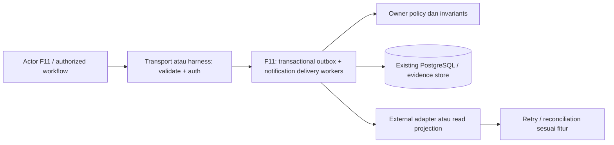

# TECH — Notifikasi booking, payment dan operasional

ID: TECH-F11-2026-10-03. Status: PROPOSED / REQUIRES ARCHITECTURE REVIEW.
Tanggal: 3 Oktober 2026 (Asia/Jakarta). Owner: BE workers + communications provider + hotel.
[PRD-F11](../prd/11-notification-delivery-2026-10-03.md) · [SRS-F11](../srs/11-notification-delivery-2026-10-03.md) · [Tech registry](README.md).

## 1. Outcome, scope dan evidence

Booking dapat committed tetapi tamu/staff tidak menerima informasi atau sistem mengklaim delivery hanya dari log.

Target teknis: Owner-reviewed templates, event dedup, email default proposal, staff alerts, delivery history/redrive.
Di luar scope: WhatsApp/SMS belum disepakati; marketing newsletter/consent tidak digabung transaksi.

Audit menyebut LogNotifier/event log, bukan pengiriman nyata. Email vendor belum diobservasi.
Dokumen ini adalah target desain, bukan bukti implementasi atau re-audit source terbaru. Backend sedang berubah; cek source, SQL, version/runtime dan existing owner sebelum mengedit.
Rancangan menambah use case di existing modular monolith; tidak membangun service baru atau mengganti pemilik kontrak fitur lain.
Lihat [kontrak/keputusan C01–C14](../srs/00-shared-contracts-and-decisions-2026-10-03.md). Status approved dokumen existing tidak dipindahkan ke dokumen ini.

## 2. Prerequisite dan authority

- [F12 Identitas staff, izin dan audit perubahan](12-staff-identity-permissions-and-audit-architecture-2026-10-03.md).
Bootstrap email access challenge tidak memerlukan payment selesai. Template payment/confirmed diaktifkan setelah event F05 verified sehingga dependency F02→F11→F12 tidak menjadi siklus.

Authority domain: Go/PostgreSQL untuk booking/quote/inventory/payment; verified identity untuk guest/staff; provider hanya melalui verified adapter. FE memegang view state, bukan otoritas financial/stock/policy. Retention, provider, stock allocation, TTL dan thresholds yang belum approved tetap keputusan terbuka.

## 3. Arsitektur dan batas komponen

Module/use case: **transactional outbox + notification delivery workers**.

Diagram menunjukkan logical ownership, bukan deployable microservices. Untuk pure read F03, external adapter adalah DTO projection; untuk F15, harness/evidence bukan HTTP publik.
Manual constructor injection dan ports yang dibutuhkan use case cukup; jangan tambah DI framework/state library/message broker tanpa kebutuhan terukur. Nuxt/BFF bila dipilih hanya session/proxy boundary, tidak menghitung ulang harga atau stock.

Ports/adapters yang diperlukan: Outbox repository/lease, template renderer, sender provider, callback verifier, delivery store, retry policy.
Interface signature Go final ditetapkan setelah current source/version/owner contract diperiksa; tidak menghasilkan skeletal interfaces yang hanya meniru semua repository.

## 4. Model data dan constraints proposal

| Record / sumber | Field / hubungan | Constraints / consistency |
|---|---|---|
| domain_outbox | Existing event ID/payload/ref/created/processing state | Written same tx domain; claim lease/retry so crashed worker recover |
| notification_deliveries | event, recipient reference,channel,template version,state/provider reference | Unique logical event+recipient+channel+template version; secret-free logs |
| notification_event_inbox/redrives | verified provider callback,event_id,attempt/ref,actor reason | Dedup callback; resend scope/idempotency prevents duplicate logical delivery |

Nama tabel bertanda proposal adalah logical model, belum migration yang dijalankan. Reuse existing owner tables jika sudah tersedia; jangan membuat dua ledger/session/quote store untuk domain yang sama.
Opaque IDs memakai strategi existing owner; UUIDv7 database function/version hanya dipakai jika actual runtime/migration capability verified. Foreign keys/history retention harus mencegah cleanup UI menghapus financial evidence.

Query/index review:
- Equality tenant/property/owner sebelum tanggal/status/pagination untuk records privat.
- Cursor order stabil created_at/id; compose index sesuai actual query EXPLAIN, bukan menambah index setiap field.
- Unique keys untuk replay/event/intent scopes; conflicts dibedakan validation versus concurrent mutation.
- Harga integer currency/exponent sesuai owner Batch C; datetime UTC RFC3339 dan DateOnly hotel Asia/Jakarta.
- Version guard untuk edit staff; immutable snapshot untuk quote/policy yang sudah disetujui tamu.
- Retention/delete/anonymize membutuhkan owner approval dan pemeriksaan references; no destructive cascade default pada money/history.

## 5. Alur transaksi dan recovery

1. Producer transaction writes domain update/outbox, never sends before commit.
2. Worker claims event with bounded lease, chooses snapshot template/recipient and durable send intent.
3. Provider call external; ambiguous result handled via provider dedup/lookup or explicitly possible duplicate risk when provider lacks support.
4. Callback verifies signature/event ID and updates accepted/delivered/bounced without changing booking state.
5. Retry/backoff budget and dead-letter notify owner; authorized redrive audited using logical key.
6. Auth challenge email can bootstrap without payment dependency; confirmed templates require verified F05 event.

Batas transaksi lokal harus merangkum effects yang saling bergantung; external I/O tidak ditahan dalam DB row locks. Lock order eksplisit setelah entity table schema inspected; retry bounded hanya untuk conflict/deadlock yang aman dan idempotent.
Read/status refresh tidak membuat intent charge/refund/booking. State “unknown” tidak dianggap failed/success; user diarahkan ke status/reconciliation. Cancellation/reset/log-out adalah operasi berbeda, bukan alias delete financial history.

Domain/view state: queued → sending → provider_accepted → delivered/bounced/failed; dead_letter setelah retry budget.
Domain enum existing dipertahankan; serializer/adapter memetakan view tanpa mengganti enum approved secara sepihak.

## 6. HTTP/FE integration boundary

Endpoint/request/response/errors dimiliki [SRS-F11](../srs/11-notification-delivery-2026-10-03.md); contoh machine-readable ada di [OpenAPI proposal](../srs/contracts/booking-roadmap-proposal.openapi.json).
Transport validates bounded body/unknown fields/DateOnly/opaque IDs; normalize payload hanya setelah hashing strategy owner ditentukan. Existing Batch D raw-body hash/key1–64 dan nested guest DTO proposal perlu C14 alignment.
Guest read/mutation selalu resolve owner; staff role/property/action trusted; provider signature/raw bytes mengikuti provider, bukan static demo header.
FE adapter tidak membawa PII/access token di URL/localStorage/analytics; private views no-store dan dibersihkan setelah expired/revoked session. Fixture tetap terpisah dan labelled demo.

## 7. Keamanan dan privacy

guest: receive own event; reception: queue sesuai role; staff: authorized resend; worker: scoped provider credentials.
- Authorization server dan application resource policy melindungi HTTP maupun job/internal callers; role UI bukan izin domain.
- Cookie auth memerlukan CSRF, HttpOnly/Secure/SameSite/session expiry/revoke proposal review; token raw tidak dicetak/log.
- Generic cross-owner not-found dan auth challenge acceptance; rate limit scope berdasarkan risiko endpoint.
- Sensitive mutation audit mencatat trusted actor/reason/request_id/version; jika evidence mandatory gagal, transaction jangan silent succeed.
- Secrets/provider credentials hanya konfigurasi secret store/deployment owner. Sandbox berbeda live.
- Export/download/evidence PII dibatasi, masked/redacted dan retention disetujui. Tidak ada klaim compliance certification dari dokumen ini.

Risiko khusus: Provider dedup capability determines real duplicate-send guarantee; acceptance distinguishes logical delivery from actual sends.

## 8. ADR-F11-01 — At-least-once worker processing with idempotent logical delivery

Status: PROPOSED. Context: Booking dapat committed tetapi tamu/staff tidak menerima informasi atau sistem mengklaim delivery hanya dari log.
Keputusan yang diusulkan: At-least-once worker processing with idempotent logical delivery dalam modular monolith dan ports/adapters existing.
Alternatif/trade-off: Exactly-once physical external email cannot be assumed; direct send inside booking transaction blocks/loses atomicity; brand-new broker unnecessary.
Konsekuensi: invariant lokal mudah diuji dan ownership jelas; schema/retry/version semantics menambah tanggung jawab implementasi. Existing approved interfaces/state butuh review kompatibilitas; stakeholder sign-off sebelum accepted.
Approval record: belum ada. Owner mencatat pilihan/alasan/approver/tanggal/effective scope; tidak menganggap proposal ini accepted.

## 9. Observability, benchmark dan kapasitas

outbox lag, delivery accepted/delivered/fail/bounce, retry budget, lease recovery and dead-letter age.

Log terstruktur mencatat operation/result/request_id/resource reference redacted; metric labels tidak memakai email/booking ID/provider reference/high-cardinality IDs. Error stack internal tidak menjadi response publik.
Ukur p50/p95/p99, DB lock waits/query rows/pool saturation, worker backlog/retry dan allocations bila use case Go baru/refined. Pisahkan DB waktu, provider latency dan render/browser timing.
Workload baseline harus mencatat jumlah nights/rooms/occupancy/data/parallelism/rate dan mesin; status test fixture tidak disamakan beban produksi. SLO/timeout/retry budgets/RPO/RTO angka di-owner review setelah measurement; tidak mengklaim quote5ms dari dokumen owner sebagai hasil benchmark.

## 10. Rencana file/module dan migrasi

| Area | Tugas rencana |
|---|---|
| Nuxt FE | Typed DTO adapter, view states dan keyboard/error/recovery pada scope fitur |
| BE transport | Extend existing routes/middleware; compatibility/auth/errors mengikuti SRS owner |
| BE application/domain | Use cases pada transactional outbox + notification delivery workers; invariants, policy checks, stable error mapping |
| BE persistence | Reuse owner repositories; reviewed schema/index/unique/version changes |
| Workers/provider | Implement only ports needed; sandbox/retry/dedup/reconciliation bila ada external effects |
| Tests/evidence | Table-driven unit/handler, isolated integration, E2E + cleanup proof, physical-device bila UI |

Target direktori mengikuti current source organisasi cmd/internal/migrations/testing; nama/path file final dipetakan pada walkthrough, bukan diasumsikan semua package baru sudah ada.

Rollout/migration sequence:
1. Reconcile approved schema/contracts and OPEN decisions; freeze proposal revision yang diterapkan.
2. Expand additive columns/tables/indexes only after volume/locking/schema version review. Jangan reuse nomor migration yang sedang dikerjakan Batch D atau fitur lain.
3. Backfill dengan checkpoint/reconciliation, bounded batches, validated constraints; data fixture bukan data live seed.
4. Deploy compatibility readers/writers dan test old/new paths; feature flag/allowlist default sesuai approved rollout.
5. Verify real data effects/provider sandbox and owner acceptance; enable scope terbatas.
6. Contract/deprecate legacy hanya setelah consumers migrated; rollback aplikasi membiarkan schema additive/data histories aman.

Down migration yang menghapus ledger/booking/session evidence bukan default rollback produksi. Database restore/rollback tidak membatalkan provider charges/refunds; reconciliation F14/F15 harus diperhitungkan. Jika tidak perlu schema change (misal pure FE reset), dokumentasikan no-migration secara eksplisit saat actual implementation.

## 11. Traceability dan verification

| SRS requirement | Design owner | Verification |
|---|---|---|
| F11-FR-01 | Use case F11, policy/transport/persistence boundaries sesuai bagian 3–7 | PRD F11-AC-01; positive/negative/boundary, actual effects |
| F11-FR-02 | Use case F11, policy/transport/persistence boundaries sesuai bagian 3–7 | PRD F11-AC-02; positive/negative/boundary, actual effects |
| F11-FR-03 | Use case F11, policy/transport/persistence boundaries sesuai bagian 3–7 | PRD F11-AC-03; positive/negative/boundary, actual effects |
| F11-FR-04 | Use case F11, policy/transport/persistence boundaries sesuai bagian 3–7 | PRD F11-AC-04; positive/negative/boundary, actual effects |
| F11-FR-05 | Use case F11, policy/transport/persistence boundaries sesuai bagian 3–7 | PRD F11-AC-05; positive/negative/boundary, actual effects |
| F11-FR-06 | Use case F11, policy/transport/persistence boundaries sesuai bagian 3–7 | PRD F11-AC-06; positive/negative/boundary, actual effects |
| F11-FR-07 | Use case F11, policy/transport/persistence boundaries sesuai bagian 3–7 | PRD F11-AC-07; positive/negative/boundary, actual effects |

Named scenarios:
- F11-TECH-VT-1: Outbox commit failure rollback dan tidak send. Catat pre/post records, duplicate/rollback proof, command/environment/source hash/result dan cleanup.
- F11-TECH-VT-2: Duplicate worker/provider callback menghasilkan satu logical delivery. Catat pre/post records, duplicate/rollback proof, command/environment/source hash/result dan cleanup.
- F11-TECH-VT-3: Queue/provider down recovery/redrive bounded. Catat pre/post records, duplicate/rollback proof, command/environment/source hash/result dan cleanup.
- F11-TECH-VT-4: Invalid recipient bounce tidak mengubah confirmed/payment. Catat pre/post records, duplicate/rollback proof, command/environment/source hash/result dan cleanup.

Wajib unit/handler contract dan permissions matrix; Go package baru/refinement target >=80% table-driven coverage, go vet dan race sesuai AGENTS. SQL locks/GiST/unique/rollback diuji DB isolated; provider signatures/replay/sandbox dan actual email/channel delivery terpisah.
Browser refresh/back/expiry/keyboard/200%/reduced-motion bila UI; Chrome Android/Safari iOS actual dicatat sebagai actual, emulation tidak menggantikannya. Lint OpenAPI/compiled docs tidak menutup integration gates.

## 12. Handoff dan keputusan terbuka

Provider/channel, template/legal review, SLA, retry retention dan escalation recipients.
Tech-specific unresolved risk: Provider dedup capability determines real duplicate-send guarantee; acceptance distinguishes logical delivery from actual sends.

FE/BE/QA/hotel/ops mengisi approved contract revision, migration impact, rollout switch, rollback owner dan acceptance evidence. Status IMPLEMENTED_UNVERIFIED boleh setelah source tersedia; VERIFIED hanya setelah required tests actual. Paket dokumen ini tidak mengubah source/database/provider atau menjalankan deployment.

