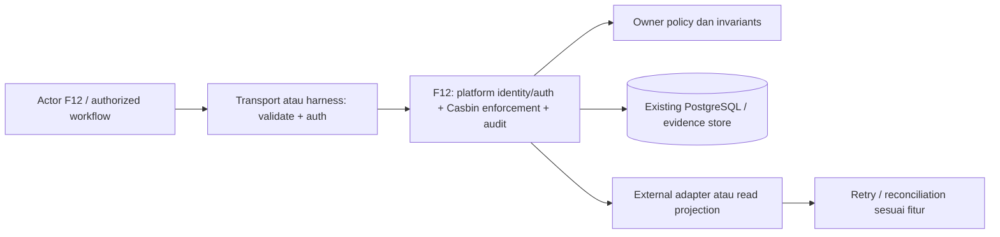

# TECH — Identitas staff, izin dan audit perubahan

ID: TECH-F12-2026-10-03. Status: PROPOSED / REQUIRES ARCHITECTURE REVIEW.
Tanggal: 3 Oktober 2026 (Asia/Jakarta). Owner: BE identity/security + GM; existing Casbin owner.
[PRD-F12](../prd/12-staff-identity-permissions-and-audit-2026-10-03.md) · [SRS-F12](../srs/12-staff-identity-permissions-and-audit-2026-10-03.md) · [Tech registry](README.md).

## 1. Outcome, scope dan evidence

Permission roles tidak cukup jika identity dapat dipalsukan atau protected route berjalan ketika enforcer gagal.

Target teknis: Trusted auth/session, fail-closed Casbin, property scope, role assignment, actor audit, protected ops boundaries.
Di luar scope: Tidak mengganti matriks Casbin approved tanpa amendment; guest endpoint dipisah dari staff.

Existing RBAC doc dan G14 audit: header identity belum trusted/fail-open. Ini persyaratan lanjutan, bukan klaim source saat ini belum diperbaiki.
Dokumen ini adalah target desain, bukan bukti implementasi atau re-audit source terbaru. Backend sedang berubah; cek source, SQL, version/runtime dan existing owner sebelum mengedit.
[Tech owner existing](hotel-rbac-casbin-architecture-2026-10-03.md) tetap dipertahankan. Extension/interoperability di sini membutuhkan amendment ketika berbeda dengan owner approved.
Lihat [kontrak/keputusan C01–C14](../srs/00-shared-contracts-and-decisions-2026-10-03.md). Status approved dokumen existing tidak dipindahkan ke dokumen ini.

## 2. Prerequisite dan authority

Tidak ada prerequisite fitur; owner decisions/identity boundary tetap berlaku sebelum live.

Authority domain: Go/PostgreSQL untuk booking/quote/inventory/payment; verified identity untuk guest/staff; provider hanya melalui verified adapter. FE memegang view state, bukan otoritas financial/stock/policy. Retention, provider, stock allocation, TTL dan thresholds yang belum approved tetap keputusan terbuka.

## 3. Arsitektur dan batas komponen

Module/use case: **platform identity/auth + Casbin enforcement + audit**.

Diagram menunjukkan logical ownership, bukan deployable microservices. Untuk pure read F03, external adapter adalah DTO projection; untuk F15, harness/evidence bukan HTTP publik.
Manual constructor injection dan ports yang dibutuhkan use case cukup; jangan tambah DI framework/state library/message broker tanpa kebutuhan terukur. Nuxt/BFF bila dipilih hanya session/proxy boundary, tidak menghitung ulang harga atau stock.

Ports/adapters yang diperlukan: Identity verifier, active-staff repository, authorizer/Casbin adapter, revocation store, audited transaction.
Interface signature Go final ditetapkan setelah current source/version/owner contract diperiksa; tidak menghasilkan skeletal interfaces yang hanya meniru semua repository.

## 4. Model data dan constraints proposal

| Record / sumber | Field / hubungan | Constraints / consistency |
|---|---|---|
| staff_users / casbin_rule | Reuse approved existing records; verified subject roles/property/active | Unique identity binding; public role headers ignored |
| staff session / revocation | Selected IdP or server session identity/expiry/revoke | Identity provider method not chosen; no home-grown header auth |
| audit_events | actor/action/resource/before-after redacted/reason/request/version | Append-only permission; sensitive mutation + audit atomic |

Nama tabel bertanda proposal adalah logical model, belum migration yang dijalankan. Reuse existing owner tables jika sudah tersedia; jangan membuat dua ledger/session/quote store untuk domain yang sama.
Opaque IDs memakai strategi existing owner; UUIDv7 database function/version hanya dipakai jika actual runtime/migration capability verified. Foreign keys/history retention harus mencegah cleanup UI menghapus financial evidence.

Query/index review:
- Equality tenant/property/owner sebelum tanggal/status/pagination untuk records privat.
- Cursor order stabil created_at/id; compose index sesuai actual query EXPLAIN, bukan menambah index setiap field.
- Unique keys untuk replay/event/intent scopes; conflicts dibedakan validation versus concurrent mutation.
- Harga integer currency/exponent sesuai owner Batch C; datetime UTC RFC3339 dan DateOnly hotel Asia/Jakarta.
- Version guard untuk edit staff; immutable snapshot untuk quote/policy yang sudah disetujui tamu.
- Retention/delete/anonymize membutuhkan owner approval dan pemeriksaan references; no destructive cascade default pada money/history.

## 5. Alur transaksi dan recovery

1. Verify staff identity signature/session against selected provider and audience; derive trusted subject.
2. Resolve active status/property + roles on server, check Casbin action and resource scope.
3. Enforcer init/loading failure refuses protected routes and readiness gate; no permissive nil fallback.
4. Mutation reads version and applies domain invariants; append audit in same local transaction.
5. Role change approval/step-up where required; revoke/role cache invalidation across instances before stale access window unacceptable.
6. Private response no-store; secret/PII redaction; guest/provider namespaces separate.

Batas transaksi lokal harus merangkum effects yang saling bergantung; external I/O tidak ditahan dalam DB row locks. Lock order eksplisit setelah entity table schema inspected; retry bounded hanya untuk conflict/deadlock yang aman dan idempotent.
Read/status refresh tidak membuat intent charge/refund/booking. State “unknown” tidak dianggap failed/success; user diarahkan ke status/reconciliation. Cancellation/reset/log-out adalah operasi berbeda, bukan alias delete financial history.

Domain/view state: staff active/inactive; session issued → revoked/expired; role assignment audit versioned.
Domain enum existing dipertahankan; serializer/adapter memetakan view tanpa mengganti enum approved secara sepihak.

## 6. HTTP/FE integration boundary

Endpoint/request/response/errors dimiliki [SRS-F12](../srs/12-staff-identity-permissions-and-audit-2026-10-03.md); contoh machine-readable ada di [OpenAPI proposal](../srs/contracts/booking-roadmap-proposal.openapi.json).
Transport validates bounded body/unknown fields/DateOnly/opaque IDs; normalize payload hanya setelah hashing strategy owner ditentukan. Existing Batch D raw-body hash/key1–64 dan nested guest DTO proposal perlu C14 alignment.
Guest read/mutation selalu resolve owner; staff role/property/action trusted; provider signature/raw bytes mengikuti provider, bukan static demo header.
FE adapter tidak membawa PII/access token di URL/localStorage/analytics; private views no-store dan dibersihkan setelah expired/revoked session. Fixture tetap terpisah dan labelled demo.

## 7. Keamanan dan privacy

receptionist/housekeeping/revenue_mgr/finance/gm_admin dari matriks approved; subject provider tidak sama dengan staff.
- Authorization server dan application resource policy melindungi HTTP maupun job/internal callers; role UI bukan izin domain.
- Cookie auth memerlukan CSRF, HttpOnly/Secure/SameSite/session expiry/revoke proposal review; token raw tidak dicetak/log.
- Generic cross-owner not-found dan auth challenge acceptance; rate limit scope berdasarkan risiko endpoint.
- Sensitive mutation audit mencatat trusted actor/reason/request_id/version; jika evidence mandatory gagal, transaction jangan silent succeed.
- Secrets/provider credentials hanya konfigurasi secret store/deployment owner. Sandbox berbeda live.
- Export/download/evidence PII dibatasi, masked/redacted dan retention disetujui. Tidak ada klaim compliance certification dari dokumen ini.

Risiko khusus: Existing architecture puts auth transport-only; application use cases still need resource policy for worker/internal invocations. Amendment before moving interfaces.

## 8. ADR-F12-01 — Verified identity + deny-by-default enforcement + resource ownership

Status: PROPOSED. Context: Permission roles tidak cukup jika identity dapat dipalsukan atau protected route berjalan ketika enforcer gagal.
Keputusan yang diusulkan: Verified identity + deny-by-default enforcement + resource ownership dalam modular monolith dan ports/adapters existing.
Alternatif/trade-off: Trusted proxy possible only proven deployment header stripping/verifier; relying client role easiest but insecure; permission library alone does not authenticate.
Konsekuensi: invariant lokal mudah diuji dan ownership jelas; schema/retry/version semantics menambah tanggung jawab implementasi. Existing approved interfaces/state butuh review kompatibilitas; stakeholder sign-off sebelum accepted.
Approval record: belum ada. Owner mencatat pilihan/alasan/approver/tanggal/effective scope; tidak menganggap proposal ini accepted.

## 9. Observability, benchmark dan kapasitas

auth rejects/enforcer readiness/policy refresh, audit failures, revoked session acceptance; role/resource matrix tests.

Log terstruktur mencatat operation/result/request_id/resource reference redacted; metric labels tidak memakai email/booking ID/provider reference/high-cardinality IDs. Error stack internal tidak menjadi response publik.
Ukur p50/p95/p99, DB lock waits/query rows/pool saturation, worker backlog/retry dan allocations bila use case Go baru/refined. Pisahkan DB waktu, provider latency dan render/browser timing.
Workload baseline harus mencatat jumlah nights/rooms/occupancy/data/parallelism/rate dan mesin; status test fixture tidak disamakan beban produksi. SLO/timeout/retry budgets/RPO/RTO angka di-owner review setelah measurement; tidak mengklaim quote5ms dari dokumen owner sebagai hasil benchmark.

## 10. Rencana file/module dan migrasi

| Area | Tugas rencana |
|---|---|
| Nuxt FE | Typed DTO adapter, view states dan keyboard/error/recovery pada scope fitur |
| BE transport | Extend existing routes/middleware; compatibility/auth/errors mengikuti SRS owner |
| BE application/domain | Use cases pada platform identity/auth + Casbin enforcement + audit; invariants, policy checks, stable error mapping |
| BE persistence | Reuse owner repositories; reviewed schema/index/unique/version changes |
| Workers/provider | Implement only ports needed; sandbox/retry/dedup/reconciliation bila ada external effects |
| Tests/evidence | Table-driven unit/handler, isolated integration, E2E + cleanup proof, physical-device bila UI |

Target direktori mengikuti current source organisasi cmd/internal/migrations/testing; nama/path file final dipetakan pada walkthrough, bukan diasumsikan semua package baru sudah ada.

Rollout/migration sequence:
1. Reconcile approved schema/contracts and OPEN decisions; freeze proposal revision yang diterapkan.
2. Expand additive columns/tables/indexes only after volume/locking/schema version review. Jangan reuse nomor migration yang sedang dikerjakan Batch D atau fitur lain.
3. Backfill dengan checkpoint/reconciliation, bounded batches, validated constraints; data fixture bukan data live seed.
4. Deploy compatibility readers/writers dan test old/new paths; feature flag/allowlist default sesuai approved rollout.
5. Verify real data effects/provider sandbox and owner acceptance; enable scope terbatas.
6. Contract/deprecate legacy hanya setelah consumers migrated; rollback aplikasi membiarkan schema additive/data histories aman.

Down migration yang menghapus ledger/booking/session evidence bukan default rollback produksi. Database restore/rollback tidak membatalkan provider charges/refunds; reconciliation F14/F15 harus diperhitungkan. Jika tidak perlu schema change (misal pure FE reset), dokumentasikan no-migration secara eksplisit saat actual implementation.

## 11. Traceability dan verification

| SRS requirement | Design owner | Verification |
|---|---|---|
| F12-FR-01 | Use case F12, policy/transport/persistence boundaries sesuai bagian 3–7 | PRD F12-AC-01; positive/negative/boundary, actual effects |
| F12-FR-02 | Use case F12, policy/transport/persistence boundaries sesuai bagian 3–7 | PRD F12-AC-02; positive/negative/boundary, actual effects |
| F12-FR-03 | Use case F12, policy/transport/persistence boundaries sesuai bagian 3–7 | PRD F12-AC-03; positive/negative/boundary, actual effects |
| F12-FR-04 | Use case F12, policy/transport/persistence boundaries sesuai bagian 3–7 | PRD F12-AC-04; positive/negative/boundary, actual effects |
| F12-FR-05 | Use case F12, policy/transport/persistence boundaries sesuai bagian 3–7 | PRD F12-AC-05; positive/negative/boundary, actual effects |
| F12-FR-06 | Use case F12, policy/transport/persistence boundaries sesuai bagian 3–7 | PRD F12-AC-06; positive/negative/boundary, actual effects |
| F12-FR-07 | Use case F12, policy/transport/persistence boundaries sesuai bagian 3–7 | PRD F12-AC-07; positive/negative/boundary, actual effects |

Named scenarios:
- F12-TECH-VT-1: Forged headers/Bearer gm_admin ditolak. Catat pre/post records, duplicate/rollback proof, command/environment/source hash/result dan cleanup.
- F12-TECH-VT-2: Enforcer nil/init failure protected route closed. Catat pre/post records, duplicate/rollback proof, command/environment/source hash/result dan cleanup.
- F12-TECH-VT-3: Role matrix + property/guest cross-resource deny. Catat pre/post records, duplicate/rollback proof, command/environment/source hash/result dan cleanup.
- F12-TECH-VT-4: Inactive staff dan audit write failure tidak mutate. Catat pre/post records, duplicate/rollback proof, command/environment/source hash/result dan cleanup.

Wajib unit/handler contract dan permissions matrix; Go package baru/refinement target >=80% table-driven coverage, go vet dan race sesuai AGENTS. SQL locks/GiST/unique/rollback diuji DB isolated; provider signatures/replay/sandbox dan actual email/channel delivery terpisah.
Browser refresh/back/expiry/keyboard/200%/reduced-motion bila UI; Chrome Android/Safari iOS actual dicatat sebagai actual, emulation tidak menggantikannya. Lint OpenAPI/compiled docs tidak menutup integration gates.

## 12. Handoff dan keputusan terbuka

Staff IdP/login method, MFA/step-up, role provisioning approvals, audit retention/export dan property scope.
Tech-specific unresolved risk: Existing architecture puts auth transport-only; application use cases still need resource policy for worker/internal invocations. Amendment before moving interfaces.

FE/BE/QA/hotel/ops mengisi approved contract revision, migration impact, rollout switch, rollback owner dan acceptance evidence. Status IMPLEMENTED_UNVERIFIED boleh setelah source tersedia; VERIFIED hanya setelah required tests actual. Paket dokumen ini tidak mengubah source/database/provider atau menjalankan deployment.

