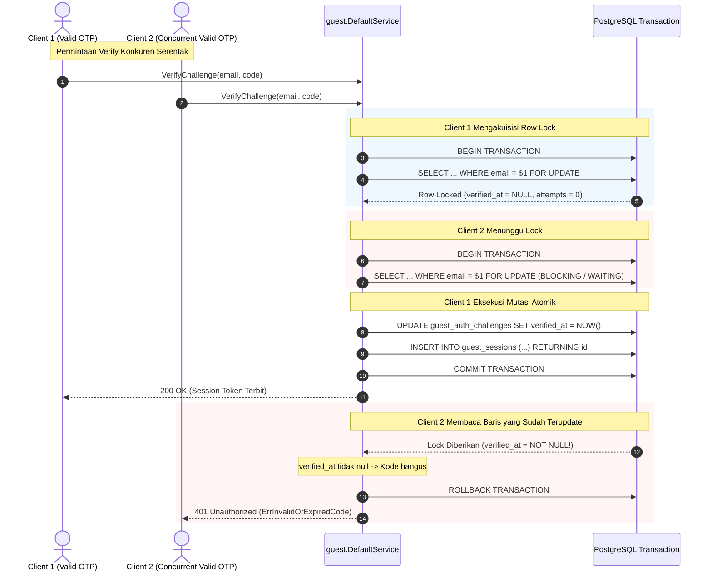

# Technical Architecture & Design — Atomic OTP Challenge & Attempt Limiting (BE-R03)

**Fitur:** Atomic OTP Challenge, Attempt Limiting & Single-Use Verification  
**ID Gap:** BE-R03 (P1)  
**Terkait:** F02, BE-G13, BE-G14  
**Tanggal:** 3 Oktober 2026  
**Status:** Approved / In Implementation  

---

## 1. Arsitektur Konkurensi & Penguncian Transaksional



---

## 2. Invarian Database & Mekanisme Penguncian

### 2.1 Cooldown Request Challenge
- **Mekanisme**: `pg_advisory_xact_lock(hashtext('guest_challenge:' || $email))`.
- **Keunggulan**: Mengunci ruang transaksi berdasarkan hash string email tamu tanpa mengunci tabel atau mempengaruhi tamu lain. Lock dilepas otomatis saat commit atau rollback.

### 2.2 Strict Attempt Limiting
- **Kueri**:
  ```sql
  UPDATE guest_auth_challenges
  SET attempts = attempts + 1
  WHERE id = $1
  RETURNING attempts;
  ```
- **Keunggulan**: Increment dijalankan di level engine PostgreSQL di dalam transaksi terisolasi row-lock, meniadakan race condition *read-modify-write* di aplikasi.

---

## 3. Analisis Anti-Overengineering (Ponytail)

- **Zero Schema Change**: Tabel `guest_auth_challenges` dan `guest_sessions` sudah memiliki kolom `attempts`, `max_attempts`, `verified_at`, dan `expires_at`. Tidak memerlukan migrasi skema tabel baru.
- **Native ACID PostgreSQL**: Memanfaatkan kapabilitas transaksi `FOR UPDATE` dan `pg_advisory_xact_lock` bawaan PostgreSQL tanpa menambah dependensi external queue atau distributed locking eksternal yang rumit.
