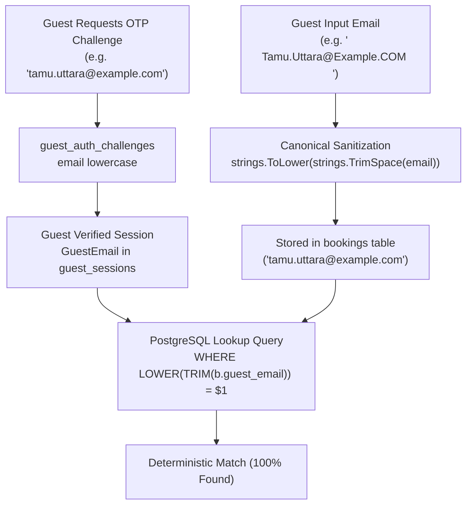
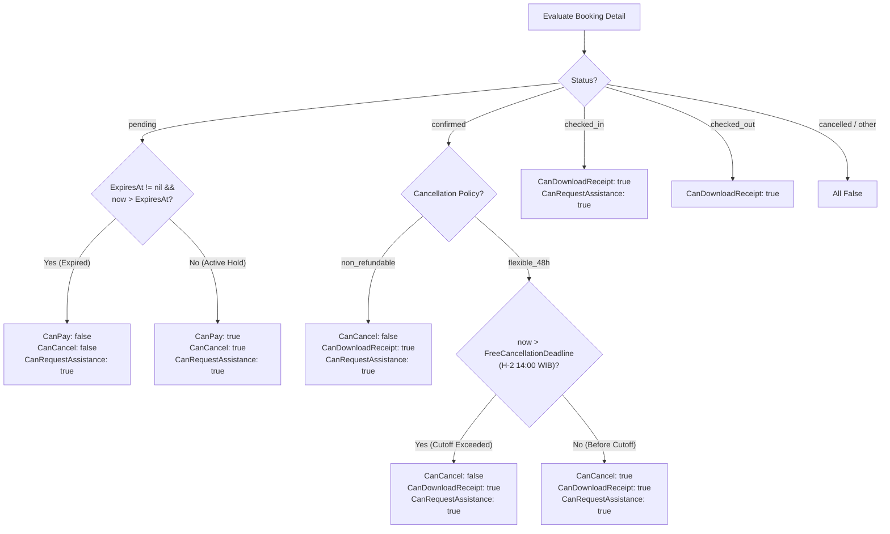

# Technical Architecture — Booking Ownership & Allowed Actions Consistency (BE-R05)

**Feature:** Canonical Email Normalization & Policy-Driven Allowed Actions  
**Gap ID:** BE-R05 (P1)  
**Date:** 2026-10-03  
**Status:** Approved for Implementation  
**Target Module:** `internal/booking`, `internal/guest`  

---

## 1. Flowchart: Canonical Email Normalization Pipeline

---

## 2. Decision Tree: `allowed_actions` Derivation

---

## 3. Anti-Overengineering Analysis (Ponytail)

- **Reuse Existing Policy Machinery**: Memanfaatkan fungsi `booking.FreeCancellationDeadline` yang sudah terbukti andal pada perbaikan BE-R12 tanpa menduplikasi logika batas waktu 14:00 WIB.
- **Zero Migration Needed**: Normalisasi query `LOWER(TRIM(b.guest_email)) = $1` menyelesaikan inkonsistensi data historis maupun masa depan secara instan tanpa perlu skrip migrasi berisiko tinggi.
