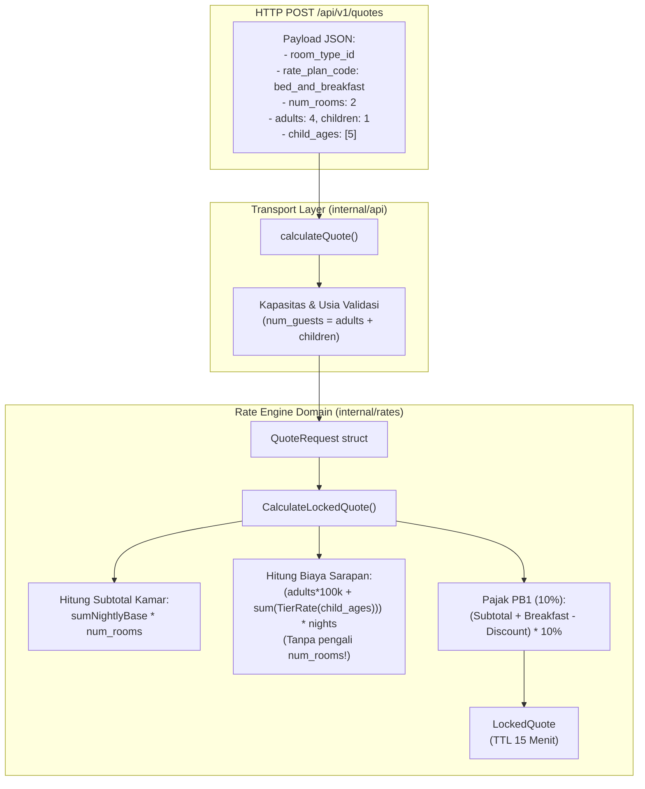
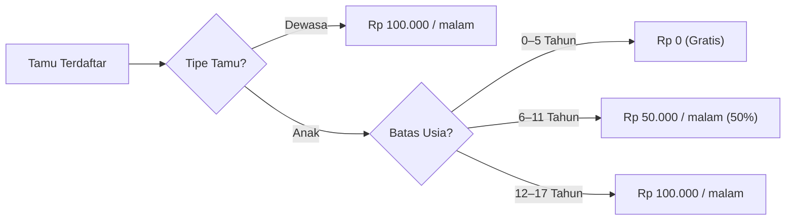

# Desain Arsitektur Teknis: Kebijakan Biaya Sarapan & Multi-Room Guest Tiers (BE-R10)

**Nomor Dokumen:** TECH-PULANG-BE-R10  
**Tanggal:** 3 Oktober 2026  
**Status:** Approved  
**Author:** AI Engineering Agent  
**Terkait:** BE-R10, BE-G04, BE-G05, F01, F09  

---

## 1. Ringkasan Arsitektur

Fitur ini menyelaraskan logika kalkulasi biaya sarapan pada rate engine (`rates.Engine.CalculateLockedQuote`) dengan semantik okupansi hotel yang sebenarnya. DTO `num_guests` diperlakukan secara konsisten sebagai total tamu seluruh reservasi, dan kalkulator tarif sarapan diperkaya dengan evaluasi berjenjang usia anak (*child age tiers*).



---

## 2. Algoritma Evaluasi Sarapan Berjenjang



### Implementasi pada `internal/rates/engine.go`

```go
func calculateDailyBreakfast(req QuoteRequest) int64 {
    if req.Adults > 0 || req.Children > 0 {
        var daily int64
        daily += int64(req.Adults) * int64(BreakfastRatePerPersonPerNight)
        if len(req.ChildAges) > 0 {
            for _, age := range req.ChildAges {
                switch {
                case age < 6:
                    // Balita complimentary
                case age <= 11:
                    daily += int64(BreakfastRateChildPerNight)
                default:
                    daily += int64(BreakfastRatePerPersonPerNight)
                }
            }
        } else if req.Children > 0 {
            // Default tier bila usia tidak dirinci
            daily += int64(req.Children) * int64(BreakfastRateChildPerNight)
        }
        return daily
    }
    // Legacy fallback jika hanya mengirim num_guests
    return int64(req.NumGuests) * int64(BreakfastRatePerPersonPerNight)
}
```

---

## 3. Analisis Anti-Overengineering (Prinsip Ponytail)

1. **Tanpa Tabel Konfigurasi Dinamis Tambahan:**
   - Aturan tarif sarapan Pulang ke Uttara (Rp 100k dewasa, Rp 50k anak, Rp 0 balita) bersifat standar operasional hotel dan didefinisikan secara tegas sebagai konstanta Go, tidak memerlukan tabel DB terpisah atau dependensi eksternal.
2. **Backward-Compatibility Penuh:**
   - Panggilan quote lama yang hanya mengirimkan `num_guests` tetap diproses secara anggun (*graceful fallback*) tanpa runtime panic atau error.

---

## 4. Matriks Pengujian

| Skenario Pengujian | Input Parameter | Hasil Biaya Sarapan yang Diharapkan |
| :--- | :--- | :--- |
| Single room, 2 dewasa, 1 malam | `rooms: 1, adults: 2, children: 0` | $2 \times 100.000 \times 1 = \text{Rp } 200.000$ |
| Multi-room, 2 kamar, 4 dewasa, 1 malam | `rooms: 2, adults: 4, children: 0` | $4 \times 100.000 \times 1 = \text{Rp } 400.000$ *(bukan 800k)* |
| Multi-room, 3 kamar, 6 dewasa, 2 malam | `rooms: 3, adults: 6, children: 0` | $6 \times 100.000 \times 2 = \text{Rp } 1.200.000$ *(bukan 3.6M)* |
| Balita gratis (0-5 tahun) | `rooms: 1, adults: 2, children: 1, child_ages: [4]` | $(2 \times 100k + 0) \times 1 = \text{Rp } 200.000$ |
| Anak 50% (6-11 tahun) | `rooms: 1, adults: 2, children: 1, child_ages: [8]` | $(2 \times 100k + 50k) \times 1 = \text{Rp } 250.000$ |
| Remaja full rate (12-17 tahun) | `rooms: 1, adults: 2, children: 1, child_ages: [15]` | $(2 \times 100k + 100k) \times 1 = \text{Rp } 300.000$ |
| Legacy request (num_guests: 3) | `rooms: 1, num_guests: 3` | $3 \times 100.000 \times 1 = \text{Rp } 300.000$ |
