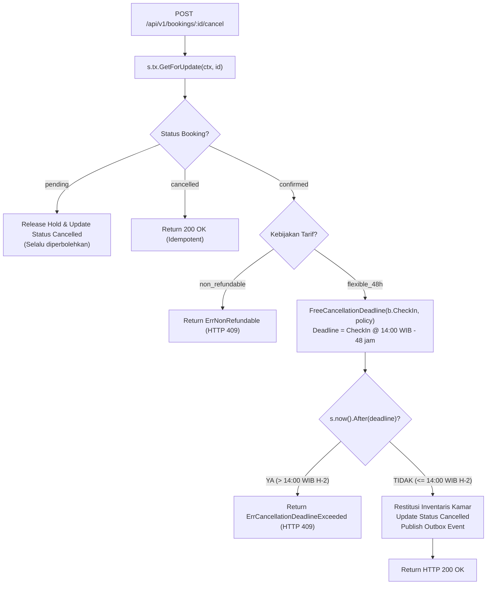

# Technical Architecture & Design — Cancellation Deadline Timezone Alignment (BE-R12)

**Fitur:** Cancellation Deadline WIB Timezone Alignment  
**ID Gap:** BE-R12 (P1)  
**Terkait:** BE-G08, BE-G19, F06/F13  
**Tanggal:** 3 Oktober 2026  
**Status:** Approved / In Implementation  

---

## 1. Perbandingan Garis Waktu: Bug UTC vs Koreksi WIB

```
Check-In Date: 10 Oktober 2026

Kebijakan Resmi: 48 jam sebelum 14:00 WIB (Asia/Jakarta, UTC+7)
------------------------------------------------------------------------------------------------------
Waktu Nyata:           8 Okt 07:00 UTC                 8 Okt 14:00 UTC                 10 Okt 07:00 UTC
                      (8 Okt 14:00 WIB)               (8 Okt 21:00 WIB)               (10 Okt 14:00 WIB)
                              |                               |                               |
                              |                               |                               |
[KOREKSI BE-R12] ------------>| BATAS DEADLINE RESMI          |                               | Check-in Resmi
                              | (Pembatalan setelah           |                               |
                              |  jam ini DITOLAK 409)         |                               |
                              |                               |                               |
[IMPLEMENTASI LAMA] --------->|                               | BATAS DEADLINE BUG            |
                              |<------- GAP 7 JAM ----------->| (Pembatalan salah diterima    |
                              |    BOCOR REVENUE HOTEL        |  karena menganggap 14:00 UTC) |
------------------------------------------------------------------------------------------------------
```

---

## 2. Diagram Alur Evaluasi Pembatalan



---

## 3. Detail Implementasi & Anti-Overengineering (Ponytail)

### 3.1 Konstruksi Zona Waktu Go Tanpa Ketergantungan Eksternal
Menggunakan `time.FixedZone("WIB", 7*3600)` menghindari kegagalan `time.LoadLocation("Asia/Jakarta")` pada lingkungan container minimal yang tidak menginstal paket `tzdata` (seperti Alpine scratch):
```go
var LocationWIB = time.FixedZone("WIB", 7*3600)
```

### 3.2 Injeksi Clock untuk Pengujian Deterministik
```go
type Service struct {
    ...
    nowFunc func() time.Time
}

func (s *Service) now() time.Time {
    if s.nowFunc != nil {
        return s.nowFunc()
    }
    return time.Now()
}

func (s *Service) SetNowFunc(fn func() time.Time) {
    s.nowFunc = fn
}
```
Metode ini memungkinkan pengujian unit mensimulasikan detik-detik krusial di sekitar batas waktu 14:00 WIB tanpa manipulasi waktu sistem host.
