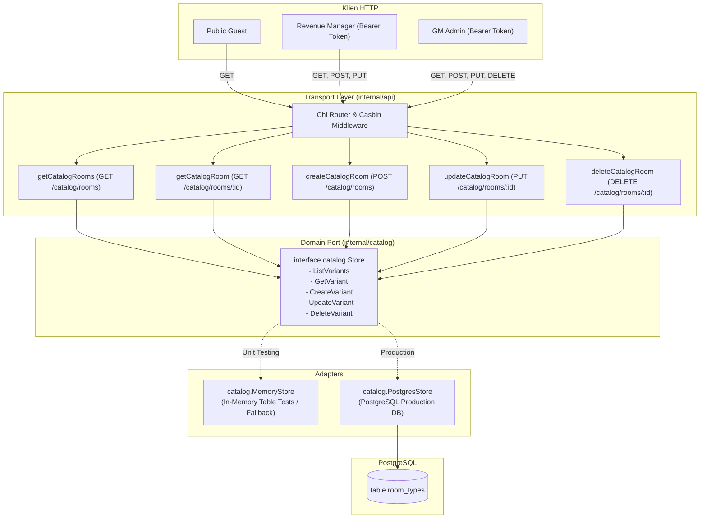

# Technical Architecture & Design — Room Variant Catalog CRUD
# Hotel Booking Engine — Pulang ke Uttara (Yogyakarta)

- **Tanggal Dokumen:** 3 Oktober 2026
- **Status:** Approved Architecture
- **Pola Desain:** Hexagonal Architecture (Ports & Adapters), In-Memory Testing, SQL Native Querying

---

## 1. Arsitektur Komponen & Diagram Alir



---

## 2. Port Interface Domain ([`internal/catalog`](file:///mnt/code/projects/jobs/pulang/current-booking/internal/catalog))

```go
type Store interface {
	ListVariants(ctx context.Context) ([]RoomVariant, error)
	GetVariant(ctx context.Context, idOrCode string) (RoomVariant, error)
	CreateVariant(ctx context.Context, v RoomVariant) (RoomVariant, error)
	UpdateVariant(ctx context.Context, id string, v RoomVariant) (RoomVariant, error)
	DeleteVariant(ctx context.Context, id string) error
}
```

---

## 3. Skema Data & Operasi PostgreSQL Native

Tabel `room_types` menampung varian kamar:
```sql
-- Create
INSERT INTO room_types (
    id, code, name, family_name, bed_type, room_size_sqm,
    max_capacity, max_adults, max_children, description,
    base_price_minor, amenities, photos
) VALUES ($1, $2, $3, $4, $5, $6, $7, $8, $9, $10, $11, $12, $13)
RETURNING id;

-- Update
UPDATE room_types SET
    code = $2, name = $3, family_name = $4, bed_type = $5, room_size_sqm = $6,
    max_capacity = $7, max_adults = $8, max_children = $9, description = $10,
    base_price_minor = $11, amenities = $12, photos = $13
WHERE id = $1;

-- Delete (Validasi Foreign Key / Active Reference)
DELETE FROM room_types WHERE id = $1;
```

---

## 4. Analisis Anti-Overengineering (Kaidah Ponytail)

1. **YAGNI (You Aren't Gonna Need It):**
   - Tidak menambahkan ORM besar seperti GORM atau Prisma; tetap menggunakan query SQL parameterized native dengan `pgxpool.Pool`.
   - Menggunakan serialisasi `json.RawMessage` / `json.Marshal` untuk amenities dan photos JSONB secara langsung.
2. **Ketersediaan Fixture Testing:**
   - [`DefaultVariants()`](file:///mnt/code/projects/jobs/pulang/current-booking/internal/catalog/catalog.go) dipertahankan sebagai fixture seed in-memory cepat untuk table-driven unit test, sehingga test suite dapat dijalankan dalam beberapa milidetik tanpa koneksi database eksternal.
3. **Casbin RBAC Integrasi Alami:**
   - Memanfaatkan model Casbin yang sudah terpasang di [`config/rbac_model.conf`](file:///mnt/code/projects/jobs/pulang/current-booking/config/rbac_model.conf), hanya menambahkan permission baru untuk `revenue_mgr` dan `gm_admin`.
