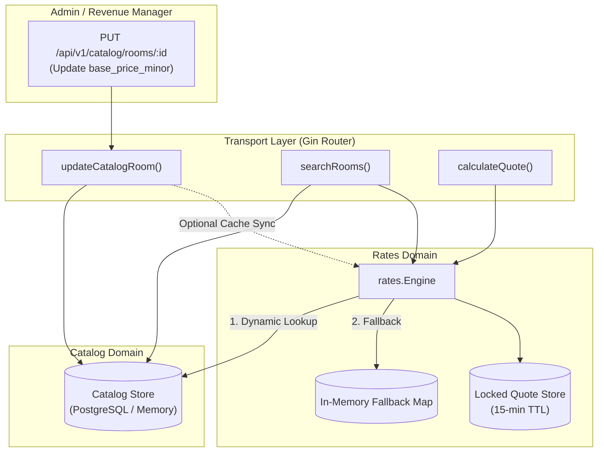
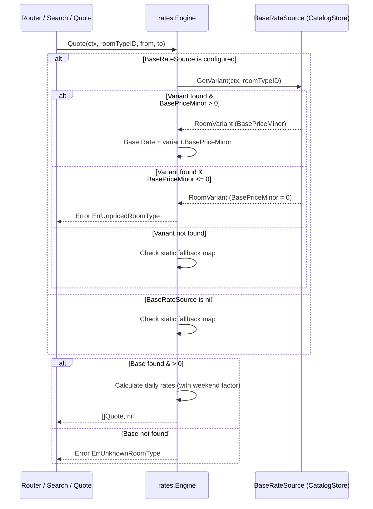

# Desain Arsitektur Teknis: Integrasi Harga Katalog CRUD ke Rate Engine Dinamis (BE-R09)

**Nomor Dokumen:** TECH-PULANG-BE-R09  
**Tanggal:** 3 Oktober 2026  
**Status:** Approved  
**Author:** AI Engineering Agent  
**Terkait:** BE-R09, BE-G01, BE-G04, BE-G05, F08, F09  

---

## 1. Ringkasan Arsitektur

Fitur ini menghubungkan pengelolaan harga dasar varian kamar pada katalog (`catalog.RoomVariant.BasePriceMinor`) dengan mesin kalkulasi tarif dinamis (`rates.Engine`). Sebelumnya, `rates.Engine` hanya mengandalkan map statis Go yang di-hardcode saat boot server di `main.go`. Melalui arsitektur Hexagonal/Ports & Adapters, `rates.Engine` kini dapat membaca sumber harga langsung dari `BaseRateSource` (yang diimplementasikan oleh `catalog.Store`), sekaligus menjaga backward-compatibility melalui in-memory fallback.

Selain itu, endpoint pencarian publik (`searchRooms`) diperkuat dengan pengaman invariant harga (*pricing guard*) untuk memastikan tidak ada kamar tanpa tarif atau kamar gratis (Rp 0) yang bocor ke publik.



---

## 2. Definisi Interface & Komponen

### 2.1 Interface Port `BaseRateSource` pada Package `rates`

```go
package rates

// BaseRateSource mendefinisikan port data katalog yang dibutuhkan rate engine.
type BaseRateSource interface {
    GetVariant(ctx context.Context, idOrCode string) (catalog.RoomVariant, error)
}
```

### 2.2 Struktur Data `rates.Engine` & Mutex Protection

```go
type Engine struct {
    mu            sync.RWMutex
    base          map[string]int64
    baseSource    BaseRateSource
    weekendFactor float64
    quoteStore    QuoteStore
}

func (e *Engine) SetBaseRateSource(src BaseRateSource) {
    e.mu.Lock()
    defer e.mu.Unlock()
    e.baseSource = src
}

func (e *Engine) SetBaseRate(roomTypeID string, rateMinor int64) {
    e.mu.Lock()
    defer e.mu.Unlock()
    if e.base == nil {
        e.base = make(map[string]int64)
    }
    e.base[roomTypeID] = rateMinor
}
```

### 2.3 Resolusi Tarif pada `rates.Engine.Quote`



---

## 3. Search Pricing Guard (`searchRooms`)

Pada `internal/api/router.go`, proses iterasi kamar pencarian:
1. Panggil `quotes, err := d.RateSvc.Quote(c.Request.Context(), v.ID, from, to)`.
2. Jika `err != nil` atau `len(quotes) == 0`:
   - Set `item.Available = false`
   - Set `item.UnavailableReason = "RATE_UNAVAILABLE"`
   - `results = append(results, item)`
   - `continue`
3. Hitung `total := sumQuotes(quotes) * int64(rooms)`.
4. Jika `total <= 0`:
   - Set `item.Available = false`
   - Set `item.UnavailableReason = "RATE_UNAVAILABLE"`
   - `results = append(results, item)`
   - `continue`
5. Hanya kamar dengan tarif valid dan kuotasi berhasil yang berhak dievaluasi ketersediaan fisiknya (`minAvail >= rooms`).

---

## 4. Analisis Anti-Overengineering (Prinsip Ponytail)

1. **Tanpa Distributed Pub/Sub Tambahan:**
   - Tidak memerlukan RabbitMQ / Redis PubSub rumit untuk sinkronisasi harga antar node.
   - Panggilan `GetVariant` langsung membaca tabel `room_types` yang sudah di-index atau in-memory cache jika diimplementasikan kelak.
2. **Re-use Existing Contracts:**
   - `catalog.Store` sudah menyediakan method `GetVariant(ctx, idOrCode) (catalog.RoomVariant, error)`. Kita cukup mengimplementasikan interface satu method `BaseRateSource` pada package `rates` tanpa membuat struct adapter baru!
3. **Backward Compatibility:**
   - Semua existing unit tests yang menginisialisasi `rates.NewEngine(map[string]int64{...}, 1.25)` tanpa katalog tetap berjalan 100% normal berkat mekanisme graceful fallback.

---

## 5. Rencana Verifikasi & Matriks Pengujian

| Pengujian | Target Cakupan | Status Rencana |
| :--- | :--- | :--- |
| `internal/rates/engine_test.go` | Dynamic lookup, catalog override, unpriced room error, fallback map | Table-driven unit tests |
| `internal/api/router_test.go` | CRUD update directly impacts quotes, search rate guard (`RATE_UNAVAILABLE`) | Table-driven router tests |
| E2E Script | Full flow update catalog via API $\rightarrow$ quote $\rightarrow$ search $\rightarrow$ verify | `testing/e2e/script/catalog_crud_rate_engine_r09_e2e.sh` |
