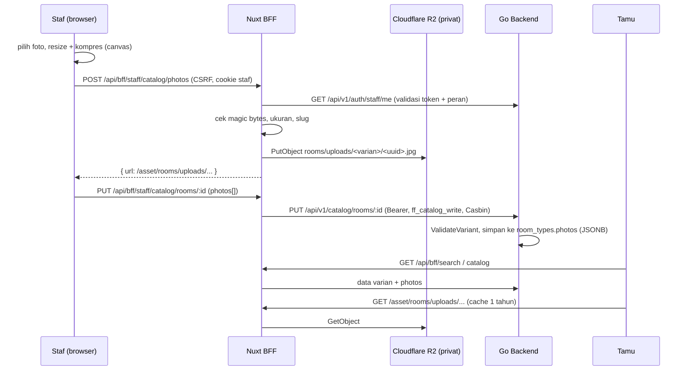

# Catalog Photo Management & Staff Catalog Editor

- **Tanggal:** 2026-10-05
- **Modul:** Catalog (BE `internal/catalog`) + Staff Catalog Editor (FE `/staff/catalog`) + Cloudflare R2
- **Repo terkait:** `current-booking` (Go backend), `mimiking-booking-secure` (Nuxt FE/BFF, `hotel-fe`)
- **Status:** Implemented — menunggu deploy

---

## 1. Latar Belakang (PRD)

Staf (`revenue_mgr`, `gm_admin`) perlu mengganti **card kamar** yang dilihat tamu di `/booking/results` dan detail kamar: nama, harga dasar, fasilitas, dan terutama **foto**. Sebelumnya:

- Backend sudah punya CRUD katalog (`POST/PUT/DELETE /api/v1/catalog/rooms`, flag `ff_catalog_write`), tetapi FE BFF **tidak meneruskan** mutasi katalog (read-only) dan editor FE hanya simulasi di browser.
- Foto kamar statis di `app/data/rooms.ts` dan remote CDN hotel (lambat; satu file suite 33 MB).
- Tidak ada cara upload/ganti foto.

### Acceptance Criteria
| ID | Kriteria |
|----|----------|
| AC-01 | Staf `revenue_mgr`/`gm_admin` dapat mengubah varian dan menyimpannya ke database lewat editor. |
| AC-02 | Staf dapat upload, hapus, dan ubah urutan foto; foto pertama menjadi cover card. |
| AC-03 | Perubahan tampil di card booking tamu tanpa deploy ulang. |
| AC-04 | Peran lain (receptionist, housekeeping, finance) ditolak (403). Hapus varian hanya `gm_admin`. |
| AC-05 | Foto disajikan cepat: kompres di sisi klien, simpan di R2, cache `immutable` 1 tahun. |
| AC-06 | Kredensial R2 tidak pernah ada di repo atau browser. |

---

## 2. Spesifikasi (SRS)

### 2.1 Backend (`internal/catalog`)
- **FR-01** `ValidateVariant(v)` dipakai oleh `MemoryStore` dan `PostgresStore` pada Create dan Update (menggantikan 4 cek duplikat):
  - `code`, `name` wajib; `max_capacity >= 1`; `base_price_minor > 0`.
  - `len(photos) <= MaxPhotosPerVariant (20)`.
  - Tiap foto: `url` harus `"/asset/rooms/..."` (tanpa `..` dan `\`) **atau** `https://...`. Ditolak: kosong, `http://`, `//host`, `javascript:`, path traversal.
  - `alt` maksimal `MaxPhotoAltLen (200)` karakter.
  - Pelanggaran → `ErrInvalidVariant` → HTTP 400 `INVALID_ROOM_DATA`.
- **FR-02** Endpoint katalog dan RBAC tidak berubah (`ff_catalog_write`; Casbin `revenue_mgr` POST/PUT, `gm_admin` DELETE).

### 2.2 FE BFF (`hotel-fe`)
- **FR-03** Allowlist `server/utils/staff-capabilities.ts` ditambah: `POST catalog/rooms`, `PUT|DELETE catalog/rooms/:id` → `/api/v1/catalog/rooms[/:id]`. Wajib header `X-Pulang-CSRF: 1`, same-origin, sesi staf valid.
- **FR-04** `POST /api/bff/staff/catalog/photos` (`multipart/form-data`: `file`, `variant`):
  1. Hanya `NUXT_PUBLIC_OPERATIONS_MODE=api`; CSRF + batas body ≈ 4 MB.
  2. Token divalidasi ke backend (`/auth/staff/me`) dan peran harus `revenue_mgr`/`gm_admin`, selain itu 403.
  3. `variant` harus slug `^[a-z0-9][a-z0-9-]{0,63}$`.
  4. Tipe file ditentukan dari **magic bytes** (JPEG/PNG/WebP). SVG/GIF/lainnya → 415.
  5. Maksimal 4 MB → 413.
  6. Simpan ke R2 `rooms/uploads/<variant>/<uuid>.<ext>` dengan `Cache-Control: public, max-age=31536000, immutable`; respons `{ url: "/asset/rooms/uploads/..." }`.
- **FR-05** Browser mengompres sebelum upload (`app/utils/image-compress.ts`): sisi terpanjang ≤ 1600 px, JPEG, kualitas turun bertahap 0.82 → 0.5 sampai ≤ 900 KB.
- **FR-06** Foto dilayani `GET /asset/rooms/**` (membaca R2 privat, fallback ke CDN resmi bila belum ada).

### 2.3 Editor (`/staff/catalog`)
- Mode live: simpan (POST/PUT), varian baru, hapus (konfirmasi), upload multi-file, hapus dan urut foto (↑/↓), pratinjau thumbnail, review perubahan before/after termasuk jumlah foto.
- Mode sample: tetap simulasi di browser; upload dinonaktifkan.

---

## 3. Arsitektur (Tech)



### Keputusan desain
| Keputusan | Alasan |
|-----------|--------|
| Kompresi di browser, bukan `sharp` di server | Tidak menambah dependensi native pada image Docker alpine; server cukup validasi. |
| Upload lewat BFF, bukan presigned URL | Kredensial R2 tetap di server; validasi tipe dan peran terpusat. |
| Nama objek `uuid` acak, tidak menimpa file lama | URL `immutable` aman di-cache; tidak ada risiko cache basi atau overwrite. |
| Foto lama tidak dihapus dari R2 saat dilepas dari varian | Aman terhadap rollback; garbage collection bisa dilakukan terpisah. |
| Validasi URL foto di backend (bukan hanya FE) | Mencegah `javascript:`/skema berbahaya dan traversal bila API dipanggil langsung. |

### Konfigurasi produksi (VPS `/opt/hotel-fe/.env`)
```
NUXT_PUBLIC_OPERATIONS_MODE=api
NUXT_R2_ACCOUNT_ID=...
NUXT_R2_ACCESS_KEY_ID=...        # token khusus bucket pulang (Object Read & Write)
NUXT_R2_SECRET_ACCESS_KEY=...
NUXT_R2_BUCKET=pulang
```
> [!WARNING]
> Kredensial **tidak boleh** di-commit. Kredensial R2 yang sempat dibagikan di chat sebaiknya di-*rotate*. Jika nginx memakai `client_max_body_size` default (1 MB), pastikan ≥ 5 MB untuk path `/api/bff/staff/catalog/photos`.

---

## 4. Verifikasi

| Lapisan | Hasil |
|---------|-------|
| BE `internal/catalog/validate_test.go` (table-driven, 14 kasus + MemoryStore) | Lulus; coverage `catalog` 93.5% |
| BE `go vet`, `go test ./internal/catalog ./internal/api/...` | Lulus |
| FE unit `photo-upload.test.ts`, `staff-routes.test.ts` | Lulus |
| FE Playwright "staff catalog editor reorders, removes and saves photos" | Lihat catatan walkthrough |
| FE lint dan typecheck | Lulus |

### Risiko dan batasan
- Mode live end-to-end butuh akun staf `revenue_mgr`/`gm_admin` dan flag `ff_catalog_write` aktif (default `true`).
- Varian dari `fixture` (`/images/rooms/...`) tetap memakai foto statis FE sebagai fallback sampai staf menyimpan foto baru.
- Tidak ada audit log khusus perubahan foto selain audit mutasi katalog yang ada.
