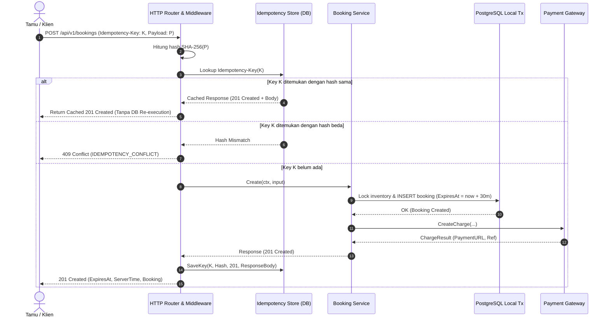

# Technical Architecture & Database Design — Batch BE-D: Checkout, Idempotensi & Pemulihan Pembayaran
# Hotel Booking Engine — Pulang ke Uttara (Yogyakarta)

- **Tanggal Dokumen:** 3 Oktober 2026
- **Status:** Approved
- **Target Parity Gap:** `BE-G07`, `BE-G09`, `BE-G11`, `BE-G12`

---

## 1. Diagram Arsitektur Komponen & Alur Idempotensi



---

## 2. Skema Database Relasional (`migrations/00007_checkout_idempotency_ledger.sql`)

### A. Perubahan Tabel `bookings`
```sql
ALTER TABLE bookings
ADD COLUMN IF NOT EXISTS guest_phone VARCHAR(32),
ADD COLUMN IF NOT EXISTS estimated_arrival_time VARCHAR(8),
ADD COLUMN IF NOT EXISTS special_requests VARCHAR(500),
ADD COLUMN IF NOT EXISTS expires_at TIMESTAMPTZ;
```

### B. Tabel `idempotency_keys`
```sql
CREATE TABLE IF NOT EXISTS idempotency_keys (
    key VARCHAR(64) PRIMARY KEY,
    request_hash VARCHAR(64) NOT NULL,
    response_code INT NOT NULL,
    response_body TEXT NOT NULL,
    created_at TIMESTAMPTZ NOT NULL DEFAULT NOW(),
    expires_at TIMESTAMPTZ NOT NULL DEFAULT NOW() + INTERVAL '24 hours'
);

CREATE INDEX IF NOT EXISTS idx_idempotency_keys_expires_at ON idempotency_keys(expires_at);
```

### C. Tabel `payment_attempts`
```sql
CREATE TABLE IF NOT EXISTS payment_attempts (
    id UUID PRIMARY KEY DEFAULT uuidv7(),
    booking_id UUID NOT NULL REFERENCES bookings(id) ON DELETE CASCADE,
    provider VARCHAR(32) NOT NULL,
    provider_reference VARCHAR(128) NOT NULL,
    amount_minor BIGINT NOT NULL,
    currency VARCHAR(3) NOT NULL DEFAULT 'IDR',
    status VARCHAR(32) NOT NULL,
    payload JSONB,
    created_at TIMESTAMPTZ NOT NULL DEFAULT NOW(),
    updated_at TIMESTAMPTZ NOT NULL DEFAULT NOW()
);

CREATE INDEX IF NOT EXISTS idx_payment_attempts_booking_id ON payment_attempts(booking_id);
CREATE INDEX IF NOT EXISTS idx_payment_attempts_reference ON payment_attempts(provider_reference);
```

---

## 3. Desain Port & Interface Go

```go
// IdempotencyStore port untuk penyimpanan key idempotensi jaringan (BE-G09).
type IdempotencyRecord struct {
    Key          string
    RequestHash  string
    ResponseCode int
    ResponseBody []byte
    CreatedAt    time.Time
    ExpiresAt    time.Time
}

type IdempotencyStore interface {
    Get(ctx context.Context, key string) (*IdempotencyRecord, error)
    Save(ctx context.Context, rec IdempotencyRecord) error
}

// PaymentAttemptLedger port pencatatan jejak transaksi pembayaran (BE-G11).
type PaymentAttempt struct {
    ID                string
    BookingID         string
    Provider          string
    ProviderReference string
    AmountMinor       int64
    Currency          string
    Status            string
    Payload           map[string]any
    CreatedAt         time.Time
}

type PaymentAttemptStore interface {
    RecordAttempt(ctx context.Context, attempt PaymentAttempt) error
    UpdateAttemptStatus(ctx context.Context, reference, status string) error
}
```
