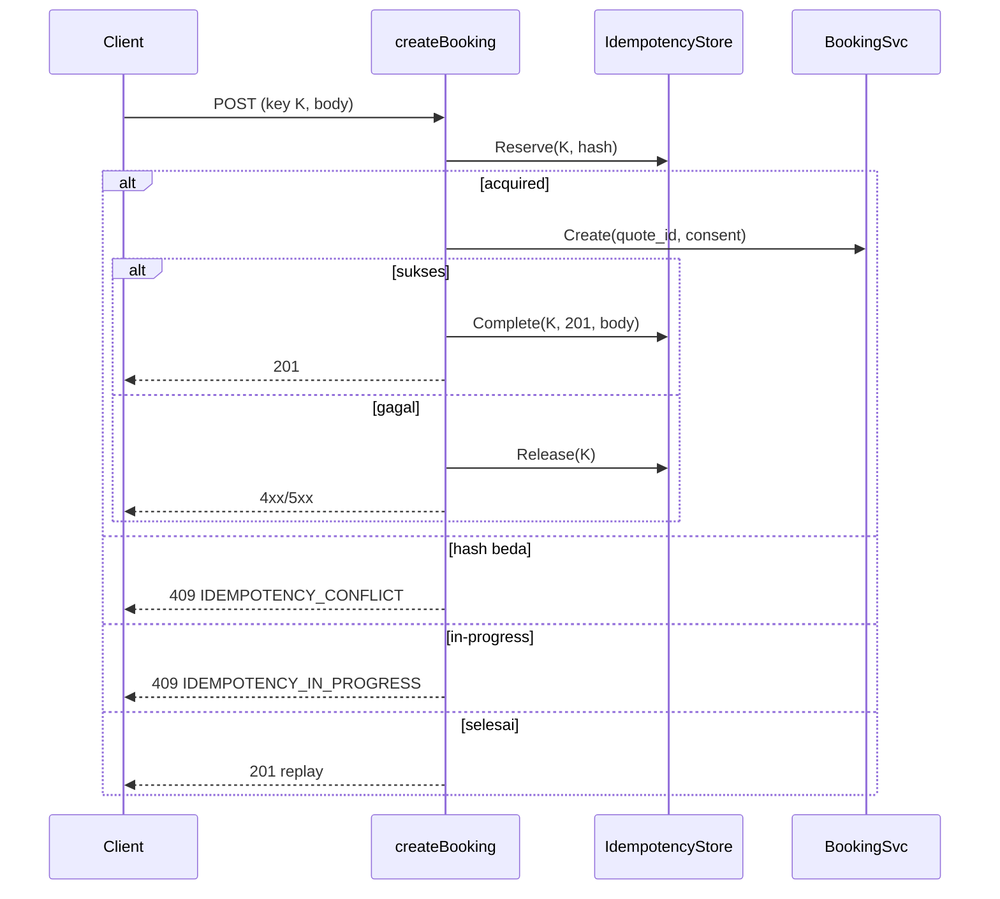

# Tech Architecture — Checkout Integrity (BE-R06, BE-R08)

## Keputusan desain (anti-overengineering)
- **R06**: hapus cabang fallback di `Service.Create` dan tambah satu guard. Tidak ada endpoint/flag baru.
- **R08**: satu pernyataan SQL `INSERT ... ON CONFLICT DO UPDATE ... WHERE expires_at <= NOW() RETURNING` memberi klaim atomik tanpa tabel atau migrasi baru. Tabel `idempotency_keys` (migrasi 00007) dipakai ulang; `response_code = 0` menandai in-progress.
- Tidak memakai advisory lock atau Valkey: Postgres sudah menjadi sumber kebenaran booking.

## Skema DB
Tidak ada perubahan. `idempotency_keys(key PK, request_hash, response_code, response_body, created_at, expires_at)`.

## Risiko residual
- Jika proses mati setelah booking commit tetapi sebelum `Complete`, reservasi kedaluwarsa dalam 2 menit dan retry dapat membuat booking kedua. Penutupan penuh membutuhkan penautan intent ke transaksi booking (pekerjaan lanjutan, di luar scope ini).
