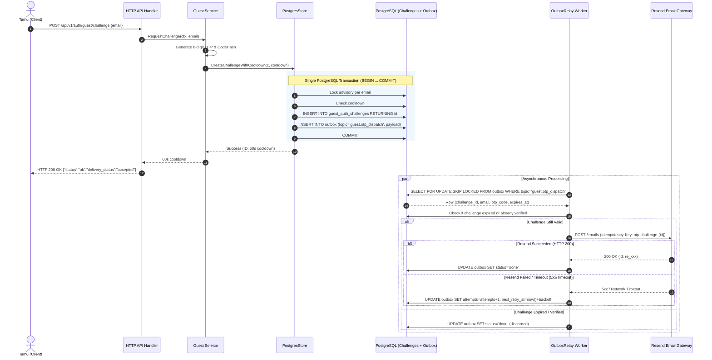
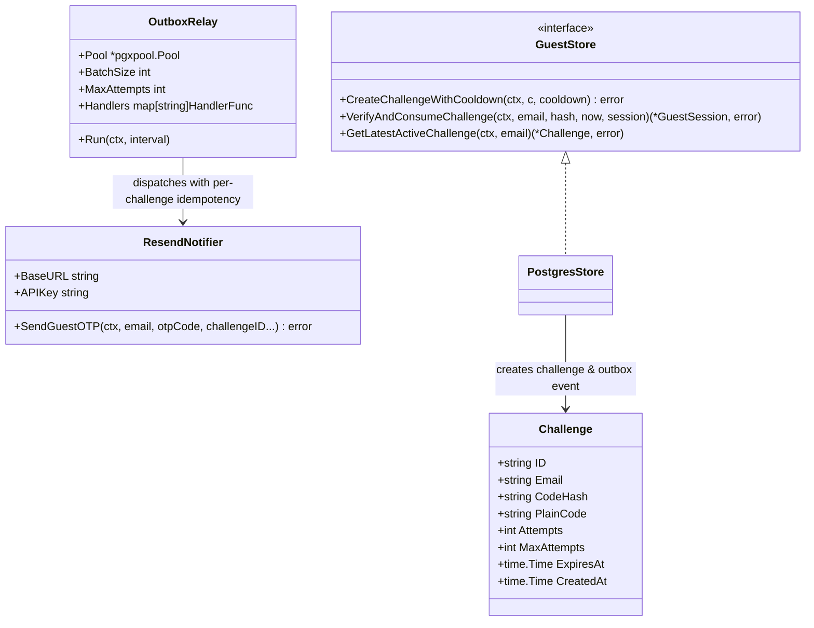

# Technical Architecture & Design: Pengiriman OTP Andal Berbasis Outbox (BE-R17)

**Nomor Dokumen:** ARCH-PULANG-BE-R17  
**Tanggal:** 3 Oktober 2026  
**Status:** Approved  
**Author:** AI Engineering & Architecture Agent  
**Target Fitur / Gap:** [`BE-R17`](file:///mnt/code/projects/jobs/pulang/current-booking/docs/gap/10-payment-recovery-and-provider-reaudit-2026-10-03.md)  
**Dokumen Terkait:** [PRD-PULANG-BE-R17](file:///mnt/code/projects/jobs/pulang/current-booking/docs/prd/durable-otp-delivery-outbox-r17-2026-10-03.md), [SRS-PULANG-BE-R17](file:///mnt/code/projects/jobs/pulang/current-booking/docs/srs/durable-otp-delivery-outbox-r17-2026-10-03.md)  

---

## 1. Arsitektur Komponen & Diagram Alir (Mermaid)

Sistem mengadopsi **Transactional Outbox Pattern** untuk memisahkan siklus penyimpanan tantangan kode OTP dengan proses jaringan eksternal ke provider email (Resend / SMTP).

### 1.1 Sequence Diagram: Permintaan Tantangan OTP & Asynchronous Durable Dispatch

---

## 2. Struktur Modul & Dependency Injection

---

## 3. Strategi Retry & Dead-Letter Queue

| Percobaan (*Attempt*) | Jeda Waktu (*Backoff Delay*) | Status Outbox | Tindakan |
| :--- | :--- | :--- | :--- |
| **Attempt 1** | Instan (interval polling relay) | `pending` | Mengirim ke Resend API |
| **Attempt 2** | +5 detik | `pending` | Retry dengan Idempotency-Key sama |
| **Attempt 3** | +10 detik | `pending` | Retry dengan Idempotency-Key sama |
| **Attempt 4** | +20 detik | `pending` | Retry dengan Idempotency-Key sama |
| **Attempt 5** | +40 detik | `pending` | Retry dengan Idempotency-Key sama |
| **Attempt 6** | +80 detik (~1.3 menit) | `pending` | Retry dengan Idempotency-Key sama |
| **Attempt 7** | +160 detik (~2.6 menit) | `pending` | Retry jika challenge belum expired |
| **Attempt 8** | +300 detik (5 menit cap) | `failed` (Dead Letter) | Dicatat ke log dead letter, dihentikan |

---

## 4. Analisis Anti-Overengineering (Ponytail)

- **Tidak menambah message broker terpisah:** Memanfaatkan tabel `outbox` yang sudah ada pada skema PostgreSQL tanpa perlu menambahkan Redis queue baru atau Kafka.
- **Transaksional murni:** Tidak memerlukan library *two-phase commit* atau distributed transaction coordinator; cukup satu `pgx.Tx` standar Go.
- **Idempotensi cerdas:** Header HTTP `Idempotency-Key` didukung secara *native* oleh Resend API dan gateway email modern.
