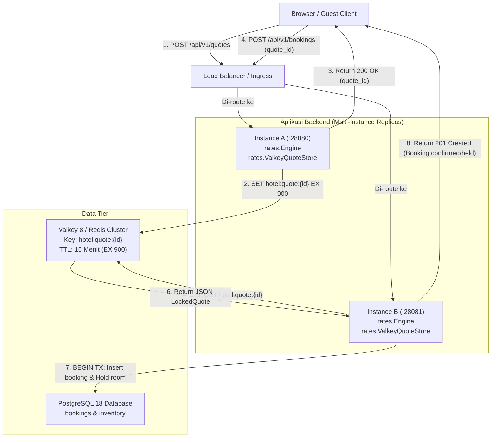
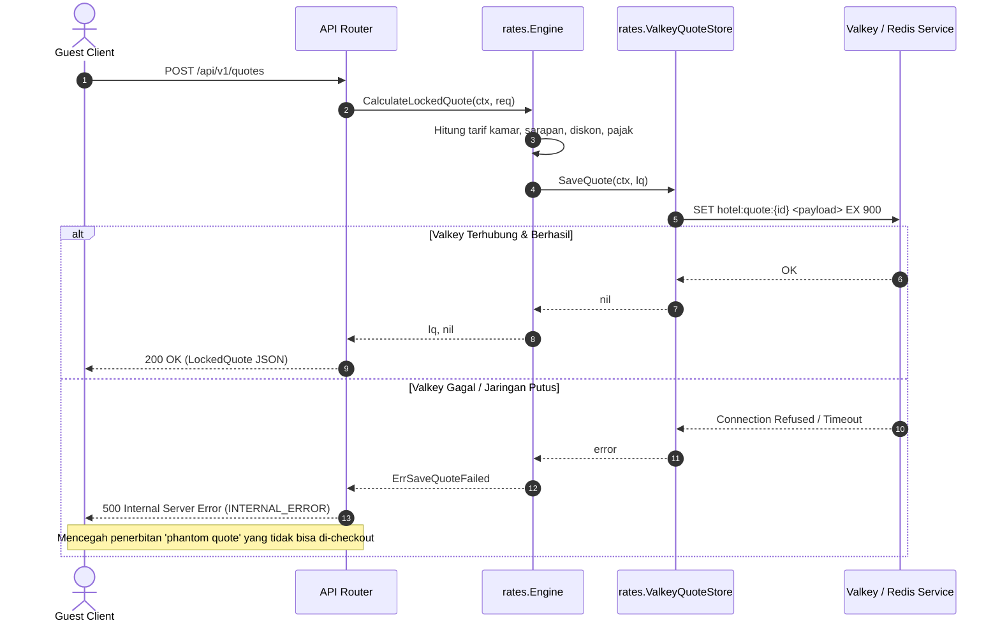

# Technical Architecture: Penyimpanan Kuotasi Harga Terdistribusi (Durable Quote Store) (BE-R11)

**Nomor Dokumen:** ARCH-PULANG-BE-R11  
**Tanggal Efektif:** 3 Oktober 2026  
**Status:** Approved  
**Author:** AI Engineering Agent  
**Terkait Audit & PRD:** `BE-R11`, `PRD-PULANG-BE-R11`, `SRS-PULANG-BE-R11`

---

## 1. Arsitektur Komponen & Diagram Alur

### 1.1 Diagram Interaksi Multi-Instance Terdistribusi


### 1.2 Sequence Diagram: Penanganan Fail-Closed saat Persistensi Gagal


---

## 2. Struktur Data & Pola Desain (Hexagonal Pattern)

### 2.1 Antarmuka Port
```go
package rates

type QuoteStore interface {
    SaveQuote(ctx context.Context, q LockedQuote) error
    GetQuote(ctx context.Context, id string) (LockedQuote, error)
}
```

### 2.2 Implementasi Adapter Valkey (`internal/rates/valkey_store.go`)
```go
package rates

import (
    "context"
    "encoding/json"
    "errors"
    "fmt"
    "time"

    "github.com/redis/go-redis/v9"
)

const (
    defaultQuotePrefix = "hotel:quote:"
    defaultQuoteTTL    = 15 * time.Minute
)

var (
    ErrSaveQuoteFailed = errors.New("rates: failed to save quote")
)

type ValkeyQuoteStore struct {
    client redis.Cmdable
    ttl    time.Duration
    prefix string
}

func NewValkeyQuoteStore(client redis.Cmdable, ttl time.Duration) *ValkeyQuoteStore {
    if ttl <= 0 {
        ttl = defaultQuoteTTL
    }
    return &ValkeyQuoteStore{
        client: client,
        ttl:    ttl,
        prefix: defaultQuotePrefix,
    }
}
```

### 2.3 Fail-Closed Propagation di `Engine.CalculateLockedQuote`
```go
    if e.quoteStore != nil {
        if err := e.quoteStore.SaveQuote(ctx, lq); err != nil {
            return LockedQuote{}, fmt.Errorf("%w: %v", ErrSaveQuoteFailed, err)
        }
    }
```

---

## 3. Analisis Anti-Overengineering (Ponytail Principles)

1. **YAGNI (You Aren't Gonna Need It):**
   - Tidak perlu membuat background database worker atau cron cleanup untuk membersihkan kuotasi kedaluwarsa. Valkey/Redis memiliki native key expiration (`EX 900`) yang membersihkan memori secara otomatis.
   - Tidak menambahkan layer caching bertingkat (misal: L1 memory + L2 redis) yang memicu *cache invalidation drift* antar instansi. Cukup delegasikan single-source-of-truth quote TTL ke Valkey.
2. **Ketergantungan Minimal:**
   - Memanfaatkan library yang sudah ada di repositori: `github.com/redis/go-redis/v9` dan `encoding/json` bawaan Go standard library. Tanpa dependensi pihak ketiga baru.
3. **Komposisi Tanpa Breaking Changes:**
   - Antarmuka `QuoteStore` tetap identik sehingga seluruh unit test yang menggunakan `MemoryQuoteStore` tetap berfungsi normal.
   - `ValkeyQuoteStore` diintegrasikan di `cmd/server/main.go` memanfaatkan `redisClient` yang telah terkonfigurasi.
