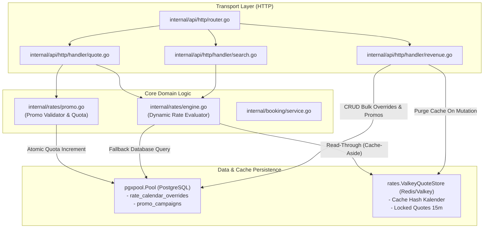
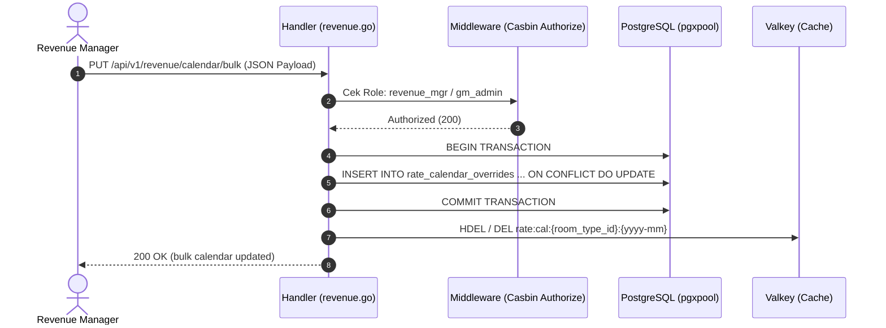
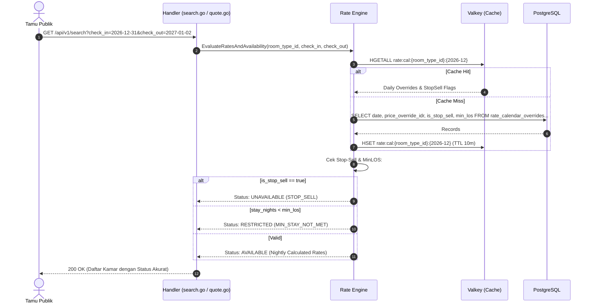

# Technical Architecture & Design Document
# Dynamic Rates, Room Allotment & Stop-Sell Engine
**Hotel Booking Engine — Pulang ke Uttara (Yogyakarta)**

- **Dokumen Identitas:** `TECH-F08-F09-RATES-ALLOTMENT-2026-10-04`
- **Tanggal Efektif:** 4 Oktober 2026
- **Status:** APPROVED FOR IMPLEMENTATION
- **Dokumen Pasangan:**
  - PRD: [`docs/prd/dynamic-rates-and-stop-sell-2026-10-04.md`](file:///mnt/code/projects/jobs/pulang/current-booking/docs/prd/dynamic-rates-and-stop-sell-2026-10-04.md)
  - SRS: [`docs/srs/dynamic-rates-and-stop-sell-2026-10-04.md`](file:///mnt/code/projects/jobs/pulang/current-booking/docs/srs/dynamic-rates-and-stop-sell-2026-10-04.md)

---

## 1. Arsitektur Komponen & Aliran Data

Integrasi fitur ini memperluas domain `internal/rates/` dan modul penyimpanan data tanpa mengubah kontrak utama `QuoteStore` atau merusak arsitektur heksagonal repositori.



---

## 2. Diagram Sekuensial: Alur Eksekusi Search & Bulk Update

### 2.1 Bulk Update Tarif & Stop-Sell oleh Revenue Manager


### 2.2 Pencarian Tamu dengan Evaluasi Stop-Sell & Restriksi


---

## 3. Skema Basis Data & Optimasi Query (PostgreSQL)

### 3.1 DDL Migrasi Goose (`00013_create_rate_calendar_and_promos.sql`)
```sql
-- +goose Up
CREATE TABLE IF NOT EXISTS rate_calendar_overrides (
    id UUID PRIMARY KEY DEFAULT gen_random_uuid(),
    room_type_id UUID NOT NULL REFERENCES catalog_rooms(id) ON DELETE CASCADE,
    rate_plan_code VARCHAR(32) NOT NULL DEFAULT 'RO',
    date DATE NOT NULL,
    price_override_idr BIGINT NULL,
    is_stop_sell BOOLEAN NOT NULL DEFAULT FALSE,
    is_cta BOOLEAN NOT NULL DEFAULT FALSE,
    is_ctd BOOLEAN NOT NULL DEFAULT FALSE,
    min_los INT NOT NULL DEFAULT 1,
    max_los INT NOT NULL DEFAULT 30,
    allotment_limit INT NULL,
    created_at TIMESTAMPTZ NOT NULL DEFAULT NOW(),
    updated_at TIMESTAMPTZ NOT NULL DEFAULT NOW(),
    CONSTRAINT uq_rate_cal_room_date_plan UNIQUE (room_type_id, date, rate_plan_code)
);

CREATE INDEX IF NOT EXISTS idx_rate_cal_range 
ON rate_calendar_overrides (room_type_id, date, rate_plan_code);

CREATE TABLE IF NOT EXISTS promo_campaigns (
    id UUID PRIMARY KEY DEFAULT gen_random_uuid(),
    code VARCHAR(32) UNIQUE NOT NULL,
    name VARCHAR(100) NOT NULL,
    discount_type VARCHAR(16) NOT NULL DEFAULT 'PERCENT',
    discount_value INT NOT NULL,
    max_discount_idr BIGINT NULL,
    min_stay_nights INT NOT NULL DEFAULT 1,
    quota_total INT NOT NULL DEFAULT 100,
    quota_used INT NOT NULL DEFAULT 0,
    valid_from TIMESTAMPTZ NOT NULL,
    valid_to TIMESTAMPTZ NOT NULL,
    applicable_room_types UUID[] NULL,
    is_active BOOLEAN NOT NULL DEFAULT TRUE,
    created_at TIMESTAMPTZ NOT NULL DEFAULT NOW(),
    updated_at TIMESTAMPTZ NOT NULL DEFAULT NOW(),
    CONSTRAINT chk_promo_quota_valid CHECK (quota_used <= quota_total)
);

CREATE INDEX IF NOT EXISTS idx_promo_code_active 
ON promo_campaigns (code) WHERE is_active = TRUE;

-- Casbin RBAC Policies
INSERT INTO casbin_rule (ptype, v0, v1, v2) VALUES
('p', 'revenue_mgr', '/api/v1/revenue/calendar', 'GET'),
('p', 'revenue_mgr', '/api/v1/revenue/calendar/bulk', 'PUT'),
('p', 'revenue_mgr', '/api/v1/revenue/promos', 'GET'),
('p', 'revenue_mgr', '/api/v1/revenue/promos', 'POST'),
('p', 'revenue_mgr', '/api/v1/revenue/promos/:id', 'PUT'),
('p', 'gm_admin', '/api/v1/revenue/calendar', 'GET'),
('p', 'gm_admin', '/api/v1/revenue/calendar/bulk', 'PUT'),
('p', 'gm_admin', '/api/v1/revenue/promos', 'GET'),
('p', 'gm_admin', '/api/v1/revenue/promos', 'POST'),
('p', 'gm_admin', '/api/v1/revenue/promos/:id', 'PUT'),
('p', 'receptionist', '/api/v1/revenue/calendar', 'GET')
ON CONFLICT DO NOTHING;

-- +goose Down
DROP TABLE IF EXISTS promo_campaigns;
DROP TABLE IF EXISTS rate_calendar_overrides;
```

### 3.2 Query Harian Berkinerja Tinggi Menggunakan `generate_series`
Untuk mendapatkan kalender lengkap tanpa lubang data (*sparse data reconciliation*):
```sql
SELECT 
    d.day::date AS calendar_date,
    c.id AS room_type_id,
    c.name AS room_type_name,
    COALESCE(rco.price_override_idr, c.base_price) AS effective_price_idr,
    COALESCE(rco.is_stop_sell, FALSE) AS is_stop_sell,
    COALESCE(rco.is_cta, FALSE) AS is_cta,
    COALESCE(rco.is_ctd, FALSE) AS is_ctd,
    COALESCE(rco.min_los, 1) AS min_los,
    COALESCE(rco.max_los, 30) AS max_los
FROM generate_series($1::date, $2::date - interval '1 day', interval '1 day') AS d(day)
CROSS JOIN catalog_rooms c
LEFT JOIN rate_calendar_overrides rco 
    ON rco.room_type_id = c.id 
   AND rco.date = d.day::date 
   AND rco.rate_plan_code = $3
WHERE ($4::uuid IS NULL OR c.id = $4::uuid)
ORDER BY d.day, c.name;
```

---

## 4. Pola Implementasi Domain (Go Idioms)

### 4.1 Interface Domain
```go
package rates

import (
	"context"
	"time"
)

// CalendarOverride mewakili aturan tarif dan restriksi satu hari.
type CalendarOverride struct {
	Date             time.Time `json:"date"`
	RoomTypeID       string    `json:"room_type_id"`
	RatePlanCode     string    `json:"rate_plan_code"`
	PriceOverrideIDR *int64    `json:"price_override_idr"`
	IsStopSell       bool      `json:"is_stop_sell"`
	IsCTA            bool      `json:"is_cta"`
	IsCTD            bool      `json:"is_ctd"`
	MinLOS           int       `json:"min_los"`
	MaxLOS           int       `json:"max_los"`
	AllotmentLimit   *int      `json:"allotment_limit"`
}

// RateCalendarStore mendefinisikan kontrak persistensi kalender tarif.
type RateCalendarStore interface {
	GetCalendar(ctx context.Context, start, end time.Time, planCode string, roomTypeID *string) ([]CalendarOverride, error)
	BulkUpsertOverrides(ctx context.Context, overrides []CalendarOverride) error
	InvalidateCache(ctx context.Context, roomTypeID string, month time.Time) error
}

// PromoStore mendefinisikan kontrak pengelolaan kampanye promo dinamis.
type PromoStore interface {
	GetByCode(ctx context.Context, code string) (PromoCampaign, error)
	ReserveQuotaAtomic(ctx context.Context, code string) error
	ReleaseQuotaAtomic(ctx context.Context, code string) error
	CreateCampaign(ctx context.Context, campaign PromoCampaign) (string, error)
	UpdateCampaign(ctx context.Context, id string, isActive bool, quotaTotal int) error
	ListCampaigns(ctx context.Context) ([]PromoCampaign, error)
}
```

### 4.2 Reservasi Kuota Promo Atomik (Concurrency-Safe)
```go
// ReserveQuotaAtomic mengeksekusi inkrementasi kuota secara atomik tanpa race condition.
func (s *PostgresPromoStore) ReserveQuotaAtomic(ctx context.Context, code string) error {
	query := `
		UPDATE promo_campaigns 
		SET quota_used = quota_used + 1, updated_at = NOW() 
		WHERE code = $1 
		  AND is_active = TRUE 
		  AND quota_used < quota_total 
		  AND valid_from <= NOW() 
		  AND valid_to >= NOW()
		RETURNING id;
	`
	var id string
	err := s.pool.QueryRow(ctx, query, code).Scan(&id)
	if errors.Is(err, pgx.ErrNoRows) {
		return ErrPromoQuotaExhaustedOrExpired
	}
	return err
}
```

---

## 5. Analisis Anti-Overengineering (Ponytail Review)

* **YAGNI (You Aren't Gonna Need It):** Tidak perlu membangun *Rule Engine AI / Complex ML Dynamic Pricing* terpisah. Hotel bintang 4 berkapasitas 95 kamar membutuhkan tabel kalender harian langsung yang dapat di-override oleh Revenue Manager secara instan.
* **Database Relasional Pertama:** Kalender dan restriksi cukup disimpan dalam tabel relasional PostgreSQL standar dengan constraint `UNIQUE(room_type_id, date, rate_plan_code)`. Tidak membutuhkan distributed time-series DB khusus.
* **Memanfaatkan Valkey yang Sudah Ada:** Repositori telah memiliki Valkey/Redis pool (`redisClient`) yang sudah digunakan untuk quote locking dan Asynq worker. Cache kalender cukup menggunakan hash set sederhana tanpa library eksternal baru.
