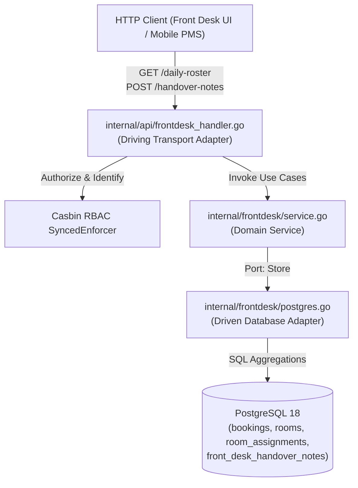

# Technical Architecture & Design Document
# Front Desk Daily Operations Roster & Shift Handover Board
# Hotel Booking Engine — Pulang ke Uttara (Yogyakarta)

- **Tanggal Dokumen:** 2026-10-03
- **Dokumen PRD Pasangan:** [PRD-Front-Desk-Roster](../prd/front-desk-daily-operations-roster-2026-10-03.md)
- **Dokumen SRS Pasangan:** [SRS-Front-Desk-Roster](../srs/front-desk-daily-operations-roster-2026-10-03.md)
- **Pelacak Eksekusi:** [Walkthrough Front Desk](../walkthrough/front-desk-daily-operations-roster-walkthrough-2026-10-03.md)
- **Status:** Approved / Ready for Implementation

---

## 1. Desain Arsitektur Hexagonal

Sesuai standar arsitektur sistem (`AGENTS.md` §2), logika operasional meja depan diisolasi dalam package domain baru: `internal/frontdesk/`.



---

## 2. Struktur Package & Port Interface

```go
package frontdesk

import (
	"context"
	"time"
)

// ShiftType enum regu kerja
type ShiftType string

const (
	ShiftMorning   ShiftType = "morning"
	ShiftAfternoon ShiftType = "afternoon"
	ShiftNight     ShiftType = "night"
)

// Store mendefinisikan kontrak persistensi dan agregasi operasional meja depan.
type Store interface {
	GetDailyRoster(ctx context.Context, targetDate time.Time) (*DailyRoster, error)
	CreateHandoverNote(ctx context.Context, note *HandoverNote) error
	ListHandoverNotes(ctx context.Context, limit, offset int) ([]HandoverNote, int, error)
}

// Service mendefinisikan use cases bisnis meja depan.
type Service interface {
	GetDailyRoster(ctx context.Context, targetDate time.Time) (*DailyRoster, error)
	RecordHandover(ctx context.Context, input RecordHandoverInput) (*HandoverNote, error)
	ListHandovers(ctx context.Context, limit, offset int) ([]HandoverNote, int, error)
}
```

---

## 3. Strategi Query Agregasi PostgreSQL Terpadu

Untuk memastikan performa baca tinggi (< 15 ms untuk 95 kamar), `GetDailyRoster` mengeksekusi agregasi ringkas:
1. **Metrics Aggregation:**
   ```sql
   SELECT
       COUNT(*) AS total_rooms,
       COUNT(*) FILTER (WHERE cleanliness_status = 'occupied') AS occupied_rooms,
       COUNT(*) FILTER (WHERE cleanliness_status = 'inspected') AS vacant_inspected_rooms,
       COUNT(*) FILTER (WHERE cleanliness_status = 'vacant_dirty') AS vacant_dirty_rooms,
       COUNT(*) FILTER (WHERE cleanliness_status = 'out_of_order') AS out_of_order_rooms
   FROM rooms;
   ```
2. **Expected Arrivals:**
   ```sql
   SELECT b.id, b.guest_name, COALESCE(b.guest_phone, ''), b.room_type_id,
          v.name AS room_type_name, b.num_rooms, b.num_guests,
          COALESCE(b.estimated_arrival_time, ''), COALESCE(b.special_requests, ''),
          b.total_price_minor,
          COALESCE(ARRAY_AGG(ra.room_number) FILTER (WHERE ra.room_number IS NOT NULL), '{}') AS assigned_rooms
   FROM bookings b
   JOIN room_variants v ON b.room_type_id = v.id
   LEFT JOIN room_assignments ra ON b.id = ra.booking_id
   WHERE b.status = 'confirmed' AND b.check_in::date = $1::date
   GROUP BY b.id, v.name;
   ```
3. **Expected Departures:**
   ```sql
   SELECT b.id, b.guest_name,
          COALESCE(ARRAY_AGG(ra.room_number) FILTER (WHERE ra.room_number IS NOT NULL), '{}') AS room_numbers,
          b.check_in, b.check_out
   FROM bookings b
   LEFT JOIN room_assignments ra ON b.id = ra.booking_id
   WHERE b.status = 'checked_in' AND b.check_out::date = $1::date
   GROUP BY b.id;
   ```

---

## 4. Analisis Anti-Overengineering (Ponytail Audit)
- Tidak ada message bus atau Redis pub-sub baru untuk roster harian; komputasi dilakukan secara langsung di PostgreSQL yang sudah memiliki indeks `idx_bookings_status` dan `idx_bookings_checkin`.
- Pagination sederhana untuk handover notes (`limit` dan `offset`).
- Struktur kode modular dan mudah diuji dengan dependency injection interfaces.
