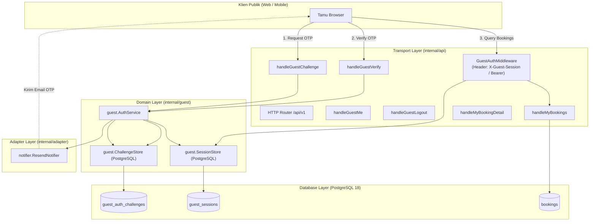

# Technical Architecture & Design Document
# Akses Tamu, Manajemen Sesi & Booking Saya (F02 & F03)
# Hotel Booking Engine — Pulang ke Uttara (Yogyakarta)

- **Tanggal Dokumen:** 3 Oktober 2026
- **Status:** **APPROVED FOR IMPLEMENTATION**
- **PRD Rujukan:** [`docs/prd/guest-access-my-bookings-2026-10-03.md`](file:///mnt/code/projects/jobs/pulang/current-booking/docs/prd/guest-access-my-bookings-2026-10-03.md)
- **SRS Rujukan:** [`docs/srs/guest-access-my-bookings-2026-10-03.md`](file:///mnt/code/projects/jobs/pulang/current-booking/docs/srs/guest-access-my-bookings-2026-10-03.md)

---

## 1. Arsitektur Komponen & Aliran Data



---

## 2. Skema Database (Migration `00008_guest_auth_and_sessions.sql`)

### A. Tabel Tantangan Verifikasi (`guest_auth_challenges`)
Menyimpan kode OTP sementara secara aman:
```sql
CREATE TABLE guest_auth_challenges (
    id           UUID PRIMARY KEY DEFAULT uuidv7(),
    email        TEXT NOT NULL,
    code_hash    TEXT NOT NULL,       -- SHA-256 dari 6-digit OTP
    attempts     INT  NOT NULL DEFAULT 0,
    max_attempts INT  NOT NULL DEFAULT 3,
    expires_at   TIMESTAMPTZ NOT NULL,
    verified_at  TIMESTAMPTZ,
    created_at   TIMESTAMPTZ NOT NULL DEFAULT now()
);

CREATE INDEX idx_guest_challenges_email ON guest_auth_challenges(email, created_at DESC);
```

### B. Tabel Sesi Tamu (`guest_sessions`)
Menyimpan token sesi aktif dengan hashing SHA-256:
```sql
CREATE TABLE guest_sessions (
    id             UUID PRIMARY KEY DEFAULT uuidv7(),
    guest_email    TEXT NOT NULL,
    token_hash     TEXT NOT NULL UNIQUE, -- SHA-256 dari token acak 32-byte
    expires_at     TIMESTAMPTZ NOT NULL,
    last_active_at TIMESTAMPTZ NOT NULL DEFAULT now(),
    created_at     TIMESTAMPTZ NOT NULL DEFAULT now()
);

CREATE INDEX idx_guest_sessions_token_hash ON guest_sessions(token_hash);
CREATE INDEX idx_guest_sessions_email ON guest_sessions(guest_email);
```

### C. Optimasi Indeks Riwayat Booking
Memastikan query `SELECT ... FROM bookings WHERE guest_email = $1` memiliki latensi sub-milidetik:
```sql
CREATE INDEX IF NOT EXISTS idx_bookings_guest_email ON bookings(guest_email, created_at DESC);
```

---

## 3. Desain Kriptografi & Keamanan Sesi

1. **Pembangkitan OTP yang Aman (*Cryptographic Randomness*):**
   * Menggunakan standard library `crypto/rand` untuk memilih angka integer acak seragam antara `100000` dan `999999`.
   * Menghindari modul PRNG pseudo-random `math/rand`.
2. **Penyimpanan Kode & Token dengan Hashing (*Zero Plaintext at Rest*):**
   * Baik kode OTP maupun token sesi **tidak pernah disimpan dalam bentuk plaintext** di database.
   * Disimpan dalam bentuk heksadesimal dari hash `crypto/sha256`:
     $$\text{code\_hash} = \text{SHA256}(\text{otp\_code})$$
     $$\text{token\_hash} = \text{SHA256}(\text{session\_token})$$
3. **Komparasi Waktu Konstan (*Constant-Time Comparison*):**
   * Saat memverifikasi hash kode OTP, menggunakan `subtle.ConstantTimeCompare` untuk mencegah eksploitasi *timing attack*.
4. **Pembatasan Percobaan (*Brute-force Mitigation*):**
   * Setiap percobaan yang salah menambah kolom `attempts`.
   * Jika `attempts >= max_attempts` (3 kali), tantangan langsung dianulir (*invalidated*).
5. **Mitigasi IDOR Total (UU PDP No. 27/2022):**
   * Setiap request ke `/guest/bookings/{id}` mencari baris dengan kriteria ganda:
     ```sql
     SELECT * FROM bookings WHERE id = $1 AND guest_email = $2
     ```
   * Jika booking ID ada di database tetapi milik email lain, database query menghasilkan `sql.ErrNoRows` $\rightarrow$ mengembalikan HTTP `404 Not Found` generik (`BOOKING_NOT_FOUND`).

---

## 4. Desain Interface & Dependency Injection (Hexagonal Pattern)

```go
package guest

import (
    "context"
    "time"
)

type GuestSession struct {
    ID          string
    GuestEmail  string
    TokenHash   string
    ExpiresAt   time.Time
    LastActiveAt time.Time
}

type Challenge struct {
    ID          string
    Email       string
    CodeHash    string
    Attempts    int
    MaxAttempts int
    ExpiresAt   time.Time
    VerifiedAt  *time.Time
}

type Service interface {
    RequestChallenge(ctx context.Context, email string) (cooldownSeconds int, err error)
    VerifyChallenge(ctx context.Context, email, code string) (token string, session *GuestSession, err error)
    ValidateSession(ctx context.Context, rawToken string) (*GuestSession, error)
    RevokeSession(ctx context.Context, rawToken string) error
    ListBookings(ctx context.Context, email, status string, limit int) ([]BookingSummary, error)
    GetBookingDetail(ctx context.Context, email, bookingID string) (*BookingDetail, *AllowedActions, error)
}
```

---

## 5. Analisis Anti-Overengineering (Prinsip Ponytail)

1. **Tanpa Framework Autentikasi Tambahan:**
   * Tidak memerlukan dependensi berat seperti Ory Kratos, Keycloak, atau library OAuth/OIDC yang rumit untuk kebutuhan autentikasi tamu hotel yang sederhana dan efisien.
2. **Standard Library Go Murni:**
   * Murni memanfaatkan paket bawaan: `crypto/rand`, `crypto/sha256`, `crypto/subtle`, `net/http`, dan driver `pgx/v5`.
3. **Penyimpanan Sesi Langsung di PostgreSQL:**
   * Menggunakan PostgreSQL untuk menyimpan sesi tamu dengan indeks unik `token_hash`. Tidak memerlukan setup Redis sekunder terpisah untuk sesi yang menambah kompleksitas operasional deployment.
