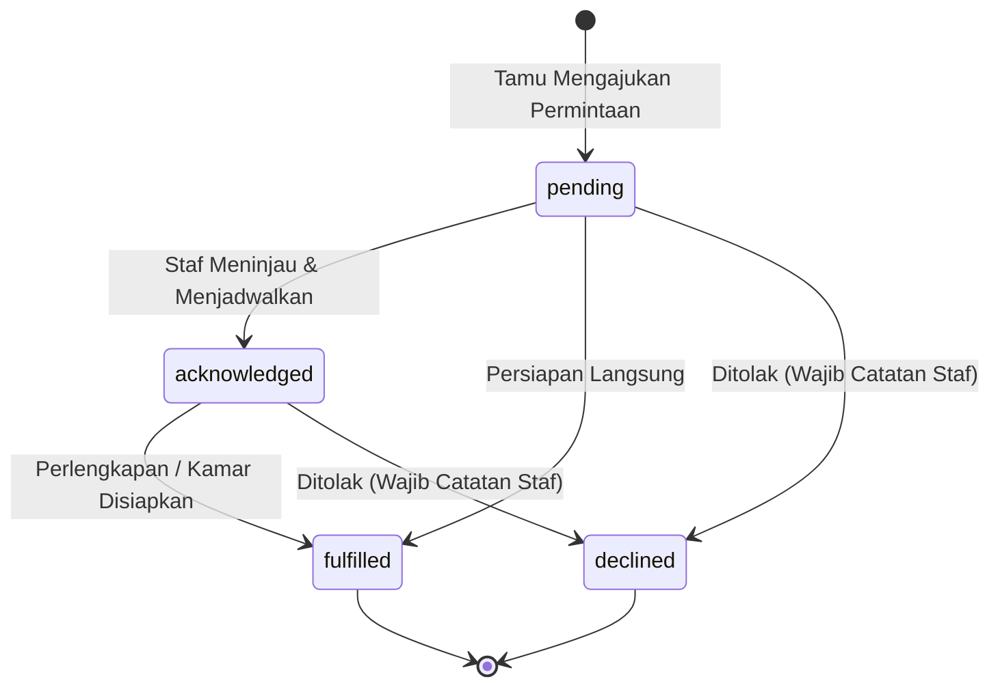

# Technical Architecture — Guest Special Requests & Stay Assistance Desk
# Hotel Booking Engine — Pulang ke Uttara (Yogyakarta)

- **Tanggal Dokumen:** 2026-10-03
- **Status:** Approved / Technical Design Freeze
- **Dokumen PRD Pasangan:** [PRD Guest Assistance](file:///mnt/code/projects/jobs/pulang/current-booking/docs/prd/guest-special-requests-and-assistance-2026-10-03.md)
- **Dokumen SRS Pasangan:** [SRS Guest Assistance](file:///mnt/code/projects/jobs/pulang/current-booking/docs/srs/guest-special-requests-and-assistance-2026-10-03.md)

---

## 1. Arsitektur Komponen & Alur Data (System Architecture)

Modul **Guest Special Requests** diimplementasikan dalam paket domain bersih `internal/assistance` dengan mematuhi prinsip Clean Architecture dan Hexagonal Pattern:

```mermaid
flowchart TD
    subgraph Client["Klien Eksternal"]
        G["Guest Web Portal\n(Bearer Guest OTP Session)"]
        S["Staff Workstation\n(receptionist / housekeeping)"]
        P["Public Guest Web\n(Unauthenticated Anon)"]
    end

    subgraph Transport["HTTP Transport Layer (internal/api)"]
        R["Chi Router & Middlewares"]
        MW_FF["RequireFeature(ff_guest_special_requests)"]
        MW_GS["requireGuestSession (Anti-IDOR)"]
        MW_RBAC["IdentifySubject + Casbin RBAC Authorize"]
        H_G["GuestRequestHandler"]
        H_S["StaffRequestHandler"]
        H_B["PublicBookingHandler (Masking BE-R02)"]
    end

    subgraph Domain["Core Domain Layer (internal/assistance)"]
        SVC["AssistanceService"]
        ROUT["Category Department Router"]
        SM["Fulfillment State Machine"]
    end

    subgraph Persistence["Storage Layer (PostgreSQL)"]
        REPO["PostgresAssistanceRepository"]
        DB[("Table: booking_special_requests\nTable: feature_flags\nTable: casbin_rule")]
    end

    G -->|POST/GET /guest/bookings/{id}/special-requests| MW_FF --> MW_GS --> H_G --> SVC
    S -->|GET/PUT /front-desk/special-requests| MW_RBAC --> H_S --> SVC
    P -->|GET /bookings/{id}| H_B -->|Mask special_requests| P
    SVC --> ROUT
    SVC --> SM
    SVC --> REPO --> DB
```

---

## 2. Model Data & State Machine

### 2.1. Kategori & Penentuan Departemen (*Auto-Routing*)
Kategori permintaan khusus dipetakan secara deterministik saat dibuat:
```go
func ResolveDepartment(category string) string {
    switch category {
    case "celebration_setup", "baby_crib", "quiet_room", "high_floor", "bed_type":
        return "housekeeping"
    case "early_arrival", "late_departure", "dietary_allergy", "other":
        return "front_desk"
    default:
        return "front_desk"
    }
}
```

### 2.2. Mesin Status Pemenuhan (*Fulfillment State Machine*)


Aturan validasi transisi:
- Menolak (*declined*) wajib menyertakan alasan pada `staff_notes` (minimal 5 karakter).
- Status `fulfilled` atau `declined` adalah status terminal (tidak dapat dikembalikan ke `pending`).

---

## 3. Penutupan Celah Keamanan BE-R02 (Public DTO Masking)

Pada `internal/api/router.go` dan `internal/booking/model.go`:
- Saat publik memanggil `GET /api/v1/bookings/{id}` tanpa `X-Guest-Token` dan tanpa token staf:
  - `SpecialRequests` pada respons JSON disamarkan menjadi `"[MASKED]"` (atau string kosong jika aslinya kosong).
- Tamu yang menyertakan header `X-Guest-Token` yang cocok dengan reservasi, atau tamu dengan sesi OTP aktif, atau staf dengan role (`receptionist`, `housekeeping`, `gm_admin`, `finance`), akan menerima teks asli `SpecialRequests`.

---

## 4. Skema Database & Migrasi Goose

Berkas migrasi: `migrations/00015_guest_special_requests.sql`

```sql
-- +goose Up
CREATE TABLE IF NOT EXISTS booking_special_requests (
    id UUID PRIMARY KEY DEFAULT uuidv7(),
    booking_id UUID NOT NULL REFERENCES bookings(id) ON DELETE CASCADE,
    category VARCHAR(32) NOT NULL CHECK (category IN (
        'early_arrival', 'late_departure', 'high_floor', 'quiet_room',
        'bed_type', 'celebration_setup', 'baby_crib', 'dietary_allergy', 'other'
    )),
    department VARCHAR(16) NOT NULL CHECK (department IN ('front_desk', 'housekeeping')),
    description TEXT NOT NULL,
    target_time VARCHAR(8) NOT NULL DEFAULT '',
    status VARCHAR(16) NOT NULL DEFAULT 'pending' CHECK (status IN ('pending', 'acknowledged', 'fulfilled', 'declined')),
    staff_notes TEXT NOT NULL DEFAULT '',
    handled_by VARCHAR(64) NOT NULL DEFAULT '',
    handled_at TIMESTAMPTZ,
    created_at TIMESTAMPTZ NOT NULL DEFAULT NOW(),
    updated_at TIMESTAMPTZ NOT NULL DEFAULT NOW()
);

CREATE INDEX IF NOT EXISTS idx_special_requests_booking ON booking_special_requests(booking_id);
CREATE INDEX IF NOT EXISTS idx_special_requests_dept_status ON booking_special_requests(department, status);

-- Casbin RBAC policies
INSERT INTO casbin_rule (ptype, v0, v1, v2) VALUES
    ('p', 'receptionist', '/api/v1/front-desk/special-requests*', 'GET'),
    ('p', 'receptionist', '/api/v1/front-desk/special-requests*', 'PUT'),
    ('p', 'housekeeping', '/api/v1/front-desk/special-requests*', 'GET'),
    ('p', 'housekeeping', '/api/v1/front-desk/special-requests*', 'PUT'),
    ('p', 'gm_admin', '/api/v1/front-desk/special-requests*', 'GET'),
    ('p', 'gm_admin', '/api/v1/front-desk/special-requests*', 'PUT')
ON CONFLICT DO NOTHING;

-- Feature Flag
INSERT INTO feature_flags (key, name, description, enabled, allowed_roles, updated_by, created_at, updated_at)
VALUES (
    'ff_guest_special_requests',
    'Guest Special Requests Management',
    'Pengajuan dan pemenuhan permintaan khusus tamu terstruktur',
    true,
    '{}',
    'system',
    NOW(),
    NOW()
) ON CONFLICT (key) DO NOTHING;

-- +goose Down
DELETE FROM feature_flags WHERE key = 'ff_guest_special_requests';
DELETE FROM casbin_rule WHERE v1 = '/api/v1/front-desk/special-requests*';
DROP TABLE IF EXISTS booking_special_requests CASCADE;
```

---

## 5. Analisis Anti-Overengineering (Ponytail Review)

- **YAGNI**: Tidak membuat microservice ticketing atau pub/sub eksternal terpisah. Semua disimpan dalam tabel relasional tunggal dengan kueri terindeks `(department, status)`.
- **Keterhubungan Ringkas**: Dihubungkan langsung ke `Chi` router dengan handler minimal dan memanfaatkan middleware `requireGuestSession` yang sudah teruji.
