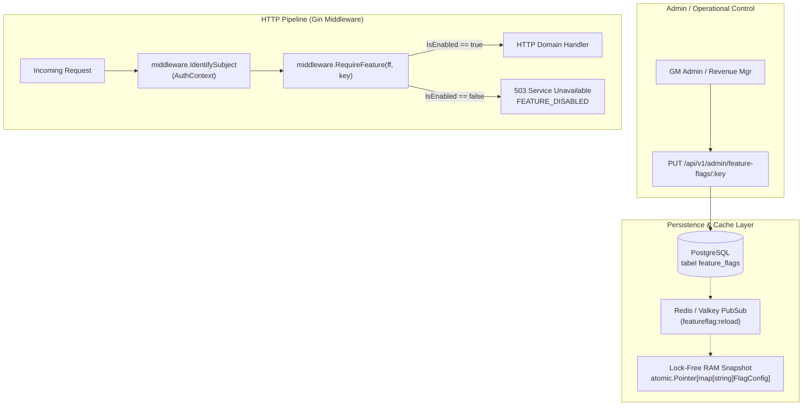

# Technical Architecture: Hospitality & Multi-Channel Feature Flags System
**Hotel Booking Engine — Pulang ke Uttara (Yogyakarta)**

- **Fitur ID:** `FEAT-HOSPITALITY-FEATURE-FLAGS`
- **Tanggal:** 4 Oktober 2026
- **Status:** APPROVED / IN IMPLEMENTATION

---

## 1. Arsitektur Evaluasi Runtime Feature Flags



---

## 2. Skema Database Goose Migration (Versi 23)

File: `migrations/00023_hospitality_and_channels_feature_flags.sql`

```sql
-- +goose Up
INSERT INTO feature_flags (key, name, description, enabled, allowed_roles) VALUES
('ff_dynamic_rates_calendar', 'Dynamic Rates & Stop-Sell Calendar', 'Kalender tarif musiman, batas stop-sell, dan kuota promo', TRUE, ARRAY['revenue_mgr', 'gm_admin']),
('ff_official_pdf_voucher', 'Official PDF Voucher & PBJT Invoice', 'Penerbitan berkas PDF e-voucher resmi A4 dan faktur pajak daerah PBJT 10%', TRUE, '{}'),
('ff_realtime_event_hub', 'Real-Time Live SSE Stream', 'Streaming live Server-Sent Events (SSE) status pemesanan tamu dan meja depan', TRUE, '{}'),
('ff_channel_sync_integration', 'Multi-Channel OTA Integration', 'Penerimaan webhook masuk kanal OTA dan monitoring isu sinkronisasi', TRUE, '{}'),
('ff_last_room_safeguards', 'Last-Room Safeguards & Upgrade', 'Proteksi kuota kamar terakhir LRDA, dynamic hold 15 menit, dan resolusi upgrade 1-click meja depan', TRUE, ARRAY['receptionist', 'revenue_mgr', 'gm_admin']),
('ff_whatsapp_notifier', 'Modular WhatsApp Dispatcher', 'Pengiriman otomatis notifikasi konfirmasi pemesanan dan tautan e-voucher via WhatsApp', TRUE, '{}')
ON CONFLICT (key) DO UPDATE SET
    name = EXCLUDED.name,
    description = EXCLUDED.description,
    allowed_roles = EXCLUDED.allowed_roles;

-- +goose Down
DELETE FROM feature_flags WHERE key IN (
    'ff_dynamic_rates_calendar',
    'ff_official_pdf_voucher',
    'ff_realtime_event_hub',
    'ff_channel_sync_integration',
    'ff_last_room_safeguards',
    'ff_whatsapp_notifier'
);
```

---

## 3. Matriks Proteksi Rute Transport

| Route Path | HTTP Method | Feature Flag Key | Peran Akses Minimal |
| :--- | :--- | :--- | :--- |
| `/api/v1/channel-events` | `POST` | `ff_channel_sync_integration` | Guest / OTA Public Webhook |
| `/api/v1/guest/bookings/:id/live-status` | `GET` | `ff_realtime_event_hub` | Guest Session Token |
| `/api/v1/front-desk/live-stream` | `GET` | `ff_realtime_event_hub` | Receptionist / GM Admin |
| `/api/v1/revenue/calendar` | `GET` | `ff_dynamic_rates_calendar` | Revenue Mgr / GM Admin |
| `/api/v1/revenue/calendar/bulk` | `PUT` | `ff_dynamic_rates_calendar` | Revenue Mgr / GM Admin |
| `/api/v1/revenue/promos` | `GET, POST` | `ff_promotions_engine` | Revenue Mgr / GM Admin |
| `/api/v1/revenue/promos/:id` | `PUT` | `ff_promotions_engine` | Revenue Mgr / GM Admin |
| `/api/v1/staff/channel-sync-issues` | `GET` | `ff_channel_sync_integration` | Receptionist / Revenue Mgr / GM Admin |
| `/api/v1/staff/channel-sync-issues/:id/resolve` | `POST` | `ff_last_room_safeguards` | Receptionist / Revenue Mgr / GM Admin |
| `/api/v1/staff/channel-partners/:code` | `GET` | `ff_channel_sync_integration` | Revenue Mgr / GM Admin |
| `/api/v1/bookings/:id/voucher.pdf` | `GET` | `ff_official_pdf_voucher` | Guest Session / Staff RBAC |
| `/api/v1/bookings/:id/invoice.pdf` | `GET` | `ff_official_pdf_voucher` | Guest Session / Staff RBAC |
