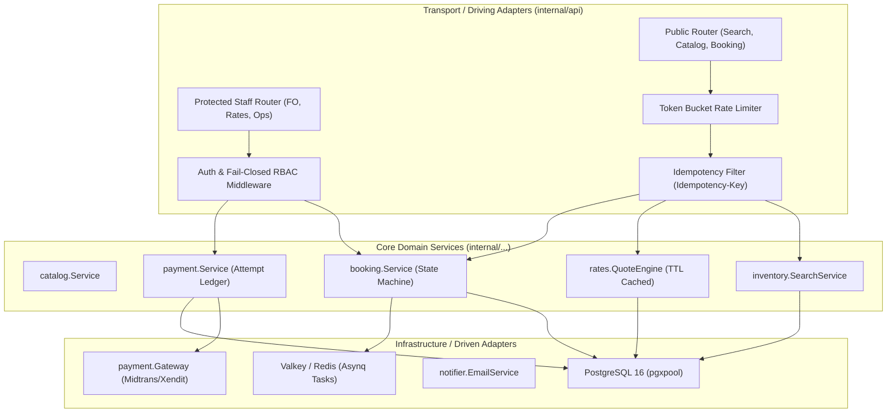
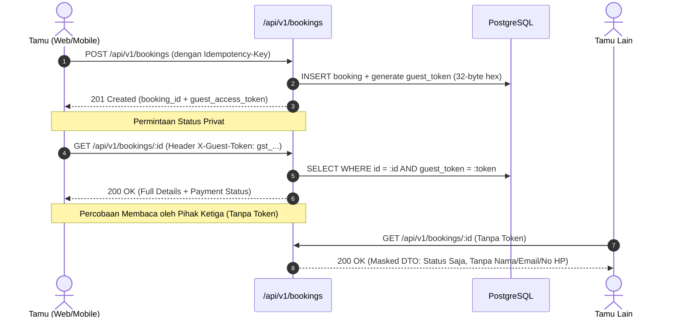
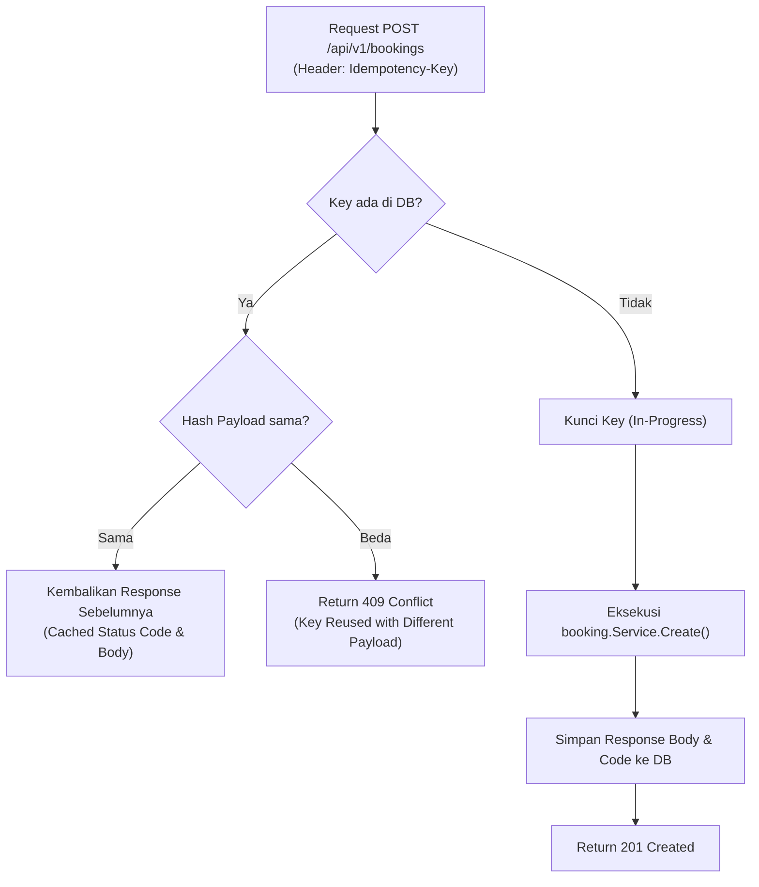

# Technical Architecture & Design Document
# Hotel Booking Engine Parity & Gap Remediation
**Properti:** Hotel Pulang ke Uttara, Yogyakarta (95 Kamar)  
**Dokumen ID:** `TECH-GAP-PARITY-2026-10-03`  
**Versi:** 1.0.0  
**Tanggal:** 2026-10-03  
**Status:** Architecture Baseline  
**Dokumen Terkait:** [`docs/prd/hotel-booking-parity-and-gap-remediation-2026-10-03.md`](file:///mnt/code/projects/jobs/pulang/current-booking/docs/prd/hotel-booking-parity-and-gap-remediation-2026-10-03.md) & [`docs/srs/hotel-booking-parity-and-gap-remediation-2026-10-03.md`](file:///mnt/code/projects/jobs/pulang/current-booking/docs/srs/hotel-booking-parity-and-gap-remediation-2026-10-03.md)  

---

## 1. Arsitektur Komponen Hexagonal (Hexagonal Architecture)

Sistem memisahkan secara ketat batas antarmuka transport (driving adapter), domain inti (*core domain*), dan adaptasi infrastruktur database/broker (driven adapter):



---

## 2. Arsitektur Keamanan & Proteksi API (Batch BE-A)

### 2.1 Fail-Closed Casbin RBAC Middleware
Pada arsitektur sebelumnya ([`cmd/server/main.go`](file:///mnt/code/projects/jobs/pulang/current-booking/cmd/server/main.go)), jika inisialisasi enforcer gagal, server tetap berjalan dan mengabaikan pemeriksaan otorisasi (*fail-open*).
Pada arsitektur baru:
1. **Startup Gate**: Kegagalan inisialisasi adapter database atau model Casbin menyebabkan server membatalkan booting (*fatal panic/os.Exit*).
2. **Runtime Enforcer Guard**: Middleware memeriksa `enforcer != nil`. Jika nil, request langsung ditolak dengan HTTP `503 Service Unavailable`.
3. **Pembersihan Header Publik**: Middleware secara eksplisit menghapus header `X-User-Role` atau `X-User-ID` yang dikirim dari klien publik. Identitas staf hanya dapat diperoleh melalui parsing dan verifikasi signature token JWT/session rahasia.

### 2.2 Perlindungan Privasi Tamu (Guest Scoped Token)


---

## 3. Desain Pencarian & Mesin Penawaran Harga (Batch BE-B & BE-C)

### 3.1 Pencarian Ketersediaan Multi-Malam Kontinu (`inventory.SearchService`)
Algoritma memeriksa ketersediaan seluruh tanggal menginap secara serentak menggunakan agregasi SQL:
```sql
SELECT 
    rt.id AS room_type_id,
    MIN(inv.available_rooms) AS min_available_rooms,
    COUNT(inv.date) AS available_nights_count
FROM room_types rt
JOIN inventory inv ON inv.room_type_id = rt.id
WHERE inv.date >= $1 AND inv.date < $2
GROUP BY rt.id;
```
* **Kriteria Tersedia:** `available_nights_count == total_stay_nights` DAN `min_available_rooms >= requested_rooms`.
* **Jika Tidak Tersedia:** Status ditandai `is_available = false` dengan `available_units = 0` dan alasan penolakan yang eksplisit.

### 3.2 Quote Engine dengan TTL 15 Menit (`rates.QuoteEngine`)
Untuk mencegah *price drift* atau manipulasi harga di sisi klien:
1. Saat tamu memilih kombinasi kamar dan rate plan pada hasil pencarian, sistem membuat entitas `Quote`:
   ```go
   type Quote struct {
       ID             string       `json:"quote_id"`
       RoomTypeID     string       `json:"room_type_id"`
       RatePlanCode   string       `json:"rate_plan_code"`
       CheckIn        time.Time    `json:"check_in"`
       CheckOut       time.Time    `json:"check_out"`
       NumRooms       int          `json:"num_rooms"`
       TotalPrice     Money        `json:"total_price"`
       PriceBreakdown Breakdown    `json:"breakdown"`
       PolicySnapshot Policy       `json:"cancellation_policy"`
       ExpiresAt      time.Time    `json:"expires_at"`
   }
   ```
2. Quote disimpan di memori ber-TTL / cache database.
3. Saat `CreateBooking` dipanggil, sistem memvalidasi:
   - Apakah `now < quote.ExpiresAt`? (Jika lewat $\rightarrow$ error `QUOTE_EXPIRED`).
   - Apakah parameter reservasi cocok 100% dengan snapshot quote?

---

## 4. Mekanisme Idempotensi & Siklus Pembayaran (Batch BE-D)

### 4.1 Filter Idempotensi Transaksi (`internal/api/idempotency.go`)


### 4.2 Otoritas Batas Waktu Hold Kamar Server
Batas waktu kedaluwarsa hold (`expires_at`) disimpan di kolom database `bookings.expires_at`.
Saat webhook konfirmasi tiba dari Payment Gateway:
```sql
SELECT status, expires_at 
FROM bookings 
WHERE id = $1 
FOR UPDATE;
```
* Jika `now() > expires_at` DAN `status == 'pending'`: Transaksi dibatalkan secara otomatis, status diubah menjadi `expired`, inventaris kamar dilepaskan, dan webhook pembayaran dicatat sebagai *late payment* yang memerlukan rekonsiliasi manual atau pengembalian dana (*refund*).

---

## 5. Algoritma Konkurensi Alokasi Kamar Bebas False-Conflict (Batch BE-E)

Untuk mencegah dua staf Front Desk gagal check-in akibat saling memperebutkan kamar yang sama padahal ada kamar lain yang kosong:
```sql
-- Memilih kamar fisik yang benar-benar bebas tanpa saling memblokir (SKIP LOCKED)
SELECT r.room_number 
FROM rooms r
WHERE r.room_type_id = $1
  AND NOT EXISTS (
      SELECT 1 
      FROM reservation_room_nights rrn
      WHERE rrn.room_number = r.room_number
        AND rrn.date >= $2 AND rrn.date < $3
  )
ORDER BY r.room_number ASC
LIMIT $4
FOR UPDATE SKIP LOCKED;
```
Dengan klausa `FOR UPDATE SKIP LOCKED`:
* Transaksi A mengunci kamar `301` dan `302`.
* Transaksi B yang berjalan di milisekon yang sama secara otomatis melompati `301`/`302` dan langsung mengunci `303` dan `304` tanpa menimbulkan deadlock atau error SQLSTATE `23P01`.

---

## 6. Rencana Migrasi Database Goose

1. **`migrations/00004_catalog_and_rate_plans.sql`**:
   * Menambahkan tabel `rate_plans` (`code`, `name`, `includes_breakfast`, `cancellation_policy`).
   * Menambahkan varian fisik kamar Pulang ke Uttara (95 kamar total across 5 families, 7 sellable variants).
2. **`migrations/00005_idempotency_and_ledger.sql`**:
   * Menambahkan tabel `idempotency_keys` (`key`, `payload_hash`, `status_code`, `response_body`, `expires_at`).
   * Menambahkan tabel `payment_attempts` (`booking_id`, `provider`, `provider_reference`, `amount_minor`, `currency`, `status`, `webhook_payload`).
   * Menambahkan kolom pada `bookings`: `guest_token`, `phone_number`, `rate_plan_code`, `special_requests`, `estimated_arrival`, `terms_consented_at`, `cancellation_policy`.
3. **`migrations/00006_outbox_durability.sql`**:
   * Menambahkan kolom `idempotency_key`, `delivery_status`, dan `last_error` pada tabel `outbox_events`.
