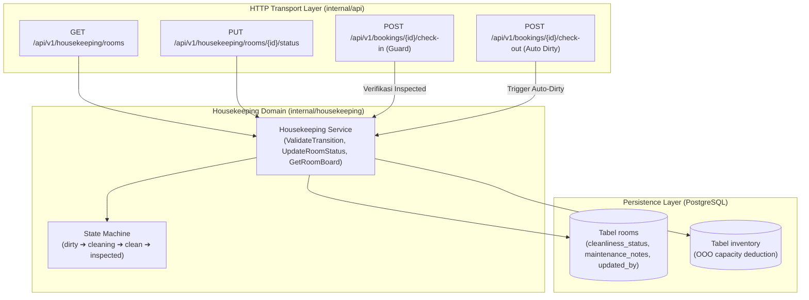

# Technical Architecture — Housekeeping Room Status & Readiness Lifecycle
# Hotel Booking Engine — Pulang ke Uttara (Yogyakarta)

Dokumen Terkait:
- **PRD:** [PRD-Housekeeping-Readiness](../prd/housekeeping-room-status-and-readiness-2026-10-03.md)
- **SRS:** [SRS-Housekeeping-Readiness](../srs/housekeeping-room-status-and-readiness-2026-10-03.md)
- **Walkthrough Tracking:** [Walkthrough Housekeeping](../walkthrough/housekeeping-room-status-walkthrough-2026-10-03.md)

---

## 1. Desain Arsitektur & Diagram Komponen

Modul **Housekeeping** mengimplementasikan prinsip *Hexagonal Architecture (Ports and Adapters)*:
- **Domain Package (`internal/housekeeping`):** Berisi logika inti mesin status kebersihan kamar, validasi transisi, dan interaksi basis data.
- **Inbound Transport (`internal/api`):** Menangani HTTP REST endpoint untuk pemantauan board kamar dan pembaruan status.
- **Outbound Storage (`internal/housekeeping/postgres.go`):** Mengelola query SQL efisien dengan penguncian baris (`FOR UPDATE`) untuk konkurensi aman.
- **Cross-Domain Integration:** Terhubung dengan `internal/booking` pada fase *Check-in* (menolak kamar kotor) dan *Check-out* (otomatisasi `vacant_dirty`).



---

## 2. Matriks Transisi Status Kamar Fisik (State Machine Matrix)

| Status Awal (*From*) | Status Tujuan (*To*) | Otorisasi Role | Validitas | Keterangan Operasional |
| :--- | :--- | :--- | :---: | :--- |
| `vacant_dirty` | `cleaning` | `housekeeping` | **LEGAL** | Attendant mulai membersihkan kamar. |
| `cleaning` | `vacant_clean` | `housekeeping` | **LEGAL** | Attendant selesai membersihkan kamar. |
| `vacant_clean` | `inspected` | `housekeeping` (Supervisor), `gm_admin` | **LEGAL** | Supervisor menyetujui kualitas kamar (QC pass). |
| `vacant_clean` | `vacant_dirty` | `housekeeping` (Supervisor) | **LEGAL** | Supervisor menolak hasil pembersihan (rework). |
| `inspected` | `occupied` | `receptionist` (via Check-in) | **LEGAL** | Tamu resmi menempati kamar. |
| `occupied` | `vacant_dirty` | `receptionist` (via Check-out) | **LEGAL** | Tamu checkout, kamar wajib dibersihkan ulang. |
| *Status apapun* | `out_of_service` | `housekeeping`, `gm_admin` | **LEGAL** | Kamar rusak ringan (tidak potong inventaris). |
| *Status apapun* | `out_of_order` | `gm_admin` | **LEGAL** | Kamar rusak berat (potong kuota inventaris web). |
| `vacant_dirty` | `inspected` | Siapapun | **ILLEGAL** | Dilarang melompati tahap pembersihan dan inspeksi. |
| `occupied` | `inspected` | Siapapun | **ILLEGAL** | Kamar terisi tidak boleh diinspeksi sebagai kamar kosong. |

---

## 3. Desain Antarmuka Kode Go (Interfaces & DTOs)

```go
package housekeeping

import (
	"context"
	"time"
)

type CleanlinessStatus string

const (
	StatusVacantDirty  CleanlinessStatus = "vacant_dirty"
	StatusCleaning     CleanlinessStatus = "cleaning"
	StatusVacantClean  CleanlinessStatus = "vacant_clean"
	StatusInspected    CleanlinessStatus = "inspected"
	StatusOccupied     CleanlinessStatus = "occupied"
	StatusOutOfService CleanlinessStatus = "out_of_service"
	StatusOutOfOrder   CleanlinessStatus = "out_of_order"
)

type RoomOperationalView struct {
	RoomNumber        string            `json:"room_number"`
	RoomTypeID        string            `json:"room_type_id"`
	RoomTypeName      string            `json:"room_type_name"`
	Floor             int               `json:"floor"`
	CleanlinessStatus CleanlinessStatus `json:"cleanliness_status"`
	MaintenanceNotes  string            `json:"maintenance_notes"`
	CurrentBookingID  *string           `json:"current_booking_id,omitempty"`
	GuestName         *string           `json:"guest_name,omitempty"`
	UpdatedAt         time.Time         `json:"updated_at"`
	UpdatedBy         string            `json:"updated_by"`
}

type Store interface {
	GetRoomStatus(ctx context.Context, roomNumber string) (CleanlinessStatus, error)
	UpdateRoomStatus(ctx context.Context, roomNumber string, to CleanlinessStatus, notes, updatedBy string) error
	ListOperationalRooms(ctx context.Context, floor int, status string, roomTypeID string) ([]RoomOperationalView, error)
	MarkRoomOutOfOrder(ctx context.Context, roomNumber string, fromDate, toDate time.Time, reason string) error
}

type Service interface {
	GetRoomBoard(ctx context.Context, floor int, status string, roomTypeID string) ([]RoomOperationalView, map[string]int, error)
	UpdateStatus(ctx context.Context, roomNumber string, to CleanlinessStatus, notes, actorID, actorRole string) error
	ValidateRoomForCheckIn(ctx context.Context, roomNumber string) error
	MarkRoomDirtyOnCheckOut(ctx context.Context, roomNumber string) error
}
```

---

## 4. Analisis Anti-Overengineering (Prinsip Ponytail)

1. **Penggunaan Go Standard Library:**
   Tidak menggunakan framework state machine eksternal. Logika transisi ditangani melalui switch/case sederhana berbasis map status legal di Go standard library.
2. **Kueri Agregasi Langsung (No Caching Overhead):**
   Hotel Pulang ke Uttara memiliki 95 kamar fisik (dataset sangat kecil < 100 baris). Kueri `SELECT ... FROM rooms` dieksekusi langsung ke PostgreSQL dengan waktu eksekusi < 1 milidetik tanpa memerlukan Redis cache yang rumit.
3. **Penyimpanan Jejak Audit Ringkas:**
   Kolom `updated_by` dan `maintenance_notes` langsung disimpan pada baris kamar, tanpa perlu tabel log terpisah yang berlebihan.
