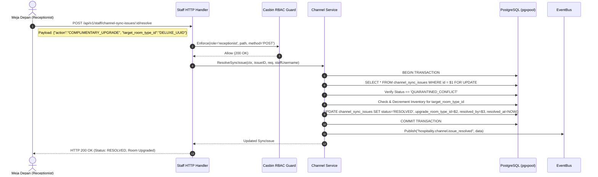

# Technical Architecture & Systems Design Document
# Last-Room Hospitality Safeguards: LRDA Safety Buffer, Dynamic Hold & 1-Click Complimentary Upgrade Resolver
**Hotel Booking Engine — Pulang ke Uttara (Yogyakarta)**

- **Dokumen Identitas:** `ARCH-FEAT-LAST-ROOM-SAFEGUARDS-2026-10-04`
- **Tanggal Efektif:** 4 Oktober 2026
- **Status Dokumen:** APPROVED / IN IMPLEMENTATION
- **Penanggung Jawab:** Lead Systems Architect & Principal Hospitality Engineer
- **Target Properti:** Hotel Pulang ke Uttara (95 Kamar, Sleman, D.I. Yogyakarta)
- **Dokumen Pasangan Terkait:**
  - PRD: [`docs/prd/last-room-safeguards-and-complimentary-upgrade-2026-10-04.md`](file:///mnt/code/projects/jobs/pulang/current-booking/docs/prd/last-room-safeguards-and-complimentary-upgrade-2026-10-04.md)
  - SRS: [`docs/srs/last-room-safeguards-and-complimentary-upgrade-2026-10-04.md`](file:///mnt/code/projects/jobs/pulang/current-booking/docs/srs/last-room-safeguards-and-complimentary-upgrade-2026-10-04.md)
  - Walkthrough: [`docs/walkthrough/last-room-safeguards-and-complimentary-upgrade-walkthrough-2026-10-04.md`](file:///mnt/code/projects/jobs/pulang/current-booking/docs/walkthrough/last-room-safeguards-and-complimentary-upgrade-walkthrough-2026-10-04.md)

---

## 1. Ringkasan Eksekutif & Konteks Rekayasa (*Executive Summary*)

Arsitektur ini merancang mekanisme perlindungan tingkat tinggi (*high-end hospitality safeguards*) untuk hotel butik bintang 4 **Pulang ke Uttara** (95 kamar fisik terbagi ke dalam tipe Superior, Deluxe, Executive, dan Suite).

Fokus rekayasa terletak pada penyelesaian anomali ketersediaan kritis saat **Kamar Tinggal 1 (*The Last Room Dilemma*)**:
1. **LRDA (Last-Room Direct Allocation) Buffer:** Mencegah kanalisasi OTA pihak ketiga (Agoda, Traveloka) menghabiskan stok kamar terakhir, memastikan kamar tersebut 100% terlindungi untuk reservasi langsung (*direct web*) atau *walk-in* di meja depan demi keuntungan margin 100% tanpa komisi 15-20%.
2. **Dynamic Hold Timeout (Anti-Ghost Booking):** Menghindari fenomena *Denial-of-Inventory* dengan memotong durasi penahanan stok dari 30 menit menjadi 15 menit ketika sisa kamar bernilai kritis $\le 1$.
3. **1-Click Complimentary Upgrade Resolution Engine:** Menyediakan mekanisme atomik bagi staf meja depan untuk menyelesaikan insiden reservasi OTA yang terlanjur tiba di hotel melalui *room upgrade* ke kamar kelas lebih tinggi tanpa menimbulkan *physical overbooking*.

---

## 2. Diagram Alur Transaksional & Arsitektur (*Sequence Diagrams*)

### 2.1 Alur Evaluasi LRDA Safety Buffer & Dynamic Hold

```mermaid
sequenceDiagram
    autonumber
    actor Guest as Tamu Web (Direct)
    actor OTA as Mitra OTA (Agoda)
    participant API as HTTP Gateway / Routes
    participant ChanSvc as Channel Service
    participant BookSvc as Booking Service
    participant InvStore as Inventory Store (PostgreSQL)
    participant Bus as NATS JetStream / EventBus
    participant FD as Live Front Desk (SSE)

    Note over OTA,InvStore: Kasus A: OTA mencoba memesan saat sisa kamar = 1 (Safety Buffer = 1)
    OTA->>API: POST /api/v1/channel-events (Booking Request)
    API->>ChanSvc: ProcessInboundEvent(req)
    ChanSvc->>InvStore: CheckAvailabilityWithBuffer(room_type, dates, rooms=1, buffer=1)
    InvStore-->>ChanSvc: ErrInsufficient (Sisa kamar = 1 <= buffer 1)
    ChanSvc->>InvStore: SaveSyncIssue(status='QUARANTINED_CONFLICT')
    ChanSvc->>Bus: Publish("hospitality.channel.conflict", data)
    Bus-->>FD: Push SSE Event ("channel_conflict")
    ChanSvc-->>API: ErrAllotmentExhausted
    API-->>OTA: HTTP 409 Conflict (ALLOTMENT_EXHAUSTED)

    Note over Guest,InvStore: Kasus B: Tamu Web Direct memesan kamar terakhir tersebut
    Guest->>API: POST /api/v1/bookings (CreateBooking)
    API->>BookSvc: Create(in)
    BookSvc->>InvStore: GetByDate(room_type, dates)
    InvStore-->>BookSvc: AvailableRooms = 1 (Critical Inventory Detected!)
    BookSvc->>BookSvc: Set HoldDuration = 15 Menit (Dynamic Hold)
    BookSvc->>InvStore: BEGIN Tx; LockAndDecrement; InsertBookingWithHold(expires_at=+15m); COMMIT
    BookSvc-->>API: BookingCreated (expires_at=+15m)
    API-->>Guest: HTTP 201 Created (Countdown: 15:00)
```

---

### 2.2 Alur 1-Click Complimentary Upgrade Resolution



---

## 3. Analisis Anti-Overengineering (*Ponytail Audit*)

Prinsip **Ponytail** (Anti-Overengineering) diterapkan secara ketat dalam rancangan ini:

| Solusi Berlebihan (*Overengineering*) | Pendekatan Ringkas Pulang ke Uttara (*Ponytail Choice*) | Justifikasi Rekayasa |
| :--- | :--- | :--- |
| Membangun microservice *Dynamic Pricing & Allocation Engine* terpisah dengan gRPC. | Mengintegrasikan kalkulasi hold dan pengecekan buffer langsung di domain service yang ada (`booking.Service` & `channel.Service`). | Latensi < 1ms, zero network hops, zero overhead deployment tambahan. |
| Menggunakan distributed consensus / distributed lock (misal Redis Redlock) untuk reservasi upgrade. | Menggunakan PostgreSQL atomic transaction dengan row-level lock (`SELECT ... FOR UPDATE` & conditional `UPDATE inventory`). | PostgreSQL ACID menjamin 100% serializability tanpa bahaya clock skew atau network partition split-brain. |
| Menambahkan tabel baru *upgrade_ledger* dan *audit_log_partitions*. | Mengembangkan tabel `channel_sync_issues` yang sudah ada dengan kolom `upgrade_room_type_id`, `resolved_by`, `resolved_at`, dan `notes`. | Menghemat DDL complexity, query bergabung langsung tanpa JOIN tabel ketiga. |

---

## 4. Desain Komponen & Spesifikasi Modul

### 4.1 Modul `internal/inventory`: `CheckWithBuffer`
Penambahan fungsi pure utility di domain inventory untuk evaluasi safety buffer:
```go
// CheckWithBuffer memverifikasi sisa kamar tidak menembus batas safetyBuffer.
func CheckWithBuffer(avail []Availability, from, to time.Time, numRooms, safetyBuffer int) error {
    fromUTC := time.Date(from.Year(), from.Month(), from.Day(), 0, 0, 0, 0, time.UTC)
    toUTC := time.Date(to.Year(), to.Month(), to.Day(), 0, 0, 0, 0, time.UTC)
    nights := int(toUTC.Sub(fromUTC) / (24 * time.Hour))
    if len(avail) < nights {
        return fmt.Errorf("%w: expected %d nights, got %d rows", ErrNotFound, nights, len(avail))
    }
    for _, a := range avail {
        if a.AvailableRooms - numRooms < safetyBuffer {
            return fmt.Errorf("%w: %s has %d available, requested %d exceeds safety buffer threshold %d",
                ErrInsufficient, a.Date.Format("2006-01-02"), a.AvailableRooms, numRooms, safetyBuffer)
        }
    }
    return nil
}
```

### 4.2 Modul `internal/booking`: Dynamic Hold Duration
Pada use case `Create`:
```go
// Evaluasi stok kritis: jika ada malam dengan stok <= 1, hold duration dipersingkat ke 15 menit
holdDuration := s.holdTimeout
for _, a := range avail {
    if a.AvailableRooms <= 1 || a.AvailableRooms - in.NumRooms <= 0 {
        if s.holdTimeout > 15*time.Minute {
            holdDuration = 15 * time.Minute
        } else {
            holdDuration = s.holdTimeout / 2
        }
        break
    }
}
holdExpiry := time.Now().UTC().Add(holdDuration)
```

### 4.3 Modul `internal/channel`: Safety Buffer Enforcement & Resolve Issue
Pada use case `ProcessInboundEvent`:
```go
// Ambil partner dan safety buffer-nya
safetyBuffer := partner.SafetyBuffer
if safetyBuffer < 0 {
    safetyBuffer = 0
}
// Pengecekan ketersediaan dengan safety buffer
if err := s.inventory.CheckAvailabilityWithBuffer(ctx, req.RoomTypeID, checkIn, checkOut, numRooms, safetyBuffer); err != nil {
    // Karantina dan tolak dengan ErrAllotmentExhausted
}
```

Pada use case `ResolveSyncIssue`:
```go
func (s *Service) ResolveSyncIssue(ctx context.Context, issueID uuid.UUID, req *ResolveIssueRequest, staffUsername string) (*SyncIssue, error)
```
- Memvalidasi action (`COMPLIMENTARY_UPGRADE`, `REJECT_AND_CANCEL`, `FORCE_OVERBOOK_CONFIRMED`).
- Pada `COMPLIMENTARY_UPGRADE`:
  - Menjalankan transaksi DB untuk memverifikasi dan memotong stok kamar `target_room_type_id`.
  - Mengupdate status isu menjadi `RESOLVED`, mengisi `upgrade_room_type_id`, `resolved_by`, `resolved_at`, dan `notes`.

---

## 5. Skema Database & Migrasi Goose `00022`

```sql
-- +goose Up
ALTER TABLE channel_partners 
ADD COLUMN IF NOT EXISTS safety_buffer INT NOT NULL DEFAULT 1;

ALTER TABLE channel_sync_issues
ADD COLUMN IF NOT EXISTS upgrade_room_type_id UUID REFERENCES room_types(id) ON DELETE SET NULL,
ADD COLUMN IF NOT EXISTS notes TEXT NOT NULL DEFAULT '';

INSERT INTO casbin_rule (ptype, v0, v1, v2) VALUES
    ('p', 'receptionist', '/api/v1/staff/channel-sync-issues', 'GET'),
    ('p', 'receptionist', '/api/v1/staff/channel-sync-issues/:id/resolve', 'POST'),
    ('p', 'revenue_mgr', '/api/v1/staff/channel-sync-issues/:id/resolve', 'POST'),
    ('p', 'gm_admin', '/api/v1/staff/channel-sync-issues/:id/resolve', 'POST')
ON CONFLICT DO NOTHING;

-- +goose Down
DELETE FROM casbin_rule WHERE ptype = 'p' AND v1 = '/api/v1/staff/channel-sync-issues/:id/resolve';
ALTER TABLE channel_sync_issues DROP COLUMN IF EXISTS notes;
ALTER TABLE channel_sync_issues DROP COLUMN IF EXISTS upgrade_room_type_id;
ALTER TABLE channel_partners DROP COLUMN IF EXISTS safety_buffer;
```

---

## 6. Mitigasi Concurrency, Deadlock & Kegagalan

1. **Deadlock Prevention (Strict Date ASC Ordering):**
   - Setiap operasi pemotongan stok (`LockAndDecrement` baik pada pemesanan reguler maupun kamar target upgrade) selalu mengeksekusi `SELECT ... FOR UPDATE` dengan klausul `ORDER BY date ASC`. Hal ini menjamin transaksi paralel mengunci baris tanggal secara deterministik dari tanggal awal ke tanggal akhir, secara matematis mengeliminasi potensi siklus deadlock (*dining philosophers cycle*).
2. **Double-Resolution Prevention:**
   - Baris isu di `channel_sync_issues` dikunci dengan `SELECT status FROM channel_sync_issues WHERE id = $1 FOR UPDATE`. Jika status telah `RESOLVED`, permintaan resolusi kedua langsung ditolak dengan `ErrIssueAlreadyResolved` (HTTP `409 Conflict`).
3. **Rollback Safety:**
   - Apabila tipe kamar target upgrade tidak memiliki sisa kamar yang cukup, transaksi database di-rollback secara penuh; status isu karantina tetap berada pada `QUARANTINED_CONFLICT` sehingga staf dapat memilih opsi lain (misal tipe kamar berbeda atau relokasi).

---

## 7. Rencana Pengujian (*Testing Strategy*)

1. **Unit Tests (Coverage $\ge$ 80%):**
   - Table-driven tests pada `internal/inventory`: verifikasi `CheckWithBuffer` untuk berbagai kombinasi sisa stok, kamar diminta, dan buffer.
   - Table-driven tests pada `internal/channel`: verifikasi penolakan OTA saat stok = 1, penerimaan OTA saat stok > 1, resolusi upgrade kamar berhasil, resolusi dengan kamar target penuh (409), dan RBAC permissions.
   - Table-driven tests pada `internal/booking`: verifikasi durasi hold 15 menit saat stok kritis vs 30 menit saat stok aman.
2. **End-to-End Testing:**
   - Skenario `E2E-79`: Dynamic hold timeout 15 menit dan penolakan OTA oleh LRDA safety buffer.
   - Skenario `E2E-80`: 1-Click complimentary upgrade resolver meja depan, verifikasi dekremen stok kamar upgrade, dan verifikasi RBAC Forbidden untuk housekeeping.
