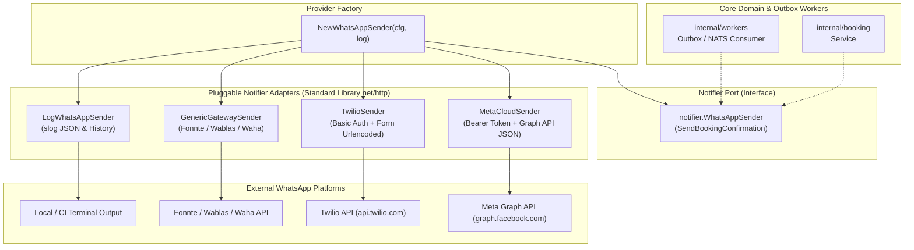

# Technical Architecture: Modular WhatsApp Notifier & Multi-Provider Engine
**Hotel Booking Engine — Pulang ke Uttara (Yogyakarta)**

- **Fitur ID:** `FEAT-MODULAR-WHATSAPP-NOTIFIER`
- **Tanggal:** 4 Oktober 2026
- **Status:** APPROVED / IN IMPLEMENTATION

---

## 1. Diagram Arsitektur Hexagonal & Adapter Pattern



---

## 2. Struktur Data Konfigurasi & Factory

```go
type WhatsAppConfig struct {
    Provider      string        // "log", "generic_http", "twilio", "meta_cloud"
    BaseURL       string        // Custom URL jika ada
    APIKey        string        // Auth Token / Secret Key / Bearer Token
    AccountSID    string        // Twilio Account SID
    PhoneNumberID string        // Meta Cloud Phone Number ID
    FromPhone     string        // Twilio Sender Phone (e.g., +14155238886)
    Timeout       time.Duration // HTTP client timeout (default 10s)
}
```

### Factory Logic:
```go
func NewWhatsAppSender(cfg WhatsAppConfig, log *slog.Logger) (WhatsAppSender, error) {
    if log == nil {
        log = slog.Default()
    }
    if cfg.Timeout <= 0 {
        cfg.Timeout = 10 * time.Second
    }

    switch strings.ToLower(strings.TrimSpace(cfg.Provider)) {
    case "", "log", "mock":
        return NewLogWhatsApp(log), nil
    case "generic_http", "gateway", "fonnte", "wablas":
        return NewGenericGatewaySender(cfg, log)
    case "twilio":
        return NewTwilioSender(cfg, log)
    case "meta_cloud", "waba", "meta":
        return NewMetaCloudSender(cfg, log)
    default:
        return nil, fmt.Errorf("%w: %s", ErrUnsupportedProvider, cfg.Provider)
    }
}
```

---

## 3. Detail Implementasi Adapter Provider

### 3.1 Normalisasi Nomor Telepon (`NormalizePhone`)
```go
// Menghilangkan spasi, tanda kurung, strip.
// Menjamin awalan kode negara Indonesia 62 (atau format E.164 +62).
func NormalizePhoneE164(phone string) string {
    digits := extractDigits(phone)
    if strings.HasPrefix(digits, "0") {
        digits = "62" + digits[1:]
    }
    return "+" + digits
}

func NormalizePhoneDigitsOnly(phone string) string {
    digits := extractDigits(phone)
    if strings.HasPrefix(digits, "0") {
        digits = "62" + digits[1:]
    }
    return digits
}
```

### 3.2 Twilio Adapter (`TwilioSender`)
- **Protokol:** POST form-urlencoded
- **Header:**
  - `Authorization: Basic base64(AccountSID + ":" + APIKey)`
  - `Content-Type: application/x-www-form-urlencoded`
- **Body Data:**
  - `From=whatsapp:<FromPhone>`
  - `To=whatsapp:<ToPhoneE164>`
  - `Body=<Text>`
- **HTTP Client:** Dialokasikan dengan timeout `cfg.Timeout`.

### 3.3 Meta WhatsApp Business Cloud API (`MetaCloudSender`)
- **Protokol:** POST JSON ke `https://graph.facebook.com/v20.0/{PhoneNumberID}/messages`
- **Header:**
  - `Authorization: Bearer <APIKey>`
  - `Content-Type: application/json`
- **Body Data:**
  ```json
  {
    "messaging_product": "whatsapp",
    "recipient_type": "individual",
    "to": "6281234567890",
    "type": "text",
    "text": {
      "preview_url": true,
      "body": "..."
    }
  }
  ```

### 3.4 Generic External Gateway (`GenericGatewaySender`)
- **Protokol:** POST JSON ke `BaseURL` (misal Fonnte / Wablas)
- **Header:**
  - `Authorization: <APIKey>`
  - `Content-Type: application/json`
- **Body Data:**
  ```json
  {
    "target": "081234567890",
    "message": "..."
  }
  ```

---

## 4. Analisis Anti-Overengineering (Ponytail Verification)

1. **Zero External SDK Dependencies:** Tidak memerlukan library pihak ketiga seperti `twilio-go` atau `facebook-go-sdk` yang berbobot puluhan megabyte dan ratusan transitive dependencies. Seluruh protokol REST HTTP diselesaikan secara ringkas dengan standard library `net/http` dan `encoding/json`.
2. **Backward Compatibility:** `LogWhatsAppSender` dan `HTTPWhatsAppSender` tetap dapat dipanggil secara langsung oleh kode eksisting tanpa *breaking change*.
3. **Fail-Fast Configuration:** Jika provider `"twilio"` dipilih namun `WHATSAPP_ACCOUNT_SID` kosong, server menolak menyala saat startup (*fail-fast*), mencegah error tersembunyi di masa produksi.
