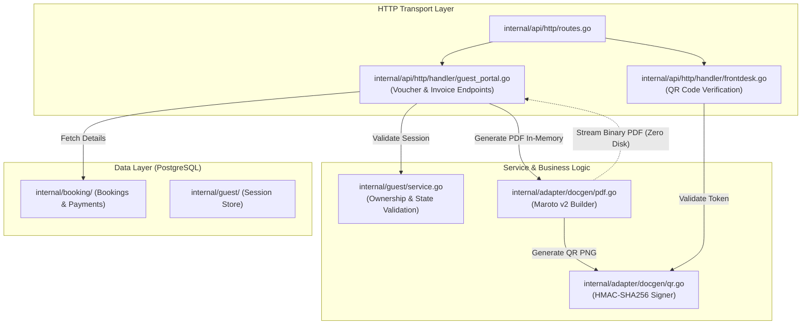
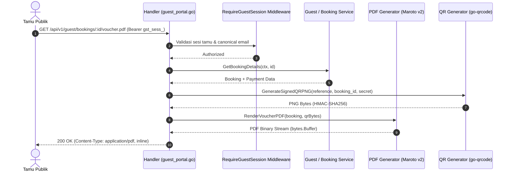

# Technical Architecture & Design Document
# Official PDF Confirmation Voucher & PBJT Tax Invoice Engine
**Hotel Booking Engine — Pulang ke Uttara (Yogyakarta)**

- **Dokumen Identitas:** `TECH-F04-PDF-VOUCHER-INVOICE-2026-10-04`
- **Tanggal Efektif:** 4 Oktober 2026
- **Status:** APPROVED FOR IMPLEMENTATION
- **Dokumen Pasangan:**
  - PRD: [`docs/prd/official-pdf-voucher-and-tax-invoice-2026-10-04.md`](file:///mnt/code/projects/jobs/pulang/current-booking/docs/prd/official-pdf-voucher-and-tax-invoice-2026-10-04.md)
  - SRS: [`docs/srs/official-pdf-voucher-and-tax-invoice-2026-10-04.md`](file:///mnt/code/projects/jobs/pulang/current-booking/docs/srs/official-pdf-voucher-and-tax-invoice-2026-10-04.md)

---

## 1. Arsitektur Komponen & Diagram Aliran

Generator PDF diisolasi di dalam package adapter/domain baru `internal/adapter/docgen/` (atau terintegrasi ke `internal/guest/`) dan dipanggil langsung oleh handler transport HTTP:



---

## 2. Diagram Sekuensial: Pembangkitan PDF & Verifikasi Meja Depan

### 2.1 Pembangkitan Voucher PDF In-Memory


---

## 3. Formulasi Perpajakan Daerah (Kabupaten Sleman, DIY)

Untuk mencegah pergeseran desimal (*floating point rounding drift*), seluruh kalkulasi menggunakan bilangan bulat integer Rupiah (*exponent 0*):

### Formula Rekonsiliasi Tarif Bersih, Service Charge & PBJT:
Diberikan nilai total pembayaran bruto yang disepakati (*Gross Paid Amount*): $T$.
Di hotel bintang 4 Pulang ke Uttara, tarif kamar sudah termasuk Service Charge ($S = 10\%$) dan Pajak Hotel PBJT ($P = 10\%$).

1. **Perhitungan Dasar Pengenaan Pajak (DPP):**
   $$\text{Faktor Pengali} = 1 + S + (1 + S) \times P = 1 + 0.10 + 1.10 \times 0.10 = 1.21$$
   $$\text{DPP (Net Room Price)} = \text{round}\left(\frac{T}{1.21}\right)$$
2. **Perhitungan Biaya Layanan (Service Charge 10%):**
   $$\text{Service Charge} = \text{round}(0.10 \times \text{DPP})$$
3. **Perhitungan Pajak PBJT Jasa Perhotelan Sleman (10%):**
   $$\text{PBJT 10\%} = T - \text{DPP} - \text{Service Charge}$$
   *(Menggunakan selisih saldo untuk menjamin $\text{DPP} + \text{Service} + \text{PBJT} \equiv T$ secara presisi 100% tanpa selisih Rp 1 pun).*

Contoh: Tamu membayar total **IDR 2.250.000**:
* $\text{DPP} = \text{round}(2.250.000 / 1.21) = \text{IDR } 1.859.504$
* $\text{Service Charge (10\%)} = \text{round}(1.859.504 \times 0.10) = \text{IDR } 185.950$
* $\text{PBJT Pajak Hotel (10\%)} = 2.250.000 - 1.859.504 - 185.950 = \text{IDR } 204.546$
* $\text{Total Verifikasi} = 1.859.504 + 185.950 + 204.546 = \text{IDR } 2.250.000$ (MATCH!).

---

## 4. Pola Implementasi Teknis (Pure Go)

### 4.1 Desain Generator Maroto v2 (Zero-CGO)
```go
package docgen

import (
	"bytes"
	"context"
	"fmt"
	"time"

	"github.com/johnfercher/maroto/v2"
	"github.com/johnfercher/maroto/v2/pkg/components/code"
	"github.com/johnfercher/maroto/v2/pkg/components/col"
	"github.com/johnfercher/maroto/v2/pkg/components/image"
	"github.com/johnfercher/maroto/v2/pkg/components/row"
	"github.com/johnfercher/maroto/v2/pkg/components/text"
	"github.com/johnfercher/maroto/v2/pkg/config"
	"github.com/johnfercher/maroto/v2/pkg/consts/align"
	"github.com/johnfercher/maroto/v2/pkg/consts/fontstyle"
	"github.com/johnfercher/maroto/v2/pkg/props"
)

type VoucherData struct {
	Reference     string
	GuestName     string
	RoomTypeName  string
	PackageName   string
	CheckIn       time.Time
	CheckOut      time.Time
	Adults        int
	Children      int
	TotalPaidIDR  int64
	PaymentMethod string
	QRToken       string
}

// GenerateVoucherPDF merender voucher A4 in-memory dalam buffer byte.
func GenerateVoucherPDF(data VoucherData, qrPNG []byte) ([]byte, error) {
	cfg := config.NewBuilder().
		WithPageNumber().
		WithLeftMargin(15).
		WithRightMargin(15).
		WithTopMargin(15).
		WithBottomMargin(15).
		Build()

	m := maroto.New(cfg)

	// Header: Logo & Info Hotel
	m.AddRows(
		row.New(20).Add(
			col.New(8).Add(
				text.New("PULANG KE UTTARA", props.Text{Style: fontstyle.Bold, Size: 18}),
				text.New("Boutique Hotel Yogyakarta — 4 Stars", props.Text{Size: 10, Style: fontstyle.Italic}),
				text.New("Jl. Kaliurang Km 5, Sleman, D.I. Yogyakarta | Telp: +62 274 5020888", props.Text{Size: 8}),
			),
			col.New(4).Add(
				text.New("CONFIRMATION VOUCHER", props.Text{Style: fontstyle.Bold, Size: 12, Align: align.Right}),
				text.New(fmt.Sprintf("Ref: %s", data.Reference), props.Text{Style: fontstyle.Bold, Size: 11, Align: align.Right}),
				text.New("Status: CONFIRMED & PAID", props.Text{Size: 9, Align: align.Right}),
			),
		),
		row.New(5), // Divider Spacing
	)

	// Detail Tamu & Inap
	m.AddRows(
		row.New(12).Add(
			col.New(6).Add(
				text.New("GUEST DETAILS", props.Text{Style: fontstyle.Bold, Size: 10}),
				text.New(fmt.Sprintf("Primary Guest: %s", data.GuestName), props.Text{Size: 9}),
				text.New(fmt.Sprintf("Occupancy: %d Adults, %d Children", data.Adults, data.Children), props.Text{Size: 9}),
			),
			col.New(6).Add(
				text.New("STAY PERIOD", props.Text{Style: fontstyle.Bold, Size: 10}),
				text.New(fmt.Sprintf("Check-in:  %s (from 14:00 WIB)", data.CheckIn.Format("02 Jan 2006")), props.Text{Size: 9}),
				text.New(fmt.Sprintf("Check-out: %s (until 12:00 WIB)", data.CheckOut.Format("02 Jan 2006")), props.Text{Size: 9}),
			),
		),
		row.New(15).Add(
			col.New(12).Add(
				text.New("ROOM & RATE PLAN", props.Text{Style: fontstyle.Bold, Size: 10}),
				text.New(fmt.Sprintf("Room Type: %s", data.RoomTypeName), props.Text{Size: 9}),
				text.New(fmt.Sprintf("Inclusions: %s", data.PackageName), props.Text{Size: 9}),
			),
		),
	)

	// QR Code Embed untuk Verifikasi Resepsionis
	m.AddRows(
		row.New(35).Add(
			col.New(4).Add(
				image.NewFromBytes(qrPNG, props.Rect{Center: true}),
				text.New("Scan for Express Check-in", props.Text{Size: 7, Align: align.Center, Style: fontstyle.Italic}),
			),
			col.New(8).Add(
				text.New("HOTEL POLICIES & IMPORTANT NOTES", props.Text{Style: fontstyle.Bold, Size: 9}),
				text.New("• Valid government-issued photo ID is required upon check-in.", props.Text{Size: 8}),
				text.New("• 100% Non-Smoking Property. Penalty applies for smoking in room.", props.Text{Size: 8}),
				text.New("• Breakfast served at Restoran Uttara from 06:00 to 10:00 WIB.", props.Text{Size: 8}),
			),
		),
	)

	doc, err := m.Generate()
	if err != nil {
		return nil, fmt.Errorf("generate voucher pdf: %w", err)
	}
	return doc.GetBytes(), nil
}
```

### 4.2 Pembuatan QR Code Berbasis Tanda Tangan Kriptografis
```go
package docgen

import (
	"crypto/hmac"
	"crypto/sha256"
	"encoding/hex"
	"fmt"

	"github.com/skip2/go-qrcode"
)

// GenerateSignedQR menghasilkan PNG QR Code dengan tanda tangan HMAC-SHA256.
func GenerateSignedQR(reference, bookingID string, secretKey []byte) ([]byte, string, error) {
	mac := hmac.New(sha256.New, secretKey)
	mac.Write([]byte(fmt.Sprintf("%s:%s", reference, bookingID)))
	signature := hex.EncodeToString(mac.Sum(nil))

	payload := fmt.Sprintf("https://booking.pulangkeuttara.com/v1/verify?ref=%s&token=%s", reference, signature)
	
	pngBytes, err := qrcode.Encode(payload, qrcode.Medium, 160)
	if err != nil {
		return nil, "", fmt.Errorf("qrcode encode: %w", err)
	}
	return pngBytes, signature, nil
}
```

---

## 5. Analisis Anti-Overengineering (Ponytail Review)

* **Zero-CGO & Tanpa Headless Browser:** Menghindari browser runtime atau dynamic C libraries yang memperbesar ukuran Docker image ratusan megabyte. `maroto/v2` dan `go-qrcode` adalah pure Go yang dikompilasi langsung ke binary statis.
* **Streaming Tanpa File Temporer:** Memori dibersihkan otomatis oleh Go runtime GC; tidak ada penulisan file temporer di `/tmp` yang berisiko memenuhi hard disk server.
* **Reuse Relasi Data yang Ada:** Tidak perlu membuat tabel baru di database. Seluruh data yang diperlukan untuk merender voucher dan faktur sudah tersimpan di tabel `bookings`, `booking_nightly_prices`, dan `payment_attempts`.
