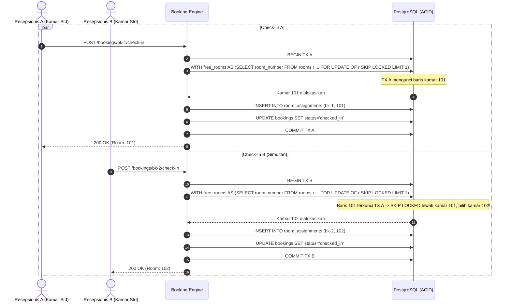
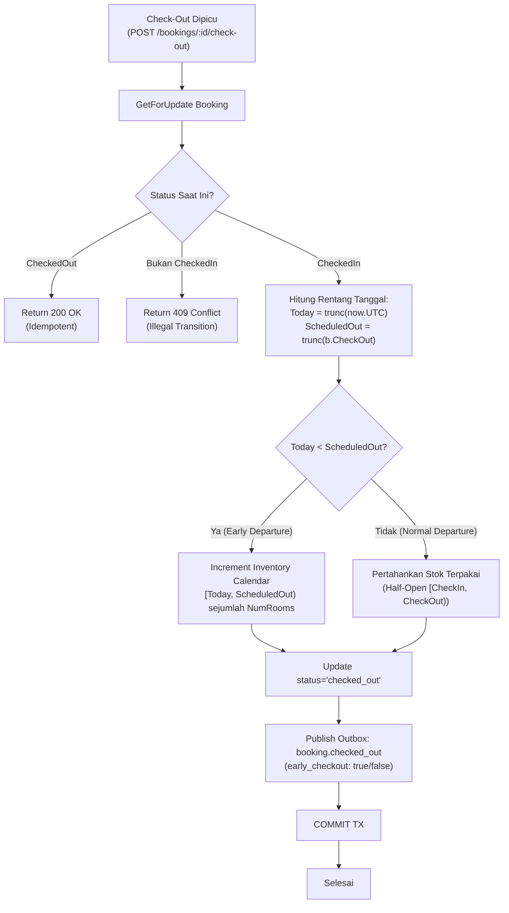

# Technical Architecture & Concurrency Design — Batch BE-E
# Hotel Booking Engine — Pulang ke Uttara (Yogyakarta)

- **Tanggal Dokumen:** 3 Oktober 2026
- **Status:** **APPROVED / READY FOR IMPLEMENTATION**
- **Referensi:** [`docs/prd/operational-reliability-concurrency-batch-e-2026-10-03.md`](file:///mnt/code/projects/jobs/pulang/current-booking/docs/prd/operational-reliability-concurrency-batch-e-2026-10-03.md) & [`docs/srs/operational-reliability-concurrency-batch-e-2026-10-03.md`](file:///mnt/code/projects/jobs/pulang/current-booking/docs/srs/operational-reliability-concurrency-batch-e-2026-10-03.md)

---

## 1. Arsitektur Alokasi Kamar Bebas Konflik (`BE-G17`)

### Diagram Urutan Konkurensi Check-In Paralel

### Penjelasan Mekanisme `SKIP LOCKED`
Pada implementasi sebelumnya, kedua query memeriksa keberadaan kamar fisik yang belum ter-assign tanpa row lock. Akibatnya, kedua transaksi memilih kamar dengan nomor urut terkecil yang sama (misal 101). Transaksi pertama berhasil memasang assignment, sedangkan transaksi kedua ditolak oleh exclusion constraint GiST (`room_number WITH =, stay_dates WITH &&`), memunculkan *false failure*.

Dengan menambahkan klausa `FOR UPDATE OF r SKIP LOCKED` pada CTE `free_rooms`, baris kamar pada tabel `rooms` dikunci oleh transaksi yang sedang memilihnya. Transaksi paralel yang berjalan pada waktu yang sama secara otomatis melompati (*skips*) baris kamar yang sedang dikunci dan langsung memilih kamar fisik bebas berikutnya.

---

## 2. Diagram Alur Restitusi Inventaris Early Check-Out (`BE-G22`)

---

## 3. Desain Graceful Shutdown & Reliability Observability (`BE-G21`)

1. **Koordinasi Penghentian Komponen:**
   - Saat sinyal OS (`SIGINT`, `SIGTERM`) diterima atau server HTTP gagal listen, context aplikasi dibatalkan.
   - Timeout shutdown dialokasikan 10 detik.
   - HTTP server memanggil `srv.Shutdown(shutdownCtx)`.
   - Asynq worker server memanggil `asynqSrv.Shutdown()`.
   - Outbox relay berhenti memproses polling baru melalui `<-ctx.Done()`.
2. **Observabilitas Sweep Expired Hold:**
   - Fungsi `workers.SweepExpiredHolds` mengevaluasi `rows.Err()` pasca iterasi.
   - Jika terjadi error pada jaringan atau pool saat streaming cursor, error terminal dicatat ke `log.ErrorContext` dan cursor ditutup secara bersih.
