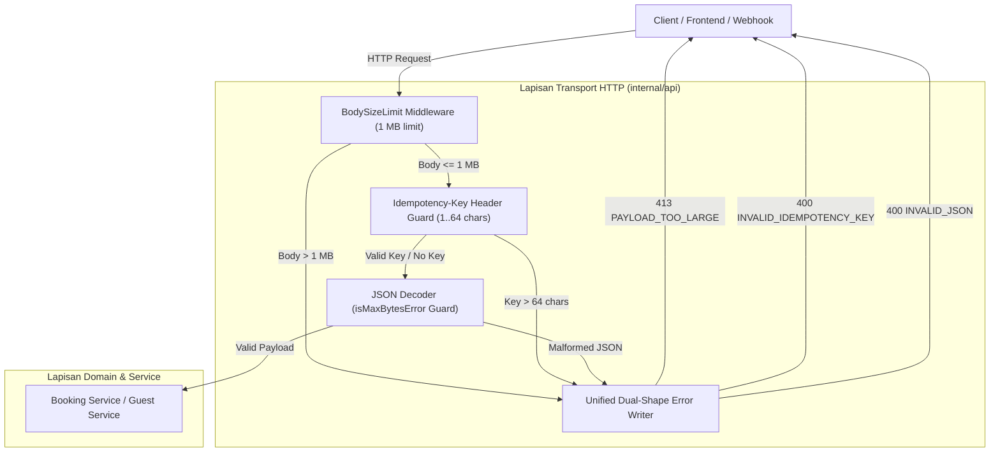

# Technical Architecture & Design — Penyeragaman Batas Payload & Skema Error API (BE-R18)

**Nomor Dokumen:** TECH-PULANG-BE-R18-2026-10-04  
**Target Rilis:** v1.0.0-rc1  
**Status:** Approved  
**Author:** AI Engineering & Architecture Agent  
**Terkait:** [`BE-R18`](file:///mnt/code/projects/jobs/pulang/current-booking/docs/gap/09-checkout-pricing-and-policy-reaudit-2026-10-03.md), [`PRD-PULANG-BE-R18`](file:///mnt/code/projects/jobs/pulang/current-booking/docs/prd/payload-boundary-and-unified-error-r18-2026-10-04.md), [`SRS-PULANG-BE-R18`](file:///mnt/code/projects/jobs/pulang/current-booking/docs/srs/payload-boundary-and-unified-error-r18-2026-10-04.md)  

---

## 1. Arsitektur Komponen & Alur Data



---

## 2. Struktur Data & Kontrak Error Seragam (Dual-Shape)

### Definisi ProblemDetails Seragam (`internal/api/middleware.go`)

```go
type ProblemDetails struct {
	Code     string `json:"code"`
	Error    string `json:"error"`
	Message  string `json:"message"`
	Detail   string `json:"detail"`
	Title    string `json:"title"`
	Status   int    `json:"status"`
	Instance string `json:"instance,omitempty"`
}

func writeProblemDetails(c *gin.Context, status int, title, detail, code string) {
	c.Header("Content-Type", "application/problem+json")
	c.Status(status)
	_ = json.MarshalWrite(c.Writer, ProblemDetails{
		Code:    code,
		Error:   detail,
		Message: detail,
		Detail:  detail,
		Title:   title,
		Status:  status,
	})
}
```

### Definisi `writeGuestError` (`internal/api/guest_auth.go`)

```go
func writeGuestError(c *gin.Context, status int, code, message string) {
	writeJSON(c, status, map[string]any{
		"error":   code,
		"code":    code,
		"message": message,
		"detail":  message,
		"title":   http.StatusText(status),
		"status":  status,
	})
}
```

Dengan struktur ini:
- Client yang membaca `resp.code` akan selalu mendapatkan machine code (misal: `"PAYLOAD_TOO_LARGE"` atau `"BOOKING_NOT_FOUND"`).
- Client yang membaca `resp.message` atau `resp.detail` akan selalu mendapatkan pesan bahasa manusia.
- Client warisan portal tamu yang membaca `resp.error` tetap mendapatkan string machine code yang diharapkan tanpa regresi.

---

## 3. Middleware Batas Ukuran Body (`http.MaxBytesReader`)

```go
// BodySizeLimit membatasi pembacaan body request maksimal maxBytes (BE-R18).
func BodySizeLimit(maxBytes int64) gin.HandlerFunc {
	return func(c *gin.Context) {
		if c.Request.Body != nil {
			c.Request.Body = http.MaxBytesReader(c.Writer, c.Request.Body, maxBytes)
		}
		c.Next()
	}
}

func isMaxBytesError(err error) bool {
	if err == nil {
		return false
	}
	var maxErr *http.MaxBytesError
	if errors.As(err, &maxErr) {
		return true
	}
	return strings.Contains(err.Error(), "request body too large")
}
```

---

## 4. Validasi Header Idempotency-Key

Pada `createBooking` (`internal/api/router.go`):
```go
idempotencyKey := strings.TrimSpace(c.GetHeader("Idempotency-Key"))
if len(idempotencyKey) > 64 {
	httpErrorCode(c, http.StatusBadRequest, "idempotency key must be between 1 and 64 characters", "INVALID_IDEMPOTENCY_KEY")
	return
}
```

---

## 5. Analisis Anti-Overengineering (Ponytail)
- Tanpa library eksternal baru: Cukup memanfaatkan standar pustaka bawaan Go `http.MaxBytesReader` dan `errors.As`.
- Tidak ada breaking change: Dukungan dual-shape menjamin kompatibilitas 100% untuk client RFC 7807 maupun portal tamu.
