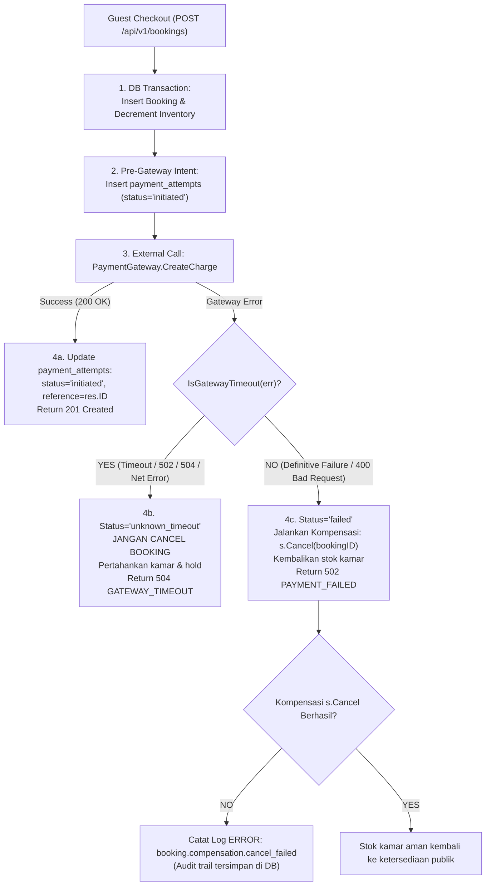
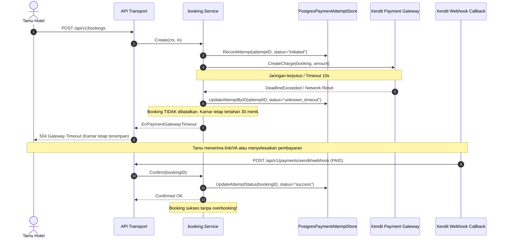

# Technical Architecture: Ketahanan Timeout Gateway Pembayaran & Integritas Buku Besar (BE-R13)

**Nomor Dokumen:** ARCH-PULANG-BE-R13  
**Tanggal Efektif:** 3 Oktober 2026  
**Status:** Approved  
**Author:** AI Engineering Agent  
**Terkait Audit & PRD:** `BE-R13`, `PRD-PULANG-BE-R13`, `SRS-PULANG-BE-R13`

---

## 1. Arsitektur Komponen & Diagram Alur

### 1.1 Diagram Keputusan Penanganan Error Gateway


### 1.2 Sequence Diagram: Penanganan Timeout vs Webhook Recovery


---

## 2. Struktur Data & Kueri SQL

### 2.1 Ekstensi Antarmuka `PaymentAttemptStore`
```go
package booking

type PaymentAttemptStore interface {
    RecordAttempt(ctx context.Context, attempt PaymentAttempt) error
    UpdateAttemptStatus(ctx context.Context, bookingID string, status string) error
    UpdateAttemptByID(ctx context.Context, attemptID string, status string, providerReference string, payload map[string]any) error
    GetAttemptsByBookingID(ctx context.Context, bookingID string) ([]PaymentAttempt, error)
}
```

### 2.2 Kueri SQL Pembaruan Spesifik (`UpdateAttemptByID`)
```sql
UPDATE payment_attempts
SET status = $1,
    provider_reference = CASE WHEN $2 <> '' THEN $2 ELSE provider_reference END,
    payload = CASE WHEN $3::jsonb IS NOT NULL THEN $3::jsonb ELSE payload END,
    updated_at = $4
WHERE id = $5;
```

---

## 3. Analisis Anti-Overengineering (Ponytail Principles)

1. **YAGNI (You Aren't Gonna Need It):**
   - Tidak perlu memperkenalkan 2-phase commit terdistribusi (*distributed transaction / saga coordinator*) rumit untuk integrasi payment gateway. Cukup gunakan pola pencatatan *intent* pra-call, evaluasi error sederhana (`IsGatewayTimeout`), dan non-destructive hold preservation.
2. **Ketergantungan Minimal:**
   - Deteksi timeout dilakukan dengan inspeksi error standar Go (`errors.Is(err, context.DeadlineExceeded)`) dan pencocokan pola error jaringan tanpa menambahkan dependency pihak ketiga baru.
3. **Pemanfaatan Kolom yang Sudah Ada:**
   - Tabel `payment_attempts` sudah memiliki kolom `id UUID PRIMARY KEY`, `status`, dan `payload JSONB`. Tidak perlu menambahkan migrasi skema database baru; cukup gunakan kapabilitas yang telah tersedia secara optimal.
