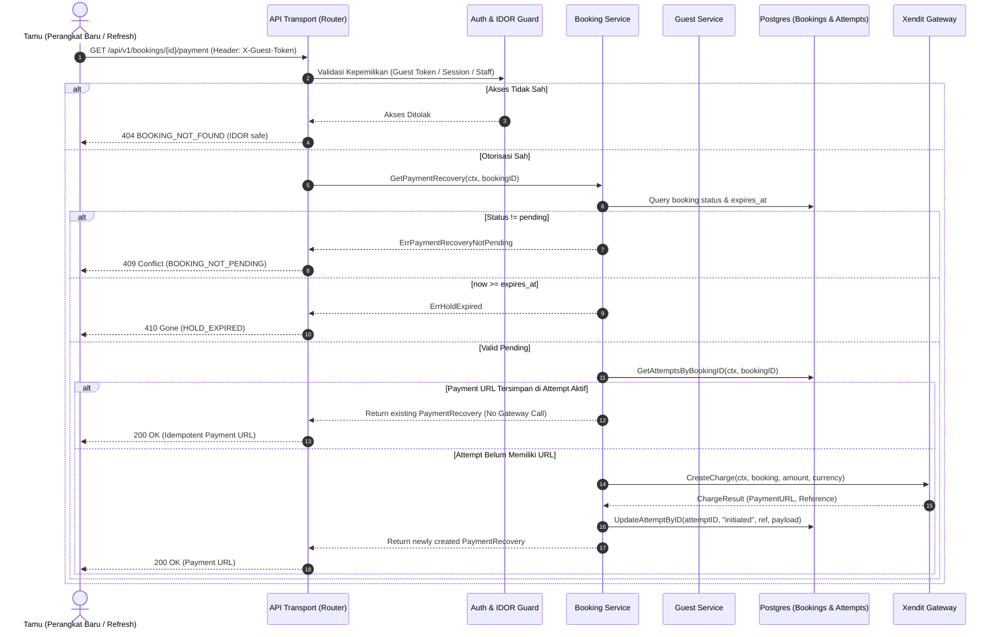

# Technical Architecture Document — Pemulihan Tautan Pembayaran Lintas Sesi (BE-R15)

**Nomor Dokumen:** TECH-PULANG-BE-R15-2026-10-03  
**Target Rilis:** v1.0.0-rc1  
**Status:** Approved  
**Author:** AI Technical Architect  
**Terkait:** [`BE-R15`](file:///mnt/code/projects/jobs/pulang/current-booking/docs/gap/10-payment-recovery-and-provider-reaudit-2026-10-03.md), PRD-PULANG-BE-R15-2026-10-03, SRS-PULANG-BE-R15-2026-10-03  

---

## 1. Arsitektur Komponen & Alur Data



---

## 2. Struktur Data & Interface

### 2.1 Model Booking Payment Recovery
```go
package booking

// PaymentRecovery merangkum informasi pemulihan tautan pembayaran untuk sesi aktif.
type PaymentRecovery struct {
	BookingID         string     `json:"booking_id"`
	Status            Status     `json:"status"`
	PaymentURL        string     `json:"payment_url"`
	ProviderReference string     `json:"provider_reference"`
	AmountMinor       int64      `json:"amount_minor"`
	Currency          string     `json:"currency"`
	ExpiresAt         *time.Time `json:"expires_at,omitempty"`
}

var (
	ErrPaymentRecoveryNotPending = errors.New("booking: payment recovery only available for pending bookings")
)
```

### 2.2 Penambahan Field pada Model Tamu (`internal/guest/model.go`)
```go
type BookingDetail struct {
	// Field existing ...
	PaymentURL     string         `json:"payment_url,omitempty"`
	AllowedActions AllowedActions `json:"allowed_actions"`
}
```

### 2.3 Metode Use Case pada `booking.Service`
```go
func (s *Service) GetPaymentRecovery(ctx context.Context, bookingID string) (PaymentRecovery, error) {
	b, err := s.reader.Get(ctx, bookingID)
	if err != nil {
		return PaymentRecovery{}, err
	}
	if b.Status != StatusPending {
		return PaymentRecovery{}, ErrPaymentRecoveryNotPending
	}
	if b.ExpiresAt != nil && !s.now().Before(*b.ExpiresAt) {
		return PaymentRecovery{}, ErrHoldExpired
	}

	// 1. Cari attempt terakhir yang sudah memegang payment_url valid
	if s.attempts != nil {
		attempts, err := s.attempts.GetAttemptsByBookingID(ctx, bookingID)
		if err == nil {
			for i := len(attempts) - 1; i >= 0; i-- {
				att := attempts[i]
				if att.Status == "initiated" || att.Status == "unknown_timeout" {
					if url, ok := att.Payload["payment_url"].(string); ok && url != "" {
						return PaymentRecovery{
							BookingID:         b.ID,
							Status:            b.Status,
							PaymentURL:        url,
							ProviderReference: att.ProviderReference,
							AmountMinor:       b.TotalPriceMinor,
							Currency:          b.Currency,
							ExpiresAt:         b.ExpiresAt,
						}, nil
					}
				}
			}
		}
	}

	// 2. Jika belum ada invoice yang terbit (misal timeout pada attempt pertama)
	charge, err := s.payment.CreateCharge(ctx, b, b.TotalPriceMinor, b.Currency)
	if err != nil {
		if IsGatewayTimeout(err) {
			return PaymentRecovery{}, fmt.Errorf("%w: %v", ErrPaymentGatewayTimeout, err)
		}
		return PaymentRecovery{}, fmt.Errorf("%w: %v", ErrPaymentDefinitiveFailure, err)
	}

	// Catat attempt baru untuk invoice yang baru diterbitkan
	attemptID := uuid.NewV7().String()
	if s.attempts != nil {
		_ = s.attempts.RecordAttempt(ctx, PaymentAttempt{
			ID:                attemptID,
			BookingID:         b.ID,
			Provider:          "gateway",
			ProviderReference: charge.Reference,
			AmountMinor:       b.TotalPriceMinor,
			Currency:          b.Currency,
			Status:            "initiated",
			Payload: map[string]any{
				"payment_url": charge.PaymentURL,
				"reference":   charge.Reference,
			},
			CreatedAt: time.Now().UTC(),
			UpdatedAt: time.Now().UTC(),
		})
	}

	return PaymentRecovery{
		BookingID:         b.ID,
		Status:            b.Status,
		PaymentURL:        charge.PaymentURL,
		ProviderReference: charge.Reference,
		AmountMinor:       b.TotalPriceMinor,
		Currency:          b.Currency,
		ExpiresAt:         b.ExpiresAt,
	}, nil
}
```

---

## 3. Analisis Anti-Overengineering (Ponytail Framework)

1. **Zero New DB Migrations:** Kolom `payload JSONB` pada tabel `payment_attempts` sudah menyimpan `payment_url` sejak inisialisasi awal. Tidak dibutuhkan migrasi skema database tambahan yang memberatkan.
2. **Kompabilitas Mundur Penuh:** Respons eksisting untuk `GET /api/v1/bookings/:id` dan `GET /api/v1/guest/bookings/:id` tetap terjaga tanpa breaking changes; field `payment_url` hanya muncul secara terarah saat relevan (`omitempty`).
3. **No Phantom Duplicate Charges:** Menggunakan attempt yang ada saat GET dipanggil, menjaga jumlah attempt tidak membesar tanpa kontrol dan tagihan ke gateway tidak terduplikasi.
