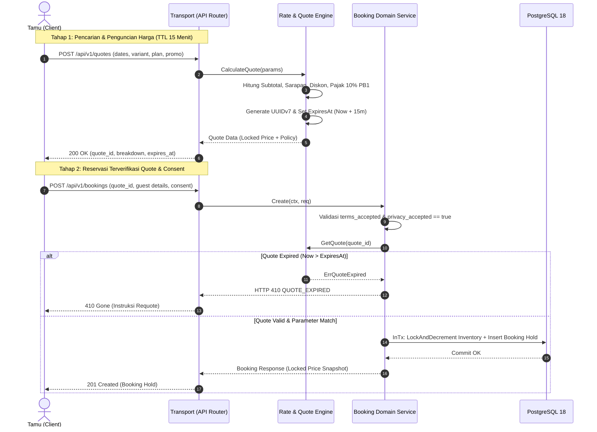

# Technical Architecture Document — Batch BE-C: Tarif, Paket, Quote Engine & Kebijakan Pembatalan
**Fitur:** Dynamic Rate Plans, Money Contract, 15-Minute Quote Lock Engine, & Cancellation Policy Enforcement  
**Properti:** Hotel Pulang ke Uttara, Yogyakarta (95 Kamar)  
**Dokumen ID:** `ARCH-BATCH-C-2026-10-03`  
**Status:** Approved for Implementation  
**Target Rilis:** Q4 2026  
**Referensi Gap Audit:** `BE-G04`, `BE-G05`, `BE-G06`, `BE-G08`, `BE-G19`

---

## 1. Diagram Alur Data & Transaksi Quote ke Booking



---

## 2. Struktur Data Domain & Model Moneter

### 2.1 Representasi Moneter Integer Eksplisit (`Money`)
```go
package rates

// Money merepresentasikan besaran moneter baku tanpa operasi desimal floating-point.
type Money struct {
    Amount   int64  `json:"amount"`   // Satuan terkecil (1 Rupiah = 1)
    Currency string `json:"currency"` // "IDR"
    Exponent int    `json:"exponent"` // 0
}
```

### 2.2 Rincian Harga (`PricingBreakdown`)
```go
type PricingBreakdown struct {
    RoomSubtotalMinor    int64 `json:"room_subtotal_minor"`
    BreakfastChargeMinor int64 `json:"breakfast_charge_minor"`
    DiscountMinor        int64 `json:"discount_minor"`
    TaxMinor             int64 `json:"tax_minor"`
    TotalPriceMinor      int64 `json:"total_price_minor"`
    Currency             string `json:"currency"`
}
```

### 2.3 Model Penawaran Terkunci (`Quote`)
```go
type Quote struct {
    ID               string           `json:"quote_id"`
    CreatedAt        time.Time        `json:"created_at"`
    ExpiresAt        time.Time        `json:"expires_at"`
    RoomTypeID       string           `json:"room_type_id"`
    RatePlanCode     string           `json:"rate_plan_code"`
    RatePlanName     string           `json:"rate_plan_name"`
    CancellationCode string           `json:"cancellation_policy"`
    CancellationDesc string           `json:"cancellation_description"`
    CheckIn          time.Time        `json:"check_in"`
    CheckOut         time.Time        `json:"check_out"`
    NumRooms         int              `json:"num_rooms"`
    NumGuests        int              `json:"num_guests"`
    Pricing          PricingBreakdown `json:"pricing"`
}
```

---

## 3. Skema Basis Data PostgreSQL (`migrations/00006_pricing_and_policies.sql`)

```sql
-- Tambah kolom snapshot harga, rate plan, kebijakan pembatalan, dan persetujuan tamu
ALTER TABLE bookings ADD COLUMN IF NOT EXISTS quote_id UUID;
ALTER TABLE bookings ADD COLUMN IF NOT EXISTS rate_plan_code VARCHAR(32) NOT NULL DEFAULT 'room_only';
ALTER TABLE bookings ADD COLUMN IF NOT EXISTS cancellation_policy VARCHAR(32) NOT NULL DEFAULT 'flexible_48h';
ALTER TABLE bookings ADD COLUMN IF NOT EXISTS cancellation_desc TEXT NOT NULL DEFAULT '';
ALTER TABLE bookings ADD COLUMN IF NOT EXISTS room_subtotal_minor BIGINT NOT NULL DEFAULT 0;
ALTER TABLE bookings ADD COLUMN IF NOT EXISTS breakfast_charge_minor BIGINT NOT NULL DEFAULT 0;
ALTER TABLE bookings ADD COLUMN IF NOT EXISTS discount_minor BIGINT NOT NULL DEFAULT 0;
ALTER TABLE bookings ADD COLUMN IF NOT EXISTS tax_minor BIGINT NOT NULL DEFAULT 0;
ALTER TABLE bookings ADD COLUMN IF NOT EXISTS currency VARCHAR(3) NOT NULL DEFAULT 'IDR';
ALTER TABLE bookings ADD COLUMN IF NOT EXISTS terms_accepted BOOLEAN NOT NULL DEFAULT true;
ALTER TABLE bookings ADD COLUMN IF NOT EXISTS terms_accepted_at TIMESTAMPTZ;
```

---

## 4. Evaluasi Anti-Overengineering (Prinsip Ponytail)

| Komponen | Potensi Overengineering (Hindari) | Solusi Ringkas Ponytail (Diterapkan) |
| :--- | :--- | :--- |
| **Penyimpanan Quote** | Redis cluster terpisah dengan sinkronisasi pub/sub rumit | In-memory thread-safe `QuoteStore` (`sync.RWMutex`) dengan pengecekan `ExpiresAt` langsung. |
| **UUID Generator** | Library pihak ketiga atau dependensi eksternal | Pustaka standar Go 1.27 `uuid.NewV7().String()` |
| **Kalkulasi Diskon & Pajak** | Library kalkulator aturan desimal/floating dinamis | Aritmatika integer murni Go (`/ 100 * 15`, `/ 100 * 10`) |
| **Kebijakan Pembatalan** | Rule engine evaluasi state machine abstrak berlapis | Evaluasi *if/else* ringkas pada domain service: `non_refundable` vs batas waktu `H-2 14:00 WIB`. |
