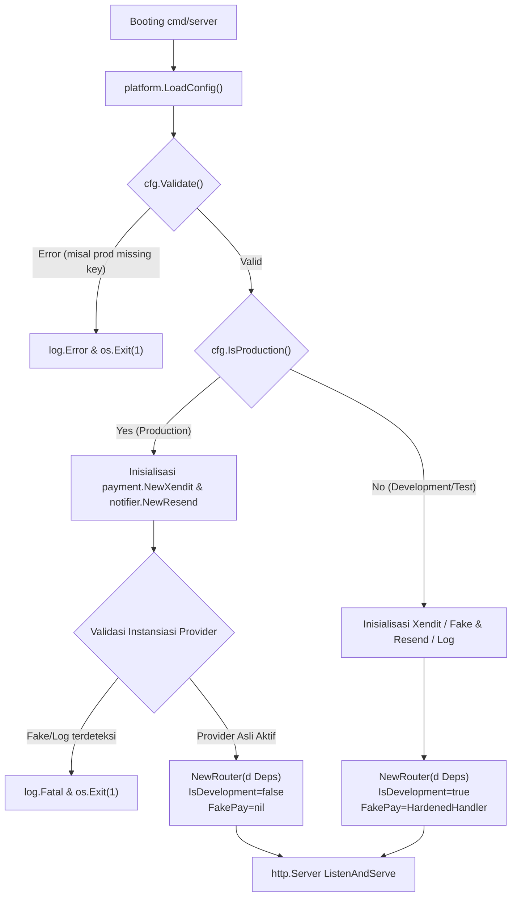
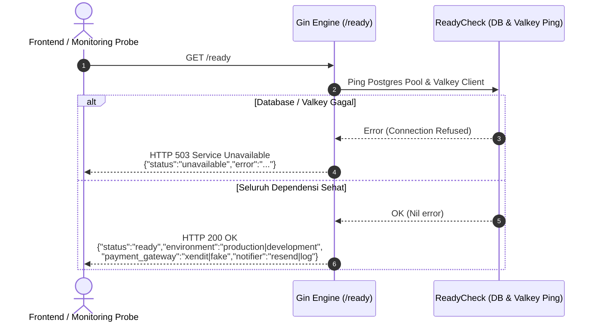

# Technical Architecture — Production Provider Fail-Fast & Readiness Safety (BE-R16)

**Fitur:** Production Provider Fail-Fast, Safe Readiness Capability & Fake-Pay Hardening  
**Tanggal:** 2026-10-03  
**Status:** Approved for Implementation  
**Terkait:** [PRD](../prd/production-provider-failfast-r16-2026-10-03.md) · [SRS](../srs/production-provider-failfast-r16-2026-10-03.md) · BE-R16  

---

## 1. Diagram Alur Booting & Fail-Fast Guard



---

## 2. Diagram Alur Readiness & Capability Inquiry (`GET /ready`)



---

## 3. Komponen & Modifikasi Kode

### A. `internal/platform/config.go`
- Tambahkan validasi berbasis lingkungan pada `Validate()`:
  - Jika `c.IsProduction()`:
    - Cek `c.XenditSecretKey != ""`
    - Cek `c.XenditWebhookToken != ""`
    - Cek `c.ResendAPIKey != ""`
- Menambahkan method `PaymentGatewayType()` dan `NotifierType()` sebagai helper ringkas jika diperlukan.

### B. `internal/adapter/notifier/log.go`
- Tambahkan field `MaskOTP bool` pada `LogNotifier`.
- Pada `SendGuestOTP`:
  ```go
  otpText := otpCode
  if n.MaskOTP {
      otpText = "[REDACTED]"
  }
  ```

### C. `internal/api/router.go`
- Tambahkan field `NotifierMode string` pada struct `Deps`.
- Perbarui handler `ready(d Deps)` untuk menyertakan `environment`, `payment_gateway`, dan `notifier` pada response JSON 200 OK.

### D. `cmd/server/main.go`
- Penegakan proteksi fail-fast eksplisit saat runtime composition:
  - Jika `cfg.IsProduction()` dan key tidak ada, langsung batalkan proses.
  - Set `NotifierMode: "resend"` atau `"log"`.
- Hardening endpoint simulasi `FakePay`:
  - Validasi string `bookingID` menggunakan `uuid.Parse(bookingID)`.
  - Jika format tidak valid: kirimkan HTTP 400 Bad Request (`INVALID_BOOKING_ID`) dalam format JSON seragam (bukan 500 error Postgres mentah).
  - Tangani error domain secara terstruktur: `booking.ErrNotFound` $\rightarrow$ 404 `BOOKING_NOT_FOUND`, `booking.ErrHoldExpired` $\rightarrow$ 409 `HOLD_EXPIRED`.
  - Error lainnya dibungkus sebagai 500 internal error generik tanpa membocorkan SQL syntax error.

---

## 4. Evaluasi Anti-Overengineering (Ponytail Review)

- **Tidak ada library baru:** Menggunakan fungsi standar Go `uuid.Parse` yang sudah tersedia di proyek melalui Google UUID.
- **Fail-Fast di Titik Masuk:** Menggunakan `cfg.Validate()` yang sudah dipanggil saat `main()` pertama kali dieksekusi, tanpa menambahkan framework konfigurasi baru.
- **Minimal Abstractions:** Tidak membuat interface baru untuk health checking; cukup memperluas response JSON dari handler `ready()` yang sudah ada.
