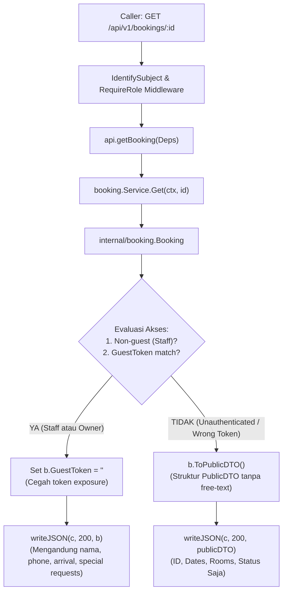

# Technical Architecture & Design — Public DTO Privacy & Token Protection (BE-R02)

**Fitur:** Public DTO Privacy, Sensitive Free-Text & Token Protection  
**ID Gap:** BE-R02 (P1)  
**Terkait:** BE-G13, F02/F03  
**Tanggal:** 3 Oktober 2026  
**Status:** Approved / In Implementation  

---

## 1. Arsitektur Data Flow & Boundary Pengungkapan Data



---

## 2. Modifikasi Komponen & Struct

### 2.1 Package `internal/booking/booking.go`
- **Pembersihan `PublicDTO`**:
  ```go
  type PublicDTO struct {
      ID         string     `json:"id"`
      RoomTypeID string     `json:"room_type_id"`
      CheckIn    time.Time  `json:"check_in"`
      CheckOut   time.Time  `json:"check_out"`
      NumRooms   int        `json:"num_rooms"`
      Status     Status     `json:"status"`
      ExpiresAt  *time.Time `json:"expires_at,omitempty"`
      CreatedAt  time.Time  `json:"created_at"`
  }
  ```
- **Pembersihan `ToPublicDTO()`**:
  Menghilangkan asignasi `EstimatedArrivalTime` dan `SpecialRequests` karena field-field tersebut sudah dihapus dari struct.

### 2.2 Package `internal/api/router.go`
- **Sanitasi Token di Handler `getBooking`**:
  ```go
  if (d.FeatureFlag != nil && !d.FeatureFlag.IsEnabled(c.Request.Context(), "ff_pii_masking_guard")) ||
      authCtx.Role != "guest" ||
      (b.GuestToken != "" && guestToken == b.GuestToken) {
      // BE-R02: Jangan mengembalikan token akses pada read biasa untuk staf maupun tamu
      b.GuestToken = ""
      writeJSON(c, http.StatusOK, b)
      return
  }

  writeJSON(c, http.StatusOK, b.ToPublicDTO())
  ```

---

## 3. Analisis Anti-Overengineering (Ponytail Principles)

- **Zero DB Schema Changes**: Tidak memerlukan tabel baru atau migrasi kolom.
- **Zero New Dependencies**: Menggunakan struct Go native dan tag `json` bawaan.
- **Kerapihan Memory Allocation**: Pengosongan string `b.GuestToken = ""` beroperasi pada *value receiver* lokal di handler tanpa mutasi database.
