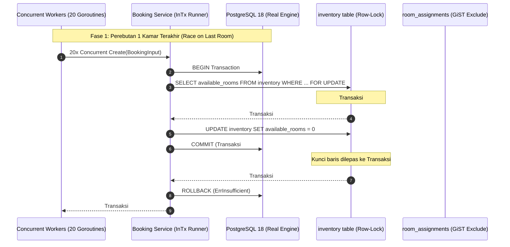
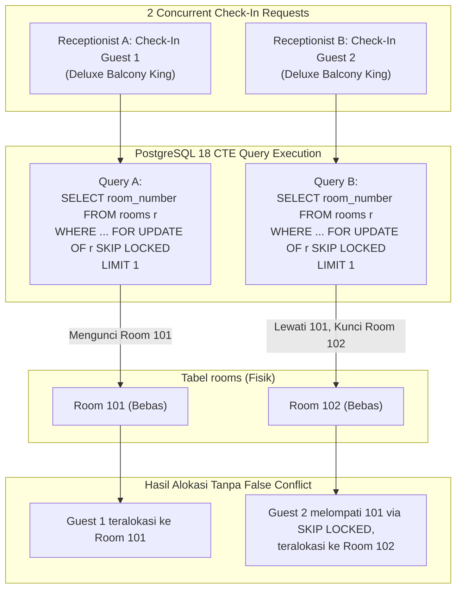

# Technical Architecture Document — Batch BE-F: Verifikasi Konkurensi DB Nyata
# Hotel Booking Engine — Pulang ke Uttara (Yogyakarta)

- **Dokumen ID:** `TECH-BATCH-F-REAL-DB-CONCURRENCY-2026-10-03`
- **Versi:** 1.0.0
- **Tanggal:** 3 Oktober 2026
- **Status:** **Approved / Ready for Implementation**
- **Referensi Dokumen:** [`docs/prd/real-db-concurrency-verification-batch-f-2026-10-03.md`](file:///mnt/code/projects/jobs/pulang/current-booking/docs/prd/real-db-concurrency-verification-batch-f-2026-10-03.md), [`docs/srs/real-db-concurrency-verification-batch-f-2026-10-03.md`](file:///mnt/code/projects/jobs/pulang/current-booking/docs/srs/real-db-concurrency-verification-batch-f-2026-10-03.md)

---

## 1. Arsitektur Verifikasi Konkurensi & Aliran Eksekusi

---

## 2. Diagram Alokasi Kamar Fisik Paralel dengan SKIP LOCKED (BE-G17)

---

## 3. Analisis Anti-Overengineering (Ponytail Principle)

| Desain Alternatif (Overengineered) | Pendekatan Terpilih (Ponytail Standard) | Alasan & Keuntungan |
|---|---|---|
| Menginstal framework `testcontainers-go` yang membutuhkan Docker daemon socket binding, unduhan container dinamis, dan memperlambat CI/CD hingga menit. | Memanfaatkan instance PostgreSQL 18 dan Valkey 8 terisolasi yang sudah berjalan di Docker Compose (`booking_test`). | Menghemat memori RAM, waktu eksekusi < 2 detik, zero new dependencies di `go.mod`. |
| Membuat skrip shell kompleks terpisah yang sulit di-debug. | Menulis suite integration test murni Go dengan build tag atau env helper di `testing/integration/postgres_concurrency_test.go`. | Menghasilkan test output Go standar, dapat diukur dengan `-race` dan `-cover`, serta mudah dijalankan oleh engineer manapun. |
| Membuat tabel mock terpisah dengan struktur sintesis. | Menggunakan schema database nyata hasil migrasi Goose versi 7 (`00007_checkout_idempotency_ledger.sql`). | 100% paritas terhadap skema database produksi. |

---

## 4. Spesifikasi Skenario Pengujian (Matriks Teknis)

1. **TestRealDB_RaceOnLastRoom:**
   - Pre-condition: `available_rooms = 1`, `total_rooms = 1` pada tanggal target.
   - Worker goroutines: $N = 20$.
   - Assert: Tepat 1 goroutine mengembalikan sukses (`nil error`), 19 goroutine mengembalikan `ErrInsufficient`.
   - Post-condition assert: Query `available_rooms` di DB bernilai tepat `0`.
2. **TestRealDB_MultiNightRollbackAtomicity:**
   - Pre-condition: Tanggal $D_1$ stok = 2, $D_2$ stok = 2, $D_3$ stok = 0.
   - Request: Booking 1 kamar untuk rentang $D_1 \rightarrow D_4$ (3 malam).
   - Assert: Pemanggilan `Create` gagal dengan `ErrInsufficient`.
   - Post-condition assert: Query $D_1$ stok tetap 2, $D_2$ stok tetap 2 (tidak ada *dangling reservation* atau *inventory leakage*).
3. **TestRealDB_ParallelRoomAssignment_SkipLocked:**
   - Pre-condition: 2 booking confirmed untuk tipe kamar yang sama, 2 kamar fisik bebas.
   - Execution: 2 goroutine memanggil `CheckIn` secara simultan.
   - Assert: Kedua panggilan sukses (HTTP 200, kamar 101 dan 102 terbagi secara eksklusif).
4. **TestRealDB_GiSTExclusionConstraintDoubleBookingRejection:**
   - Pre-condition: Kamar 101 teralokasi untuk tanggal 10–12 Oktober.
   - Execution: Transaksi terpisah mencoba meng-insert kamar 101 untuk tanggal 11–13 Oktober.
   - Assert: PostgreSQL menolak dengan kode `23P01`.
5. **TestRealDB_HoldExpirySweepVsPaymentConfirmationRace:**
   - Pre-condition: Booking pending dengan `expires_at` masa lalu.
   - Execution: Pemanggilan `Confirm` dan `SweepExpiredHolds` secara bersamaan.
   - Assert: Tidak terjadi status *zombie* (booking tidak boleh confirmed jika hold telah kedaluwarsa).
