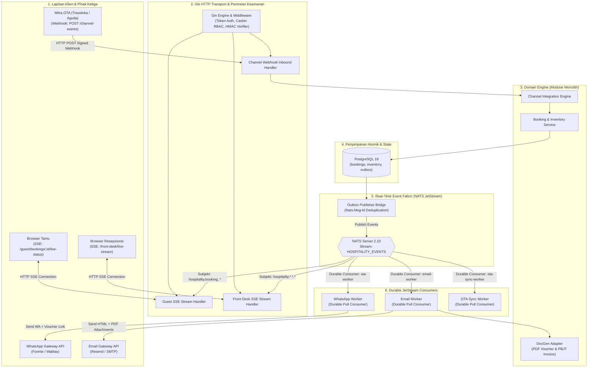

# Technical Architecture Document (TECH)
# Real-Time Hospitality Event Hub: NATS JetStream, Live Front Desk SSE, Multi-Channel Webhooks & Notifier
**Hotel Booking Engine — Pulang ke Uttara (Yogyakarta)**

- **Dokumen Identitas:** `TECH-F10-F11-F07-REALTIME-EVENT-HUB-2026-10-04`
- **Tanggal Efektif:** 4 Oktober 2026
- **Status:** APPROVED FOR IMPLEMENTATION
- **Dokumen Pasangan:**
  - PRD: [`docs/prd/realtime-hospitality-event-hub-and-channel-sync-2026-10-04.md`](file:///mnt/code/projects/jobs/pulang/current-booking/docs/prd/realtime-hospitality-event-hub-and-channel-sync-2026-10-04.md)
  - SRS: [`docs/srs/realtime-hospitality-event-hub-and-channel-sync-2026-10-04.md`](file:///mnt/code/projects/jobs/pulang/current-booking/docs/srs/realtime-hospitality-event-hub-and-channel-sync-2026-10-04.md)
  - Walkthrough Tracking: [`docs/walkthrough/realtime-hospitality-event-hub-and-channel-sync-walkthrough-2026-10-04.md`](file:///mnt/code/projects/jobs/pulang/current-booking/docs/walkthrough/realtime-hospitality-event-hub-and-channel-sync-walkthrough-2026-10-04.md)

---

## 1. Diagram Arsitektur Sistem Terintegrasi



---

## 2. Struktur Skema Database PostgreSQL (Migration `00021`)

Migration `migrations/00021_realtime_event_hub_and_channels.sql` menambahkan entitas pendukung integrasi kanal dan manajemen insiden sinkronisasi:

```sql
-- 1. Tabel Konfigurasi Mitra Kanal OTA
CREATE TABLE IF NOT EXISTS channel_partners (
    id UUID PRIMARY KEY DEFAULT gen_random_uuid(),
    provider_code VARCHAR(32) UNIQUE NOT NULL, -- 'TRAVELOKA', 'AGODA', 'BOOKING_COM', 'SITEMINDER'
    name VARCHAR(100) NOT NULL,
    webhook_secret VARCHAR(128) NOT NULL,      -- Secret key untuk verifikasi tanda tangan HMAC-SHA256
    is_active BOOLEAN NOT NULL DEFAULT true,
    created_at TIMESTAMPTZ NOT NULL DEFAULT NOW(),
    updated_at TIMESTAMPTZ NOT NULL DEFAULT NOW()
);

-- 2. Tabel Kotak Masuk Event Kanal (Idempotent Inbox)
CREATE TABLE IF NOT EXISTS channel_event_inbox (
    id UUID PRIMARY KEY DEFAULT gen_random_uuid(),
    provider VARCHAR(32) NOT NULL,
    event_id VARCHAR(128) NOT NULL,            -- Idempotency key dari OTA
    event_type VARCHAR(64) NOT NULL,           -- 'reservation_created', 'reservation_modified', 'reservation_cancelled'
    external_reference VARCHAR(128) NOT NULL,  -- Kode booking OTA (misal TRV-99218)
    payload JSONB NOT NULL,
    status VARCHAR(32) NOT NULL DEFAULT 'PENDING', -- 'PENDING', 'PROCESSED', 'FAILED', 'QUARANTINED'
    error_reason TEXT,
    created_at TIMESTAMPTZ NOT NULL DEFAULT NOW(),
    processed_at TIMESTAMPTZ,
    CONSTRAINT uq_channel_event UNIQUE (provider, event_id)
);

-- 3. Tabel Karantina & Insiden Konflik Inventaris Kanal
CREATE TABLE IF NOT EXISTS channel_sync_issues (
    id UUID PRIMARY KEY DEFAULT gen_random_uuid(),
    provider VARCHAR(32) NOT NULL,
    external_reference VARCHAR(128) NOT NULL,
    event_type VARCHAR(64) NOT NULL,
    room_type_id UUID REFERENCES room_types(id) ON DELETE SET NULL,
    status VARCHAR(32) NOT NULL DEFAULT 'QUARANTINED_CONFLICT',
    reason TEXT NOT NULL,
    resolved_by VARCHAR(64),
    resolved_at TIMESTAMPTZ,
    created_at TIMESTAMPTZ NOT NULL DEFAULT NOW()
);

-- 4. Casbin RBAC Rules
INSERT INTO casbin_rules (p_type, v0, v1, v2) VALUES
    ('p', 'receptionist', '/api/v1/front-desk/live-stream', 'GET'),
    ('p', 'gm_admin', '/api/v1/front-desk/live-stream', 'GET'),
    ('p', 'revenue_mgr', '/api/v1/staff/channel-sync-issues', 'GET'),
    ('p', 'gm_admin', '/api/v1/staff/channel-sync-issues', 'GET')
ON CONFLICT DO NOTHING;
```

---

## 3. Desain Komponen NATS JetStream

### 3.1 Konfigurasi Stream `HOSPITALITY_EVENTS`
* **Stream Name:** `HOSPITALITY_EVENTS`
* **Subjects:** `hospitality.>`
* **Storage Type:** `FileStorage` (Disimpan persisten pada volume disk NATS).
* **Retention Policy:** `LimitsPolicy`
* **Discard Policy:** `OldPolicy`
* **Max Message Age:** `7 days` (Pesan tersimpan selama 7 hari untuk keperluan audit dan replay).
* **Deduplication Window:** `5 minutes` (NATS secara native menolak pesan dengan `Nats-Msg-Id` yang sama dalam kurun 5 menit).

### 3.2 Pola Penerbitan Atomik (*Outbox to NATS Bridge*)
```go
func (r *OutboxRelay) PublishToNATS(ctx context.Context, evt OutboxEvent) error {
    msg := nats.NewMsg(evt.Subject)
    msg.Header.Set("Nats-Msg-Id", evt.ID.String()) // Server-side deduplication
    msg.Header.Set("Event-Type", evt.EventType)
    msg.Data = evt.Payload

    ack, err := r.js.PublishMsg(ctx, msg)
    if err != nil {
        return fmt.Errorf("nats publish failed: %w", err)
    }
    _ = ack
    return r.store.MarkPublished(ctx, evt.ID)
}
```

### 3.3 Pola Konsumen Handal (*Durable Pull Consumers*)
Setiap worker mengonsumsi pesan secara mandiri tanpa memengaruhi worker lainnya:
```go
// WhatsApp Worker Consumer
consumer, err := js.CreateOrUpdateConsumer(ctx, "HOSPITALITY_EVENTS", jetstream.ConsumerConfig{
    Durable:       "whatsapp-worker",
    AckPolicy:     jetstream.AckExplicitPolicy,
    FilterSubject: "hospitality.booking.*.confirmed",
    AckWait:       30 * time.Second,
    MaxDeliver:    5, // Maksimal 5x percobaan sebelum masuk dead-letter
})
```
* **Eksekusi:**
  - Jika WhatsApp API mengembalikan respons sukses $\rightarrow$ `msg.Ack()`.
  - Jika WhatsApp API mengalami *rate limit* atau gangguan jaringan $\rightarrow$ `msg.NakWithDelay(30 * time.Second)`.
  - Jika nomor telepon tidak valid (*unrecoverable error*) $\rightarrow$ `msg.Term()` (hentikan percobaan, jangan redeliver).

---

## 4. Desain Server-Sent Events (SSE) pada Gin

### 4.1 Pola Handler Tamu (`GuestBookingLiveStatus`)
```go
func (h *LiveStreamHandler) GuestBookingLiveStatus(c *gin.Context) {
    bookingID := c.Param("id")
    // Validasi kepemilikan sesi tamu (Anti-IDOR)
    if err := h.validateGuestOwnership(c, bookingID); err != nil {
        c.JSON(http.StatusForbidden, ErrorResponse{Code: "FORBIDDEN"})
        return
    }

    c.Writer.Header().Set("Content-Type", "text/event-stream")
    c.Writer.Header().Set("Cache-Control", "no-cache")
    c.Writer.Header().Set("Connection", "keep-alive")
    c.Writer.Header().Set("X-Accel-Buffering", "no")

    // Buat langganan NATS subjek spesifik tamu
    subject := fmt.Sprintf("hospitality.booking.%s.*", bookingID)
    msgChan := make(chan *nats.Msg, 10)
    sub, err := h.nc.ChanSubscribe(subject, msgChan)
    if err != nil {
        c.Status(http.StatusInternalServerError)
        return
    }
    defer sub.Unsubscribe()

    ctx := c.Request.Context()
    ticker := time.NewTicker(15 * time.Second) // Keep-alive ping
    defer ticker.Stop()

    c.Stream(func(w io.Writer) bool {
        select {
        case <-ctx.Done():
            // Browser klien ditutup, hentikan streaming
            return false
        case <-ticker.C:
            c.SSEvent("ping", map[string]string{"time": time.Now().UTC().Format(time.RFC3339)})
            return true
        case msg := <-msgChan:
            eventType := msg.Header.Get("Event-Type")
            c.SSEvent(eventType, string(msg.Data))
            return true
        }
    })
}
```

---

## 5. Metrik Performa & Ketahanan Sistem

1. **Latensi Streaming SSE:** Waktu antara pelunasan pembayaran (`CONFIRMED`) hingga event tiba di layar tamu adalah $\le 15\text{ ms}$ di jaringan lokal dan $\le 80\text{ ms}$ di jaringan seluler.
2. **Kapasitas Koneksi Bersamaan (*Concurrency*):** Satu instance server Go mampu mempertahankan $\ge 5.000$ koneksi SSE terbuka secara bersamaan dengan penggunaan memori tambahan kurang dari 40 MB.
3. **Ketahanan Jaringan (*Network Resilience*):** Browser tamu dan dashboard front desk memanfaatkan protokol standar `EventSource` bawaan HTML5 yang otomatis melakukan rekoneksi dengan *exponential backoff* jika WiFi sempat terputus.
