# Technical Architecture — Refactor Transport Router & Middleware

| | |
|---|---|
| **Dokumen ID** | `TECH-ROUTER-REFACTOR-2026-10-04` |
| **Versi** | 2.0 (komprehensif; menggantikan v1 + addendum) |
| **Status** | Approved untuk implementasi (scope: fase 1–7 + middleware, dikonfirmasi user) |
| **PRD** | [router-refactor](file:///mnt/code/projects/jobs/pulang/current-booking/docs/prd/router-refactor-2026-10-04.md) |
| **SRS** | [router-refactor](file:///mnt/code/projects/jobs/pulang/current-booking/docs/srs/router-refactor-2026-10-04.md) |
| **Walkthrough** | [router-refactor](file:///mnt/code/projects/jobs/pulang/current-booking/docs/walkthrough/router-refactor-walkthrough-2026-10-04.md) |
| **Kode sumber** | [`internal/api/router.go`](file:///mnt/code/projects/jobs/pulang/current-booking/internal/api/router.go), [`internal/api/middleware.go`](file:///mnt/code/projects/jobs/pulang/current-booking/internal/api/middleware.go) |

## Daftar Isi
1. [Ringkasan Eksekutif](#1-ringkasan-eksekutif)
2. [Riset & Dasar Keputusan](#2-riset--dasar-keputusan)
3. [Arsitektur Saat Ini (As-Is)](#3-arsitektur-saat-ini-as-is)
4. [Arsitektur Target (To-Be)](#4-arsitektur-target-to-be)
5. [Mekanisme Detail Middleware](#5-mekanisme-detail-middleware)
6. [Mekanisme Detail Router & Handler](#6-mekanisme-detail-router--handler)
7. [Composition Root & Konfigurasi](#7-composition-root--konfigurasi)
8. [Kontrak Error & Respons](#8-kontrak-error--respons)
9. [Strategi Pengujian](#9-strategi-pengujian)
10. [Performa & Efisiensi](#10-performa--efisiensi)
11. [Rencana Migrasi, Rollback, & Risiko](#11-rencana-migrasi-rollback--risiko)
12. [Analisis Anti-Overengineering (Ponytail)](#12-analisis-anti-overengineering-ponytail)

---

## 1. Ringkasan Eksekutif

`internal/api` adalah *driving adapter* (hexagonal) yang menerjemahkan HTTP ⇄ use case. Saat ini dua berkasnya menjadi titik beban:

| Berkas | Baris | Masalah utama |
|---|---|---|
| `router.go` | 1372 | `Deps` + wiring domain + middleware inline + ±60 route berprefix berulang + 14 handler + logika domain (search, rekonsiliasi webhook) |
| `middleware.go` | 308 | Auth, authz, body, error writer, rate limiter dalam satu berkas; `IdentifySubject` bersarang dalam |

Refactor ini **tidak mengubah kontrak bisnis**. Ia (a) memecah berkas per tanggung jawab, (b) menyeragamkan pola (route group, tabel error, helper flag, helper idempotency), (c) menutup 10+ cacat reliabilitas/keamanan yang ditemukan saat analisis, dan (d) memindahkan 2 logika domain ke service. Semua dilakukan **dalam satu package `api`** tanpa dependensi baru.

---

## 2. Riset & Dasar Keputusan

| Topik | Temuan | Keputusan |
|---|---|---|
| **Idempotency-Key** (Stripe, IETF draft) | Key harus di-scope per akun/operasi, parameter harus divalidasi sama, TTL ±24 jam | Scope `sha256(subject\|METHOD\|route\|key)` di sisi aplikasi; skema DB tak diubah (PK `key` tetap) |
| **Gin trusted proxies** | Default mempercayai semua proxy → `X-Forwarded-For` bisa dipalsukan untuk menembus rate limit | `Deps.TrustedProxies`; default `nil` = abaikan header forward |
| **Casbin `keyMatch2`** | `:param` ⇒ segmen non-`/`; `/*` ⇒ sisa path | `Authorize` memakai `c.FullPath()` (template route), diverifikasi test parity |
| **RFC 7807** | `application/problem+json`; `instance` = URI kejadian | Pertahankan dual-shape R18 (`code,error,message,detail,title,status`) + `request_id` aditif |
| **Go `http.Handler` chain** | Middleware urut dari luar ke dalam; `defer` setelah `Next()` untuk post-processing | Susunan di §4.2 mengikuti prinsip: observabilitas di luar, pelindung di tengah, otorisasi paling dalam |
| **Kompetitor** (Cloudbeds, SiteMinder) | API dipisah per domain (reservation/rates/inventory), error terstruktur, rate limit per kelas endpoint | Handler dipisah per domain; limiter terpisah untuk endpoint kredensial |

---

## 3. Arsitektur Saat Ini (As-Is)

### 3.1 Pipeline middleware & grup route

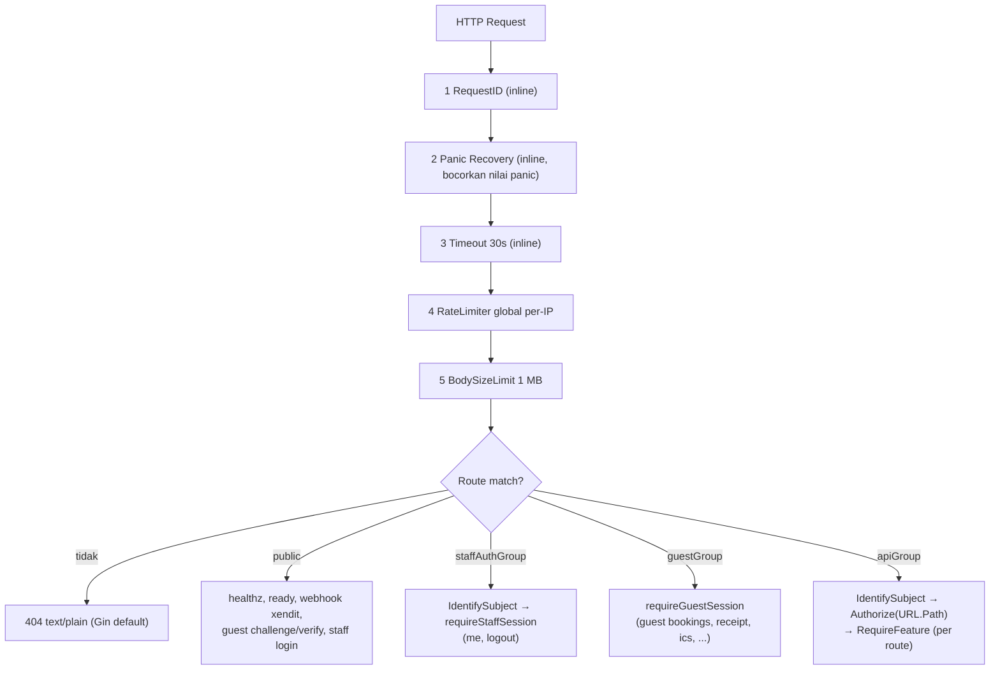

### 3.2 Cacat yang diverifikasi

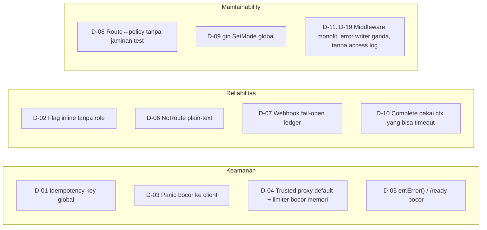

### 3.3 Alur `createBooking` saat ini (rawan)

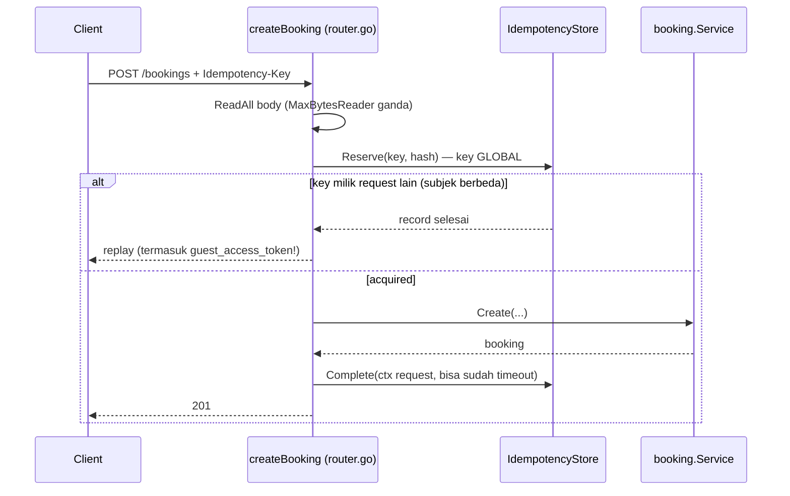

---

## 4. Arsitektur Target (To-Be)

### 4.1 Komponen & kepemilikan

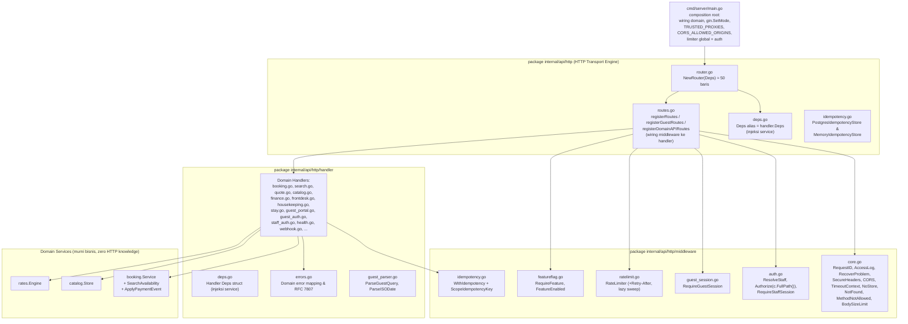

**Aturan ketergantungan:**
- `internal/api/http` bertindak sebagai *HTTP transport root* yang mengorkestrasi pipeline Gin engine, route groups, dan konfigurasi HTTP transport. Caller luar (`cmd/server/main.go`, E2E test runner, dll.) mengimpor `internal/api/http` secara langsung tanpa perantara facade.
- `internal/api/http/handler` bertindak sebagai *HTTP driving adapter* (decode request, validasi DTO, delegasi use-case ke domain service, dan encode response JSON RFC 7807).
- `internal/api/http/middleware` bertindak sebagai *HTTP cross-cutting filters* (`gin.HandlerFunc`) yang bebas dari logika handler maupun domain.
- Domain services (`booking`, `catalog`, `rates`, dll.) murni berorientasi bisnis dan **zero HTTP / Gin dependency**. Siap digunakan bersama gRPC atau Message Broker adapters di masa depan.

### 4.2 Urutan middleware global (final)

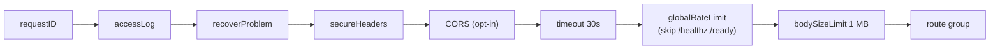

| # | Middleware | Alasan posisi |
|---|---|---|
| 1 | `requestID` | Harus pertama: semua log dan respons error (termasuk 429/500) membawa ID |
| 2 | `accessLog` | Di luar `recover` agar 500 dari panic tetap tercatat dengan status akhir & latensi |
| 3 | `recoverProblem` | Menangkap panic dari semua lapisan di dalamnya, menulis problem+json generik |
| 4 | `secureHeaders` | Murah; ditulis sebelum handler agar ikut ke semua respons (termasuk error) |
| 5 | `CORS` | Preflight `OPTIONS` tak membawa kredensial → harus dijawab sebelum rate-limit/auth |
| 6 | `timeout` | Batas waktu konteks sebelum pekerjaan berat |
| 7 | `globalRateLimit` | Tolak lebih awal sebelum membaca body / memanggil domain |
| 8 | `bodySizeLimit` | Pembatas stream; handler tidak lagi membungkus `MaxBytesReader` sendiri |

### 4.3 Grup route target

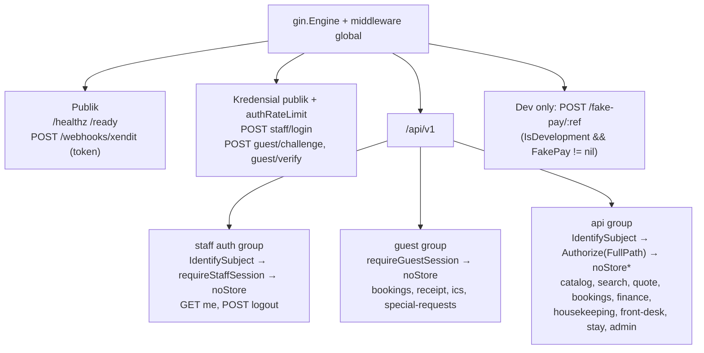
`*` `noStore` tidak dipasang pada katalog/search/availability (data publik, cacheable); dipasang per sub-grup yang memuat PII/booking/staf.

---

## 5. Mekanisme Detail Middleware

### 5.1 `requestID`
1. Baca `X-Request-Id` (fallback `X-Request-ID`).
2. Valid bila `len ≤ 64` dan hanya `[A-Za-z0-9._-]` (mencegah log injection / header abuse). Jika tidak valid atau kosong → generate 16 byte `crypto/rand` → hex.
3. Simpan dalam **satu** `context.WithValue` (kunci tipe privat `reqIDKey`) bersama pengaturan timeout (satu `WithContext`), set header respons `X-Request-Id`.
4. Diekspos via `RequestIDFrom(ctx)` untuk log, `ProblemDetails.request_id`, dan error domain yang dilog.

### 5.2 `accessLog`
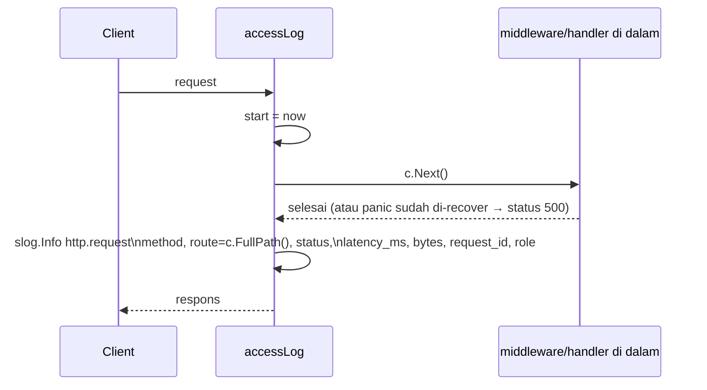
- `route` memakai **template** (`/api/v1/bookings/:id`), bukan path mentah → kardinalitas log/metrik terkendali dan tidak membocorkan ID booking.
- Tidak mencatat body, header otorisasi, maupun query string (PII/kredensial).
- `/healthz` & `/ready` → `slog.Debug` (hindari banjir log dari probe).
- `role` dibaca dari `GetAuthContext` setelah `Next()` sehingga mencerminkan hasil `IdentifySubject` (guest bila tak sampai ke sana).

### 5.3 `recoverProblem`
```go
defer func() {
    if rec := recover(); rec != nil {
        slog.ErrorContext(ctx, "http.panic", "request_id", id, "method", m, "path", c.FullPath(),
            "panic", rec, "stack", string(debug.Stack()))
        if !c.Writer.Written() {
            writeError(c, 500, "INTERNAL_ERROR", "internal server error")
        }
        c.Abort()
    }
}()
```
- Body klien **generik** (D-03); detail hanya di log.
- Jika header sudah terkirim (`Written()`), tidak menimpa respons parsial.
- Tidak menangkap `http.ErrAbortHandler` (di-panic ulang sesuai konvensi `net/http`).

### 5.4 `secureHeaders` & `noStore`
- `secureHeaders` (global): `X-Content-Type-Options: nosniff`.
- `noStore` (per grup autentikasi/PII): `Cache-Control: no-store` — mencegah proxy/browser menyimpan data booking, receipt, sesi.

### 5.5 `CORS` (opt-in)
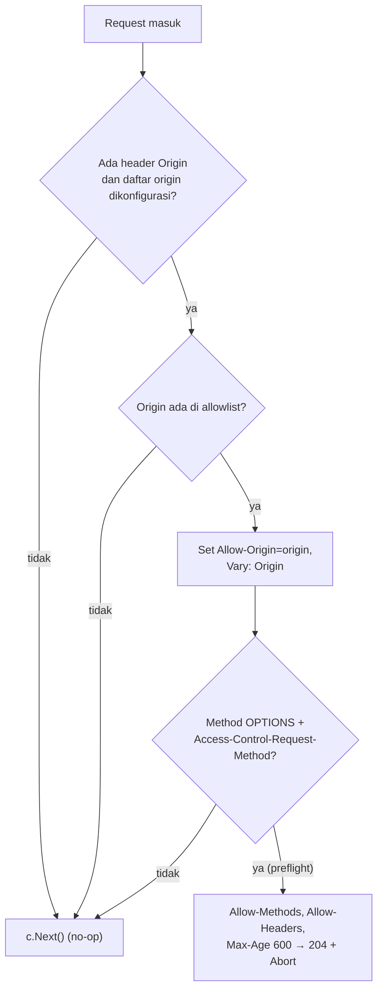
- Konfigurasi `CORS_ALLOWED_ORIGINS` (koma). Kosong → middleware tidak dipasang sama sekali (nol overhead).
- **Wildcard `*` ditolak saat startup** karena `Authorization` dipakai.
- `Allow-Headers`: `Authorization, Content-Type, Idempotency-Key, X-Guest-Token, X-Guest-Session, X-Request-Id`; `Expose-Headers`: `X-Request-Id, Retry-After, Idempotency-Replayed`.
- Tidak memakai `Allow-Credentials` kecuali diperlukan cookie `guest_session` lintas-origin (di luar scope; dicatat).

### 5.6 `timeout`
`context.WithTimeout(ctx, Deps.RequestTimeout)` (default 30 detik), `defer cancel()`. Hanya membatalkan konteks; handler yang menghormati `ctx` (query pgx, panggilan gateway) berhenti. Efek samping yang sudah ter-commit (booking) tidak dibatalkan — itulah alasan `Complete` idempotency memakai `context.WithoutCancel` (§6.4).

### 5.7 `RateLimiter` (token bucket)

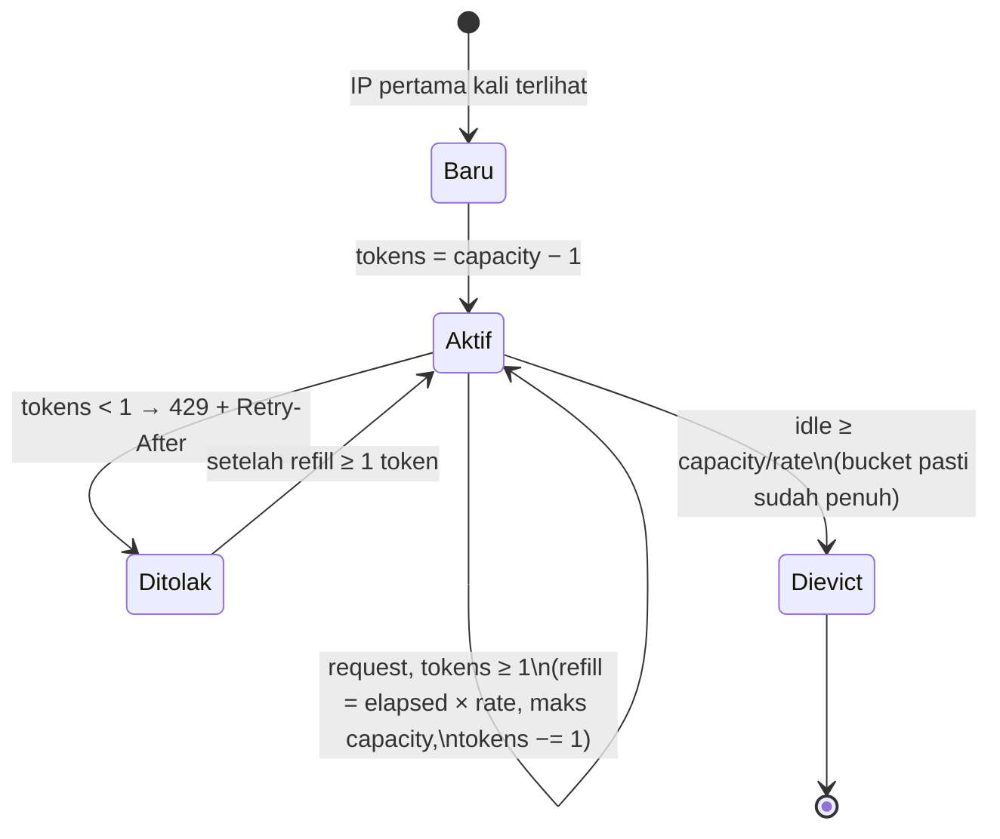
- **Dua instance**: global (`rate=20/s, burst=40`) dan auth (`5/menit, burst 10`, hanya untuk `staff/login`, `guest/challenge`, `guest/verify`).
- **`Retry-After`** = `ceil((1 − tokens) / rate)` detik.
- **Eviction lossless**: visitor dihapus bila `now − lastRefill ≥ capacity/rate` — pada saat itu bucket pasti penuh, sehingga membuang state tidak mengubah perilaku limiter. Sapuan *lazy* dilakukan di dalam `Limit()` (maks 1×/menit) di bawah mutex yang sama → **tanpa goroutine**, tanpa `Close()`, tanpa kebocoran goroutine di test. *(Menyempurnakan FR-23(b) yang sebelumnya menyebut ambang tetap 10 menit.)*
- **Identitas klien**: `c.ClientIP()`; efektif aman hanya bila `TrustedProxies` dikonfigurasi benar (§7).
- `skip`: `/healthz`, `/ready` agar probe orkestrator tidak ikut terbatasi.

### 5.8 `IdentifySubject` (dipecah)

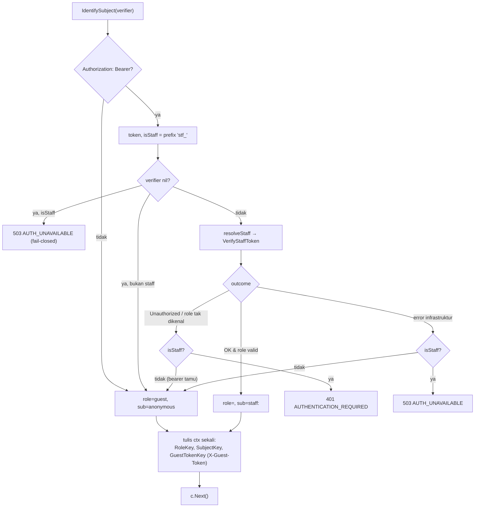
- **Fail-closed tidak berubah**: nama role literal, `X-User-Role`, dll. tidak memberi hak apa pun; identitas staf hanya dari sesi server.
- `resolveStaff(ctx, bearer, verifier) (principal, outcome)` murni (tanpa Gin) → dapat di-table-test dengan fake verifier (outcome: `guest | staff | unauthorized | unavailable`).
- `c.Set(...)` dihapus (0 pembaca); satu `context.WithValue` berantai + satu `WithContext`. Kunci `RoleKey/SubjectKey/GuestTokenKey` tetap karena test menginjeksinya.

### 5.9 `Authorize` (Casbin) dengan `FullPath()`

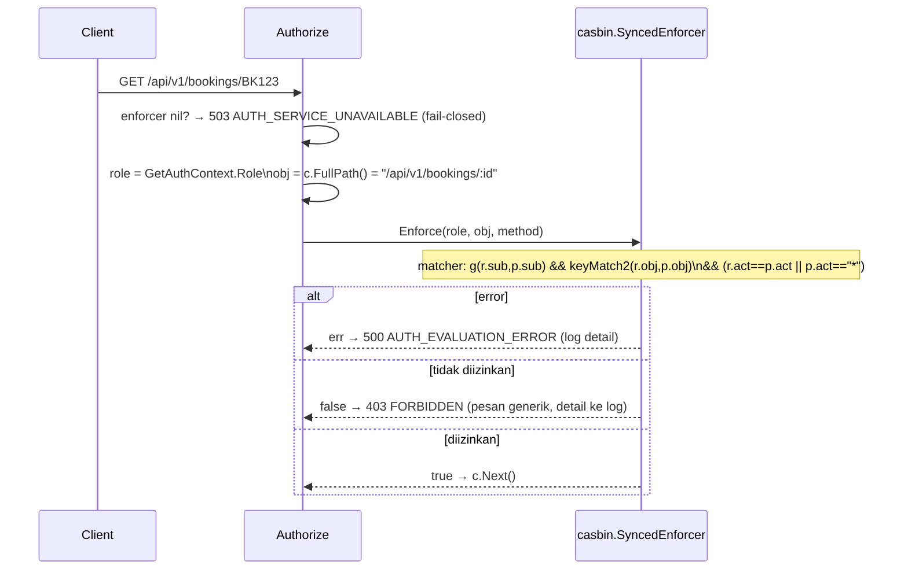
- **Mengapa `FullPath()`**: template route stabil & pendek; tidak terpengaruh variasi path mentah; memungkinkan test statis "setiap route punya policy". `keyMatch2` memperlakukan `:id` pada policy sebagai `[^/]+`, sehingga literal `:id` pada template ikut cocok; wildcard `/*` pada policy `gm_admin` (`/api/v1/*`) tetap berlaku.
- **Jaminan keamanan perpindahan**: test parity (§9) membandingkan keputusan `URL.Path` vs `FullPath` untuk seluruh route × 6 role sebelum perubahan di-merge; selisih = blocker.
- Jika `FullPath()` kosong (tak seharusnya karena Authorize hanya ada di grup route) → fail-closed 404.

### 5.10 `RequireFeature` & `featureEnabled`
- `RequireFeature(ff, key)` (route-level) dipertahankan: fail-open bila manager `nil`; 503 `FEATURE_DISABLED` bila nonaktif.
- **Cacat D-02**: pengecekan inline (`ff_checkout_idempotency`, `ff_pii_masking_guard`, `ff_strict_cancellation_policy`, `ff_promotions_engine`, `ff_room_readiness_checkin_guard`) memanggil `IsEnabled(c.Request.Context(), …)` tanpa `featureflag.WithRole`, sehingga flag yang dibatasi per-role dievaluasi tanpa role.
- **Perbaikan**: satu helper
```go
func featureEnabled(c *gin.Context, ff featureflag.Manager, key string) bool {
    if ff == nil { return true }                         // fail-open (kompatibilitas)
    ctx := featureflag.WithRole(c.Request.Context(), GetAuthContext(c.Request.Context()).Role)
    return ff.IsEnabled(ctx, key)
}
```
dipakai `RequireFeature` dan semua handler inline → satu jalur evaluasi.

### 5.11 Pembatas body & decoder JSON
- `BodySizeLimit` global membungkus `Request.Body` dengan `http.MaxBytesReader(1 MiB)`.
- `createBooking` & webhook **tidak lagi** membungkus ulang; mereka cukup `io.ReadAll` dan memeriksa `isMaxBytesError`.
- `isMaxBytesError` memakai `errors.As(*http.MaxBytesError)`; fallback `strings.Contains` dihapus jika test (termasuk jalur `encoding/json/v2` `UnmarshalRead`) membuktikan `errors.As` cukup.

### 5.12 `requireStaffSession` & `requireGuestSession`
- `requireStaffSession`: 401 `AUTHENTICATION_REQUIRED` bila `role == guest` (dipasang setelah `IdentifySubject`).
- `requireGuestSession(guestSvc)`: 501 bila service nil, 401 bila token tak ada/tak valid; menaruh `*GuestSession` di request context (`GuestSessionFromContext`). Key ganda `c.Set("guest_session")` dihapus bila tak ada pembaca.

---

## 6. Mekanisme Detail Router & Handler

### 6.1 `NewRouter` (±80 baris)
```go
func NewRouter(d Deps) *gin.Engine {
    d = d.withDefaults()                 // murni: CatalogStore memory, IdempotencyStore memory, RequestTimeout 30s
    r := gin.New()
    _ = r.SetTrustedProxies(d.TrustedProxies) // nil ⇒ abaikan header forward
    r.HandleMethodNotAllowed = true
    r.NoRoute(notFound); r.NoMethod(methodNotAllowed)

    r.Use(requestID(), accessLog(), recoverProblem(), secureHeaders())
    if len(d.CORSOrigins) > 0 { r.Use(CORS(d.CORSOrigins)) }
    r.Use(timeout(d.RequestTimeout))
    if d.RateLimiter != nil { r.Use(d.RateLimiter.Limit("/healthz", "/ready")) }
    r.Use(BodySizeLimit(DefaultMaxBodyBytes))

    registerHealth(r, d)
    registerPublicAuth(r, d)
    v1 := r.Group("/api/v1")
    registerStaffAuth(v1, d); registerGuest(v1, d); registerAPI(v1, d)
    registerDev(r, d)
    return r
}
```
`withDefaults()` **hanya** mengisi default transport. Mutator domain (`SetBaseRateSource`, `SetQuoteStore`, turunan `RateSvc`/`QuoteStore`) pindah ke composition root (§7). `gin.SetMode` pindah ke `main`/`TestMain`.

### 6.2 Pola pendaftaran route
```go
func registerCatalog(g *gin.RouterGroup, d Deps) {
    ff := func(k string) gin.HandlerFunc { return RequireFeature(d.FeatureFlag, k) }
    g.GET("/catalog/rooms", getCatalogRooms(d))
    g.GET("/catalog/rooms/:id", getCatalogRoom(d))
    g.POST("/catalog/rooms", ff("ff_catalog_write"), createCatalogRoom(d))
    // ...
}
```
Prefix `/api/v1` hanya sekali; `URL.Path` tidak berubah sehingga kompatibel dengan seluruh klien; golden file route menjamin set route identik.

### 6.3 Tabel error (`errors.go`)
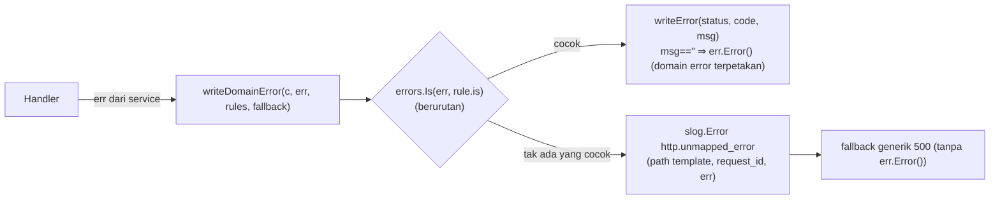
```go
type errRule struct { is error; status int; code, msg string }

var createBookingErrors = []errRule{
    {booking.ErrExceedsCapacity, 400, "EXCEEDS_CAPACITY", ""},
    {booking.ErrQuoteExpired,    410, "QUOTE_EXPIRED",    ""},
    {inventory.ErrInsufficient,  409, "INSUFFICIENT_ROOMS", "kamar tidak tersedia untuk rentang tsb"},
    // ... 25 aturan menggantikan 25 blok if
}
```
- Urutan aturan = urutan `if` lama (menjaga prioritas bila satu error membungkus beberapa sentinel).
- Pesan & kode HTTP **identik** dengan kode lama (diuji table-driven per aturan).
- Kasus yang bergantung flag (mis. `ErrNonRefundable` hanya jika `ff_strict_cancellation_policy`) tetap berupa pengecekan eksplisit sebelum tabel — tidak dipaksakan ke tabel (YAGNI).

### 6.4 Idempotency (`withIdempotency`)

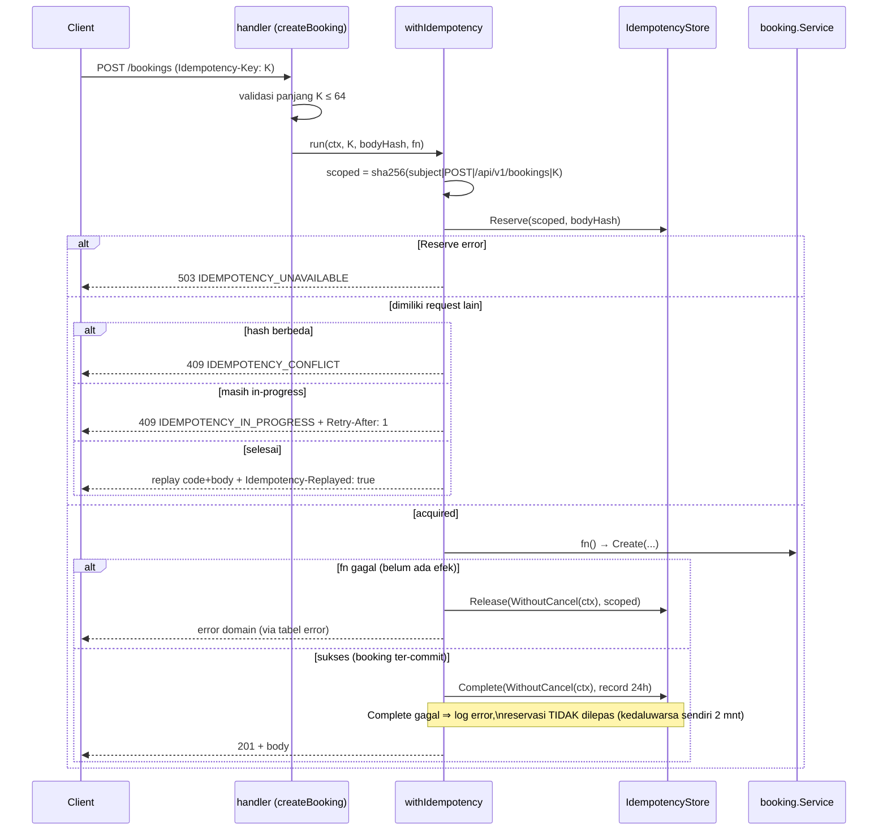
- **Scope** menutup D-01. Guest anonim berbagi `subject=anonymous`; perlindungan sisa = hash body harus identik (mengandung email tamu). Risiko residu didokumentasikan (PRD §6).
- **`context.WithoutCancel`** untuk `Complete`/`Release` menutup D-10: booking sudah commit walau konteks request timeout.
- Dipilih **helper**, bukan middleware generik dengan response-capturing writer: hanya satu endpoint yang membutuhkan; hindari pembungkus `ResponseWriter` (YAGNI).
- Flag `ff_checkout_idempotency` dievaluasi lewat `featureEnabled` (role-aware, D-02).

### 6.5 Webhook Xendit → `booking.Service.ApplyPaymentEvent`

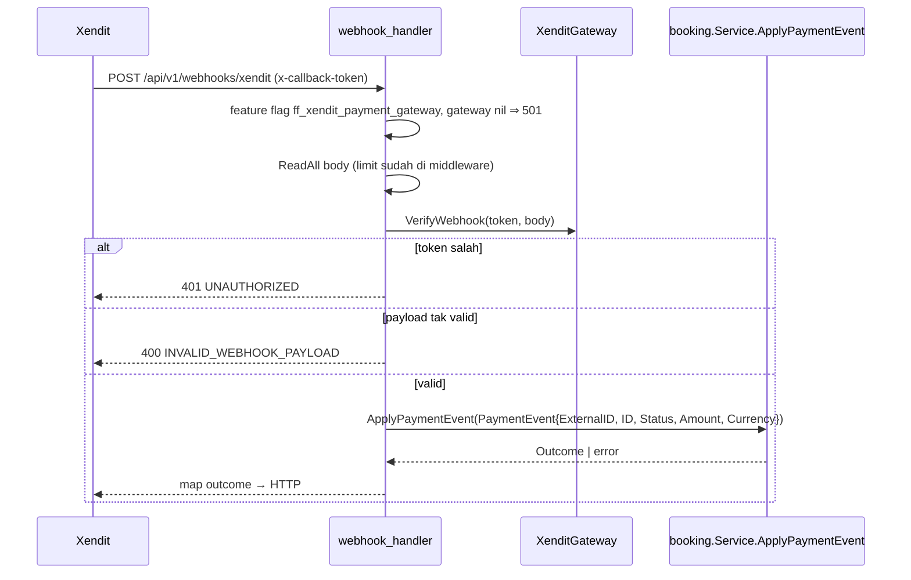
Matriks keputusan (dipindah dari handler ke service; perilaku identik kecuali baris ★):

| Status event | Kondisi | Outcome | HTTP |
|---|---|---|---|
| — | booking tak ada | `ErrNotFound` | 404 `BOOKING_NOT_FOUND` |
| `PAID`/`SETTLED` | sudah `confirmed` | `AlreadyConfirmed` | 200 ok (idempotent replay) |
| `PAID`/`SETTLED` | amount ≠ total | `ErrAmountMismatch` | 422 `PAYMENT_AMOUNT_MISMATCH` |
| `PAID`/`SETTLED` | currency ≠ booking | `ErrCurrencyMismatch` | 422 `PAYMENT_CURRENCY_MISMATCH` |
| `PAID`/`SETTLED` | ledger punya referensi tapi tidak ada yang cocok | `ErrInvoiceMismatch` | 422 `INVOICE_ID_MISMATCH` |
| `PAID`/`SETTLED` | ★ **ledger error** (dulu: dilewati) | error | **500** `INTERNAL_ERROR` (Xendit retry) |
| `PAID`/`SETTLED` | `Confirm` → `ErrHoldExpired` | buat *late-payment case* (finance) | 409 `HOLD_EXPIRED` |
| `PAID`/`SETTLED` | `Confirm` gagal lain | error | 500 `CONFIRM_FAILED` (pesan generik) |
| `EXPIRED` | sudah `confirmed` | `StaleExpiryIgnored` | 200 `ignored` |
| `EXPIRED` | lainnya | `Cancel` | 200 ok / 500 `CANCEL_FAILED` |
| lainnya | — | `Ignored` | 200 `ignored` |

Handler hanya: verifikasi token → panggil service → petakan hasil. Ketergantungan `FinanceSvc` untuk late-payment case diinjeksi ke service (bukan dibaca dari `Deps` di handler).

### 6.6 `searchRooms` → `SearchAvailability`
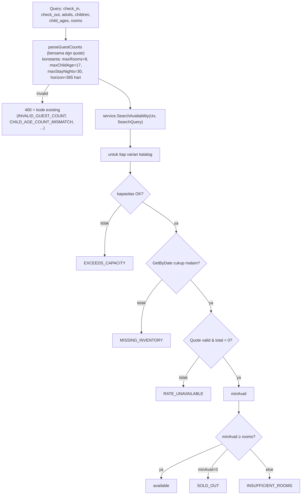
Handler: parse query → panggil service → `writeJSON`. Urutan pengecekan & `UnavailableReason` identik. **Tidak ada paralelisasi** (katalog kecil; ukur dulu — §12).

### 6.7 `NoRoute` / `NoMethod`
- `NoRoute` → 404 problem+json `NOT_FOUND`.
- `HandleMethodNotAllowed=true` + `NoMethod` → 405 `METHOD_NOT_ALLOWED` + header `Allow` (Gin menyediakan daftar method yang valid).
- Keduanya melewati middleware global, sehingga tetap ber-request-id, ter-log, dan terbatasi rate limiter.

---

## 7. Composition Root & Konfigurasi

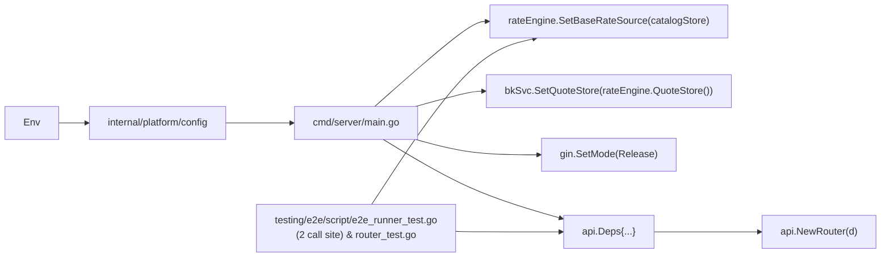

| Env / field `Deps` | Default | Keterangan |
|---|---|---|
| `TRUSTED_PROXIES` → `Deps.TrustedProxies` | kosong (`nil`) | Daftar IP/CIDR LB. **Wajib diisi bila di balik LB**, kalau tidak IP klien = IP LB |
| `CORS_ALLOWED_ORIGINS` → `Deps.CORSOrigins` | kosong | Nonaktif; wildcard ditolak |
| `Deps.RateLimiter` | `NewRateLimiter(20, 40)` | Global |
| `Deps.AuthRateLimiter` | `NewRateLimiter(5.0/60, 10)` | Endpoint kredensial |
| `Deps.RequestTimeout` | `30s` | |
| `IsDevelopment` + `FakePay` | — | `/fake-pay/:ref` hanya dev |

**Catatan sinkronisasi katalog→rate engine:** `createCatalogRoom`/`updateCatalogRoom` memanggil `RateEngine.SetBaseRate`. Setelah `SetBaseRateSource(catalogStore)` terpasang, pemanggilan ini adalah *cache sync* in-memory. Dipertahankan sampai terbukti redundan lewat test (tidak dihapus spekulatif).

---

## 8. Kontrak Error & Respons

### 8.1 Bentuk tunggal
```go
type ProblemDetails struct {
    Code      string `json:"code"`
    Error     string `json:"error"`   // kompatibilitas klien lama
    Message   string `json:"message"`
    Detail    string `json:"detail"`
    Title     string `json:"title"`
    Status    int    `json:"status"`
    Instance  string `json:"instance,omitempty"`
    RequestID string `json:"request_id,omitempty"` // BARU, aditif
}
```
- `writeError(c, status, code, msg)` adalah satu-satunya penulis; `httpErrorCode` menjadi alias tipis; `httpError` (0 pemakaian) dihapus.
- `writeGuestError` memakai struct yang sama, tetap `Content-Type: application/json` (kompatibilitas portal tamu R18), field existing tak berubah.

### 8.2 Katalog kode error (hanya yang berubah/baru)
| Kode | HTTP | Sumber |
|---|---|---|
| `NOT_FOUND` | 404 | `NoRoute` / `Authorize` tanpa `FullPath` |
| `METHOD_NOT_ALLOWED` | 405 | `NoMethod` |
| `RATE_LIMIT_EXCEEDED` | 429 | limiter (+`Retry-After`) |
| `INTERNAL_ERROR` | 500 | recovery & fallback tabel error (pesan generik) |
| `FORBIDDEN` | 403 | `Authorize` — pesan generik |

Kode lain (±60) tidak berubah.

---

## 9. Strategi Pengujian

### 9.1 Piramida
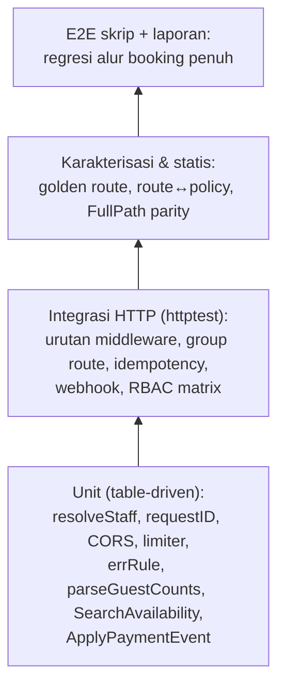

### 9.2 Jaring pengaman (dibuat PERTAMA, hijau pada kode lama)
| Test | Tujuan |
|---|---|
| `TestRoutesGolden` | Dump `r.Routes()` terurut (method+path) → `testdata/routes.golden`; refactor tak boleh mengubah set route |
| `TestEveryProtectedRouteHasPolicy` | Parse `INSERT` policy `migrations/*.sql` (regex `\('p',\s*'(\w+)',\s*'([^']+)',\s*'(\w+\|\*)'`) + seed `casbin_pgx.go`; tiap route `apiGroup` cocok ≥1 role via `keyMatch2` (pengecualian eksplisit mis. `/fake-pay/:ref`) |
| `TestAuthorizeFullPathParity` | Route × 6 role × method: keputusan `URL.Path` contoh vs `FullPath` identik |
| `BenchmarkMiddlewareChain` | Baseline `-benchmem` untuk dibandingkan setelah refactor |

### 9.3 Test baru per perubahan (table-driven)
| Area | Skenario inti |
|---|---|
| requestID | valid dipakai; terlalu panjang/karakter ilegal → regenerate; header respons terisi |
| recover | panic → 500 generik, body tak berisi nilai panic, log ber-stack; panic setelah `Written` tak menimpa |
| NoRoute/NoMethod | 404/405 problem+json, `Allow` terisi |
| CORS | kosong=no-op; origin cocok/tidak; preflight 204; wildcard ditolak |
| RateLimiter | burst, refill, 429 + `Retry-After`, eviction (waktu disuntik), skip health, limiter auth terpisah |
| IdentifySubject | matriks 8 kombinasi (bearer ada/tidak × verifier nil/ok × stf_/non-stf × ok/unauthorized/error) |
| Authorize | enforcer nil=503, allow, deny=403 generik, error=500 |
| featureEnabled | nil manager fail-open; role-scoped on/off |
| withIdempotency | key beda subjek tidak replay; conflict; in-progress; replay; `Complete` setelah ctx dibatalkan tetap tersimpan |
| webhook | seluruh baris matriks §6.5 termasuk ledger error=500 |
| errRule | tiap aturan → status/kode/pesan seperti sebelumnya |

**Target coverage:** `internal/api` ≥ 80% (baseline 83,8%); paket service baru ≥ 80%. `go vet ./...` bersih.

---

## 10. Performa & Efisiensi

| Sumber biaya | Sebelum | Sesudah | Verifikasi |
|---|---|---|---|
| `WithContext` per request | Timeout + IdentifySubject + RequireFeature (tiap ±250 B salinan `*http.Request`) | requestID+timeout digabung; IdentifySubject 1×; RequireFeature hanya route ber-flag | `-benchmem` allocs/op |
| `context.WithValue` | 3 | 3 (kunci dipertahankan) → 1 untuk request-id | idem |
| `c.Set` mati | 3 map insert | 0 | idem |
| `MaxBytesReader` | 2× pada booking & webhook | 1× | review |
| Rate limiter memori | tumbuh tanpa batas per IP unik | dibatasi oleh eviction lossless | test eviction + benchmark |
| Authorize | regex pada path mentah | regex pada template konstan | benchmark `Enforce` |
| Access log | tidak ada | 1 `slog` call/request (~µs) | benchmark chain (batas +5%) |

**Kriteria penerimaan:** `BenchmarkMiddlewareChain` sesudah ≤ +5% waktu/op dan ≤ baseline allocs/op (tambahan access log diimbangi penghapusan alokasi). Tidak ada optimasi spekulatif lain.

---

## 11. Rencana Migrasi, Rollback, & Risiko

### 11.1 Urutan fase (tiap fase = commit tersendiri, test hijau)
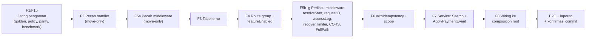
`F2`, `F5a`, `F3`, `F4` bersifat struktural (tanpa perubahan perilaku) → dapat di-revert terpisah. `F5b–g`, `F6`, `F7` mengubah perilaku → wajib E2E per fase.

### 11.2 Risiko & mitigasi
| Risiko | Dampak | Mitigasi |
|---|---|---|
| `FullPath` mengubah keputusan RBAC | Akses salah | Test parity sebagai blocker; selisih diperbaiki di policy (migrasi), bukan test |
| `TrustedProxies=nil` di balik LB | Semua klien terlihat satu IP → rate limit menghukum semua | Dokumentasi deploy + `TRUSTED_PROXIES`; log peringatan saat startup bila `X-Forwarded-For` terlihat tapi proxy kosong (opsional) |
| Pesan 403 generik memecah test lama | Test merah | Assert pada `code`; ubah dalam F5f |
| `/ready` ringkas memecah skrip E2E | Skrip gagal | Audit `testing/e2e/script` pada Tahap 5 |
| Scope idempotency mengubah replay | Klien lama kehilangan replay lintas-sesi | Replay memang tak aman lintas subjek; E2E replay sesama subjek |
| Service baru memicu regresi webhook | Pembayaran salah status | Matriks §6.5 sebagai test; E2E webhook penuh (PAID, replay, EXPIRED, mismatch) |
| CORS salah konfigurasi | Origin tak sah | Default mati; allowlist eksplisit; tanpa wildcard |

### 11.3 Rollback
- Per-fase revert (git). Tidak ada migrasi skema → tidak ada rollback data.
- Perubahan runtime yang bisa dimatikan tanpa deploy ulang: CORS (kosongkan env), limiter auth (set kapasitas besar), access log (level `slog`).

---

## 12. Analisis Anti-Overengineering (Ponytail)

| Dipilih (minimum yang bekerja) | Ditolak (dan alasannya) |
|---|---|
| Subpackage terfokus (`internal/api/middleware` & `internal/api/handler`) + type alias `Deps` kompatibel mundur di `internal/api` | Package `transport/http/rest/v1/...` berlapis-lapis → membebani navigasi & memecah 3.120+ baris test existing |
| Tabel `errRule` + 1 fungsi (~15 baris) | Interface `HTTPStatuser` di tiap error domain → ubah domain demi transport |
| Eviction lazy di mutex yang sama | Goroutine sweeper / `Close()` → lifecycle & kebocoran di test |
| Rate limiter in-memory | Limiter terdistribusi Valkey → satu instance server saat ini |
| `withIdempotency` helper | Middleware generik + response-capturing writer → 1 pemakai |
| `resolveStaff` fungsi murni | Strategy/Chain-of-responsibility auth → tiga outcome sudah cukup |
| CORS ±30 baris stdlib | Library `gin-contrib/cors` → dependensi baru untuk fitur opt-in sederhana |
| Access log `slog` | OpenTelemetry/tracing → belum ada backend; `request_id` cukup |
| 2 service method baru (`SearchAvailability`, `ApplyPaymentEvent`) | Memindahkan seluruh handler ke use-case layer → hanya dua logika domain yang bocor ke transport |
| Tidak paralelisasi search | Katalog beberapa varian; ukur dulu sebelum menambah `errgroup` |
| Tidak strict-unknown-fields JSON | Perubahan kontrak klien, di luar scope |

> `// ponytail:` — setiap penyederhanaan yang disengaja ditandai komentar tersebut di kode agar peninjau tahu itu keputusan, bukan kelalaian.
