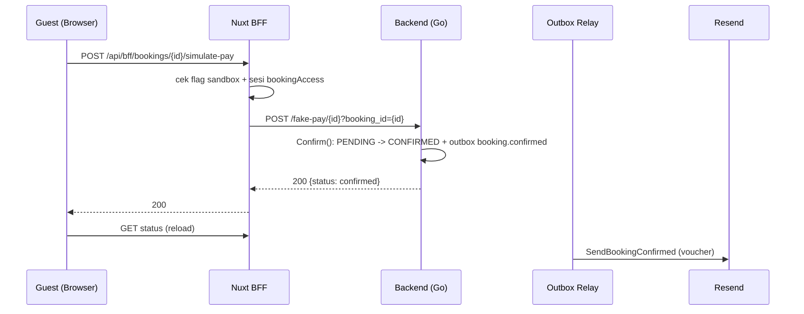

# Tech Architecture — Simulasi Bayar Sandbox

**Tanggal:** 2026-10-05 · SRS: [sandbox-simulate-pay-2026-10-05.md](file:///mnt/code/projects/jobs/pulang/current-booking/docs/srs/sandbox-simulate-pay-2026-10-05.md)

## Perubahan
| Repo | File | Catatan |
|---|---|---|
| FE | `server/api/bff/bookings/[id]/simulate-pay.post.ts` | Endpoint baru |
| FE | `nuxt.config.ts` | `public.sandboxPay` ← `NUXT_PUBLIC_SANDBOX_PAY` |
| FE | `app/services/api-booking-client.ts`, `booking-client.ts` | `simulatePay` (opsional di interface; mock tak perlu) |
| FE | `BookingStatusPanel.vue`, `status/[id].vue` | Tombol + handler |
| FE | `tests/unit/simulate-pay.test.ts` | Table-driven test |
| BE | — | **Tidak ada perubahan**; memakai `/fake-pay` yang sudah ada (dev-only, non-production) |

## Anti-overengineering (ponytail)
Tidak menambah endpoint/migrasi/email baru di BE; reuse `Confirm` + outbox + notifier yang sudah ada. Flag env tunggal, tanpa feature-flag DB.

## Deploy
VPS `/opt/hotel-fe/.env`: `NUXT_PUBLIC_SANDBOX_PAY=true`. Hapus/ubah ke `false` saat gateway riil aktif. Perhatian: backend harus `APP_ENV` non-production (saat ini `staging`).
