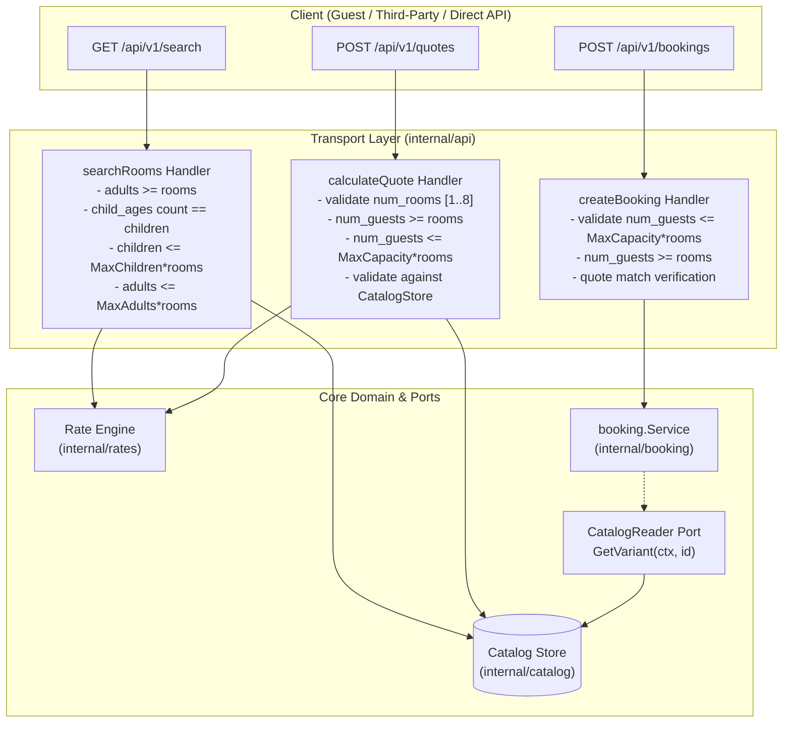
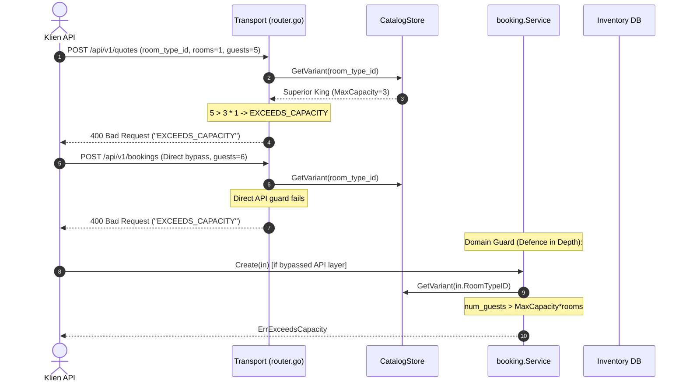

# Desain Arsitektur Teknis: Invariant Kapasitas Kamar Search, Quote, dan Checkout (BE-R07)

**Nomor Dokumen:** ARCH-PULANG-BE-R07  
**Tanggal:** 3 Oktober 2026  
**Status:** Approved  
**Author:** AI Engineering Agent  
**Terkait:** BE-R07, BE-G03, F01, F08  

---

## 1. Ikhtisar Arsitektur

Fitur ini menyelaraskan penegakan invariant kapasitas fisik kamar hotel di seluruh lapisan boundary arsitektur hexagonal (Transport API, Rate Engine, dan Core Booking Domain):



---

## 2. Diagram Alur Validasi Kapasitas



---

## 3. Desain Komponen & Interface (Hexagonal Port)

### 3.1 Port `CatalogReader` pada `internal/booking/service.go`
Sesuai prinsip Hexagonal Architecture (§8.2), domain `booking` mendefinisikan kontrak interface yang dibutuhkannya sendiri:

```go
// CatalogReader mendefinisikan port untuk membaca spesifikasi varian kamar (BE-R07).
type CatalogReader interface {
    GetVariant(ctx context.Context, idOrCode string) (catalog.RoomVariant, error)
}
```

Service disematkan method injeksi dependency:
```go
func (s *Service) SetCatalogStore(cs CatalogReader) {
    s.catalogStore = cs
}
```

### 3.2 Penegakan Invariant pada `booking.Service.Create`
```go
// Validasi kapasitas dasar
if in.NumRooms < 1 || in.NumRooms > 8 || in.NumGuests < 1 {
    return Booking{}, ChargeResult{}, ErrInvalidCapacity
}
if in.NumGuests < in.NumRooms {
    return Booking{}, ChargeResult{}, ErrInvalidCapacity
}

// Validasi terhadap batas fisik katalog (BE-R07)
if s.catalogStore != nil {
    variant, err := s.catalogStore.GetVariant(ctx, in.RoomTypeID)
    if err != nil {
        if errors.Is(err, catalog.ErrVariantNotFound) {
            return Booking{}, ChargeResult{}, ErrUnknownRoomType
        }
        return Booking{}, ChargeResult{}, fmt.Errorf("booking: catalog lookup: %w", err)
    }
    if in.NumGuests > variant.MaxCapacity*in.NumRooms {
        return Booking{}, ChargeResult{}, ErrExceedsCapacity
    }
}
```

---

## 4. Analisis Anti-Overengineering (Prinsip Ponytail)

1. **YAGNI (You Aren't Gonna Need It):**
   - Tidak menambahkan tabel database baru atau migration skema baru, karena kapasitas fisik (`max_capacity`, `max_adults`, `max_children`) sudah ada pada tabel `room_types` dan struct `RoomVariant`.
   - Tidak membuat microservice validator terpisah; validasi dijalankan secara in-process dengan sub-microsecond latency.
2. **Reuse Existing Ports:**
   - Memanfaatkan interface `catalog.Store` yang sudah ada dan mengikatnya sebagai `CatalogReader` pada booking service.
3. **Fail-Fast Early:**
   - Error overcapacity dicegah sebelum menyentuh transaksi database PostgreSQL `InTx` dan sebelum mengunci baris inventori `FOR UPDATE`, menghemat resource DB connection pool.
