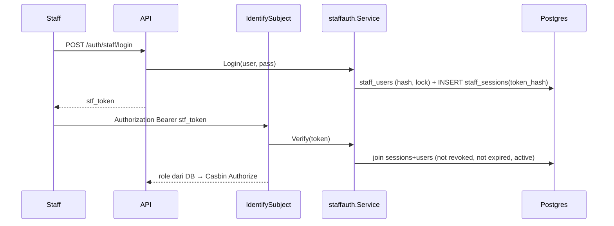

# Tech Architecture — Autentikasi Staf (BE-R01)

## Keputusan (anti-overengineering)
- Pakai tabel `staff_users` yang ada + 1 tabel `staff_sessions`; token opak acak (bukan JWT), sehingga pencabutan dan nonaktif langsung berlaku tanpa daftar revokasi atau manajemen kunci.
- Satu paket `internal/staffauth` (service + store Postgres); middleware hanya mengenal interface `StaffVerifier`.
- Fixture test `api.TestStaffVerifier()` (pola seperti `auth.DefaultTestEnforcer`) memetakan token `finance`, `gm_admin`, dst. ke principal, sehingga test lama tetap memakai `Bearer <role>`. Tidak pernah dipasang di `cmd/server`.

## Skema (migrasi 00017)
`staff_users` + `password_hash TEXT`, `failed_attempts INT`, `locked_until TIMESTAMPTZ`.
`staff_sessions(id uuid pk, staff_id uuid fk, token_hash char(64) unique, created_at, expires_at, revoked_at)`.

## Risiko dan batas
- Tanpa MFA, tanpa rotasi/refresh, tanpa audit event per aksi (F12 lanjutan). Rate limit login mengandalkan lockout per akun + limiter IP global.
- Menjalankan hotel nyata mewajibkan `APP_ENV=production`, password staf diset via CLI, dan TLS di depan server.
