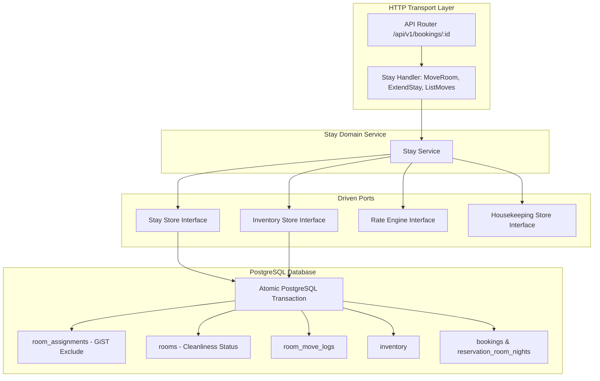
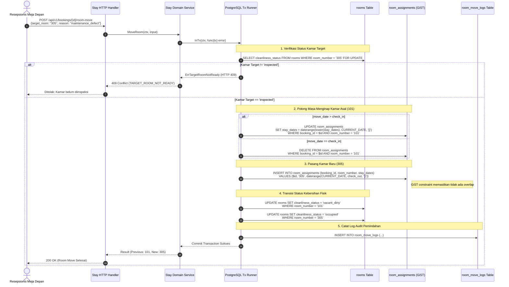
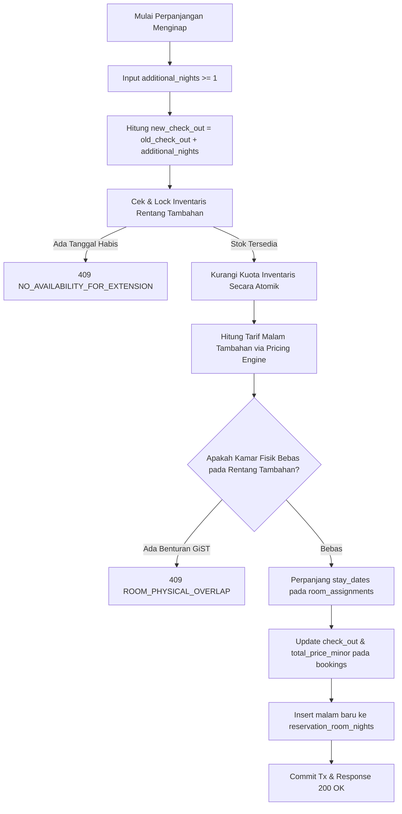

# Technical Architecture & Design — Proposed 03: Stay Modification & Room Move
# Hotel Booking Engine — Pulang ke Uttara (Yogyakarta)

- **Tanggal Dokumen:** 2026-10-03
- **Status:** Approved / Technical Design
- **Dokumen PRD:** [PRD Stay Modification](file:///mnt/code/projects/jobs/pulang/current-booking/docs/prd/stay-modification-room-move-and-extension-2026-10-03.md)
- **Dokumen SRS:** [SRS Stay Modification](file:///mnt/code/projects/jobs/pulang/current-booking/docs/srs/stay-modification-room-move-and-extension-2026-10-03.md)

---

## 1. Arsitektur Domain & Pola Transaksi

Modul Stay Modification ditempatkan sebagai sub-domain operasional pada `internal/stay/` atau terintegrasi dengan port `booking.Store`, `inventory.Store`, dan `housekeeping.Store`:

---

## 2. Diagram Sekuens Alur Room Move (Atomisitas Transaksional)

---

## 3. Diagram Alur Transaksi Perpanjangan Menginap (Stay Extension)

---

## 4. Analisis Anti-Overengineering (Ponytail Standard)

1. **YAGNI (You Aren't Gonna Need It):**
   * Tidak menambahkan sub-sistem event bus terpisah untuk room move log. Audit log disimpan langsung dalam transaksi database yang sama dengan eksekusi perpindahan fisik kamar.
2. **Minimal Abstraction:**
   * Memanfaatkan kemampuan native PostgreSQL:
     - `daterange` dan klausul GiST exclusion constraint (`EXCLUDE USING GIST`) menggantikan ratusan baris kode logika pendeteksi overlap di aplikasi.
     - `lower(stay_dates)` dan operator `&&` menjamin nol balapan data (*zero race condition*).
3. **Pemanfaatan Reusable Components:**
   * Perhitungan tarif malam tambahan menggunakan komponen `rates.Engine` yang sudah teruji.
   * Modifikasi status kamar memanfaatkan kolom `cleanliness_status` pada tabel `rooms` yang telah diinisialisasi pada Proposed 01.

---

## 5. Pertimbangan Konkurensi & Keamanan

- **Isolasi Transaksi:**
  Seluruh operasi pemindahan kamar dan perpanjangan menginap dibungkus dalam PostgreSQL `InTx` dengan query `FOR UPDATE` pada baris kamar target untuk mencegah dua resepsionis memindahkan tamu berbeda ke kamar target yang sama pada milidetik yang sama.
- **Fail-Closed RBAC:**
  Endpoint dilindungi oleh middleware Casbin enforcer. Tamu (`guest`) atau staf yang tidak memiliki wewenang langsung ditolak di lapisan HTTP transport (403 Forbidden).
