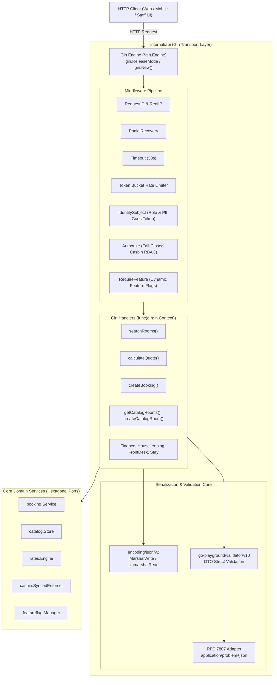

# Technical Architecture & Implementation Design
# Modernisasi Transport Layer: Gin Router, JSON v2, & Go Validator v10
**Properti:** Hotel Pulang ke Uttara (Yogyakarta)  
**Dokumen ID:** `TECH-TRANSPORT-MODERNIZATION-2026-10-03`  
**Versi:** 1.0.0  
**Tanggal:** 2026-10-03  
**Status:** Architecture Baseline / In Implementation  
**PRD & SRS Referensi:** [`docs/prd/transport-migration-gin-jsonv2-validator-2026-10-03.md`](file:///home/ahmadm/.gemini/antigravity/worktrees/current-booking/migrate_router_to_gin/docs/prd/transport-migration-gin-jsonv2-validator-2026-10-03.md) & [`docs/srs/transport-migration-gin-jsonv2-validator-2026-10-03.md`](file:///home/ahmadm/.gemini/antigravity/worktrees/current-booking/migrate_router_to_gin/docs/srs/transport-migration-gin-jsonv2-validator-2026-10-03.md)  

---

## 1. Arsitektur Komponen Hexagonal (Hexagonal Architecture)

Transport layer ([`internal/api`](file:///home/ahmadm/.gemini/antigravity/worktrees/current-booking/migrate_router_to_gin/internal/api)) bertindak sebagai **Driving Adapter** murni. Seluruh dependency domain diinjeksikan melalui `api.Deps`. Arsitektur baru memodernisasi transport tanpa mencemari domain core:



---

## 2. Inovasi Kunci & Desain Teknis

### 2.1 Gin Engine & Handler Migration Pattern
Router mengembalikan `http.Handler` (di mana `*gin.Engine` secara native mengimplementasikan antarmuka `http.Handler` melalui method `ServeHTTP(w, req)`). Ini menjamin keselarasan 100% dengan `cmd/server/main.go` dan `httptest.NewRecorder()` di unit test.

Handler ditulis dalam idiom native Gin:
```go
type Deps struct {
    BookingSvc   *booking.Service
    CatalogStore catalog.Store
    // ... dependencies
}

func getCatalogRoom(d Deps) gin.HandlerFunc {
    return func(c *gin.Context) {
        id := c.Param("id")
        v, err := d.CatalogStore.GetVariant(c.Request.Context(), id)
        if errors.Is(err, catalog.ErrVariantNotFound) {
            httpErrorCode(c, http.StatusNotFound, "varian kamar tidak ditemukan", "ROOM_VARIANT_NOT_FOUND")
            return
        }
        if err != nil {
            httpErrorCode(c, http.StatusInternalServerError, "gagal membaca varian kamar", "CATALOG_ERROR")
            return
        }
        writeJSON(c, http.StatusOK, v)
    }
}
```

### 2.2 Integrasi `encoding/json/v2`
Alih-alih bergantung pada refleksi v1 di dalam Gin, helper transport layer memanggil `encoding/json/v2` secara langsung:
```go
import "encoding/json/v2"

func writeJSON(c *gin.Context, code int, v any) {
    c.Header("Content-Type", "application/json; charset=utf-8")
    c.Status(code)
    _ = json.MarshalWrite(c.Writer, v)
}

func writeProblemDetails(c *gin.Context, status int, title, detail, code string) {
    c.Header("Content-Type", "application/problem+json")
    c.Status(status)
    _ = json.MarshalWrite(c.Writer, ProblemDetails{
        Error:  detail,
        Title:  title,
        Status: status,
        Detail: detail,
        Code:   code,
    })
}
```

### 2.3 Integrasi `go-playground/validator/v10` & Adapter RFC 7807
Validator singleton diinisialisasi sekali dan digunakan untuk memeriksa DTO yang telah di-unmarshal:
```go
var validate = validator.New(validator.WithRequiredStructEnabled())

func validateDTO(c *gin.Context, s any) bool {
    if err := validate.StructCtx(c.Request.Context(), s); err != nil {
        handleValidationError(c, err)
        return false
    }
    return true
}
```
Adapter `handleValidationError` memetakan tag yang gagal ke error code ramah mesin sesuai kontrak API yang telah ada.

---

## 3. Analisis Anti-Overengineering (Prinsip Ponytail)

1. **YAGNI & No Duplicate Engines**: Kita tidak membuat wrapper ORM atau layer abstraksi router ganda. Kita langsung menggunakan `*gin.Context` secara murni pada layer transport.
2. **Pemanfaatan Library Standar**: Menggunakan `encoding/json/v2` standar Go 1.27 daripada library JSON pihak ketiga lainnya (`sonic`, `easyjson`).
3. **Efisiensi Alokasi**: `json.MarshalWrite` menulis langsung ke buffer streaming socket Gin (`c.Writer`), memangkas overhead buffering ganda.
