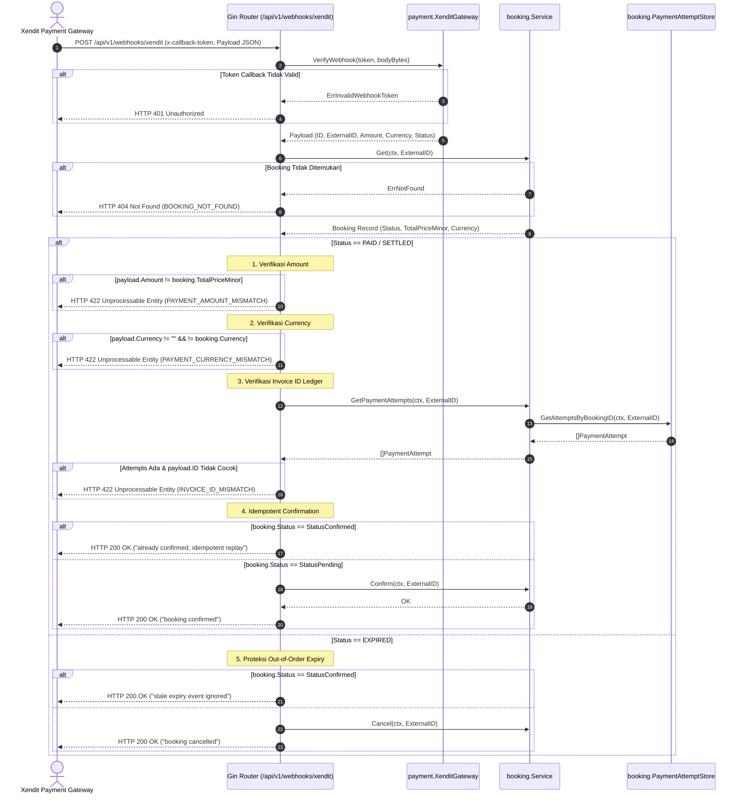

# Technical Architecture — Webhook Ledger & Amount Reconciliation (BE-R14)

**Fitur:** Webhook Amount, Currency & Ledger Verification  
**Tanggal:** 2026-10-03  
**Status:** Approved for Implementation  
**Terkait:** [PRD](../prd/webhook-ledger-reconciliation-r14-2026-10-03.md) · [SRS](../srs/webhook-ledger-reconciliation-r14-2026-10-03.md) · BE-R14  

---

## 1. Sequence Diagram: Validasi & Rekonsiliasi Webhook Xendit

---

## 2. Rincian Modifikasi Kode

1. **`internal/adapter/payment/xendit.go`:**
   - Tambahkan field `Currency string` pada struct `XenditWebhookPayload`.
2. **`internal/booking/service.go`:**
   - Tambahkan method `GetPaymentAttempts(ctx context.Context, bookingID string) ([]PaymentAttempt, error)`.
3. **`internal/api/router.go`:**
   - Perbarui handler `xenditWebhook`:
     - Panggil `d.BookingSvc.Get(ctx, payload.ExternalID)` terlebih dahulu.
     - Lakukan validasi `Amount`, `Currency`, dan `Invoice ID`.
     - Cegah pembatalan booking berstatus `StatusConfirmed` saat event `EXPIRED` diterima.
4. **`internal/api/webhook_test.go`:**
   - Tambahkan skenario table test:
     - `Amount mismatch rejected with 422`
     - `Currency mismatch rejected with 422`
     - `Invoice ID mismatch rejected with 422`
     - `Stale EXPIRED on confirmed booking returns 200 ignored without cancelling`
     - `Booking not found returns 404`

---

## 3. Analisis Anti-Overengineering (Ponytail Review)

- **Menggunakan Komponen yang Sudah Ada:** Menggunakan kembali `PaymentAttemptStore` yang telah diimplementasikan sejak BE-G11 tanpa membuat skema database baru.
- **Fail-Safe HTTP Codes:** Menggunakan HTTP 422 Unprocessable Entity untuk kegagalan semantik data (mismatch), sehingga gateway dapat membedakan error autentikasi (401), sintaks (400), dan semantik tagihan (422).
